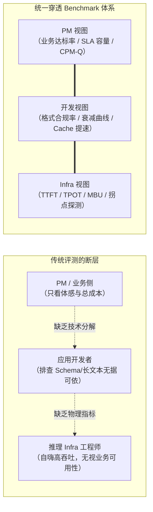
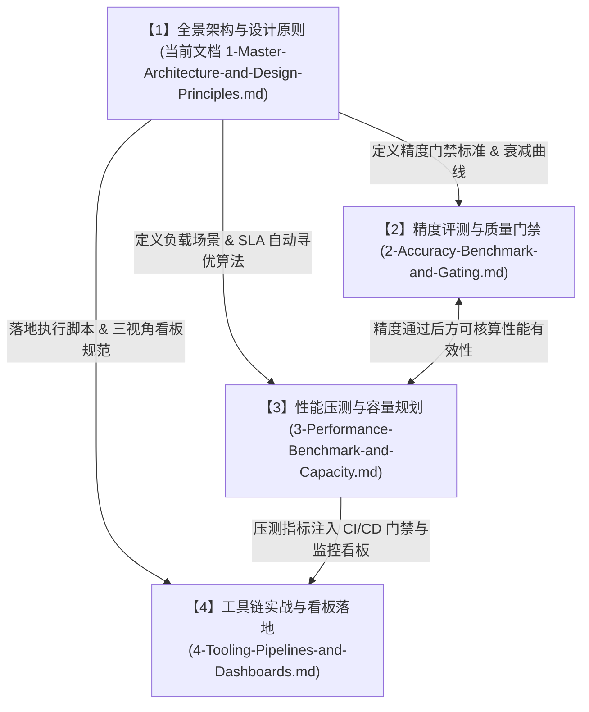

# 1. 大模型推理 Benchmark 全景架构与设计原则

> **核心命题**：如何设计一套兼顾**“精度（Accuracy）”**与**“性能（Performance）”**的大模型推理评测体系？
> **三重视角穿透**：对于项目经理与业务侧要极简直观，对于应用开发者要有明确的 Debug 与开发指导意义，对于底层 Infra 工程师必须具备严谨的工程执行力与可落地性。
> **两大工业标杆融合**：吸取 **MLCommons MLPerf Inference**（工业级标准、场景分类、一票否决门禁、能效测算）的规范严谨性，结合 **ModelScope EvalScope**（SLA Auto-Tune 自动寻优、开闭环压测、多轮会话 Prefix Cache 评测）的工程敏捷性。
> **文档定位**：本文件为本体系的**【主文档（序号 1）】**，统领全景框架，并与其余各专业模块联动。

---

## 目录

1. [大模型评测的“三方割裂”与破局之道](#1-大模型评测的三方割裂与破局之道)
2. [三层指标穿透金字塔（统一度量语言）](#2-三层指标穿透金字塔统一度量语言)
   * 2.1 [PM / 业务层：极简、高可解释性的业务大屏](#21-pm--业务层极简高可解释性的业务大屏)
   * 2.2 [应用开发层：可行动、可复现的诊断与调优指标](#22-应用开发层可行动可复现的诊断与调优指标)
   * 2.3 [推理 Infra 层：物理瓶颈定位与硬件极限逼近](#23-推理-infra-层物理瓶颈定位与硬件极限逼近)
   * 2.4 [全链路因果穿透与归因矩阵](#24-全链路因果穿透与归因矩阵)
3. [借鉴两大业界标杆的设计哲学](#3-借鉴两大业界标杆的设计哲学)
   * 3.1 [MLCommons MLPerf Inference 的精髓：严谨规则与场景矩阵](#31-mlcommons-mlperf-inference-的精髓严谨规则与场景矩阵)
   * 3.2 [ModelScope EvalScope 的精髓：工程敏捷性与自动闭环](#32-modelscope-evalscope-的精髓工程敏捷性与自动闭环)
4. [Token 经济学视角：Goodput 与真实合格成本（CPM-Q）](#4-token-经济学视角goodput-与真实合格成本cpm-q)
5. [全景评测系统执行蓝图与模块导引](#5-全景评测系统执行蓝图与模块导引)

---

## 1. 大模型评测的“三方割裂”与破局之道

在当前大模型与 Agent 应用规模化落地的生产实践中，工程团队往往面临严重的“度量断层”：

* **业务与项目经理（PM）的困惑**：
  * *“Infra 团队宣称吞吐提升了 300%，为什么用户还是在投诉客服机器人反应慢、偶尔胡说八道？”*
  * *“财务只关心每个月服务器账单和单次业务调用的成本，我不懂什么是 MFU，更不懂算子耗时。”*
* **应用开发者的痛点**：
  * *“为什么本地单测正常的 JSON 输出，一旦接入线上生产集群就频繁出现解析报错？”*
  * *“Prompt 长度从 2k 扩充到 16k 做 RAG 后，模型生成质量急剧下降，究竟是 Prompt 写法问题、引擎截断、还是量化导致的注意力丢失？”*
* **推理 Infra 工程师的无奈**：
  * *“业务侧只给一个含糊的‘要快、要便宜’，既不给首字延迟（TTFT）与解码延迟（TPOT）的具体 SLA，也不给请求的到达分布模型。”*
  * *“为了极限降本做了 FP8 量化甚至 NVFP4/INT4 混合量化，却因为缺乏标准化的精度回归门禁，每次上线都被业务研发质疑导致了幻觉增加。”*



**破局之道**在于：**不搞割裂的指标孤岛，构建一套自底向上聚合、自顶向下因果穿透的“金字塔体系”**。每一项底层物理指标都对应着应用层的开发体验，并最终映射为业务层的财务与体验成本。

---

## 2. 三层指标穿透金字塔（统一度量语言）

```
                     ┌────────────────────────────────┐
                     │   1. 业务与用户层 (PM / User)   │
                     │  - SLA 达标容量 (Max Concurrency)│
                     │  - 业务任务完成率 (Pass Rate)   │
                     │  - 每万次任务真实成本 (CPM-Q)    │
                     └───────────────▲────────────────┘
                                     │ 业务抽象与财务折算
                     ┌───────────────┴────────────────┐
                     │  2. 应用开发层 (App Developer)  │
                     │  - JSON Schema 强校验合规率    │
                     │  - 长上下文 Needle 衰减曲线     │
                     │  - Prefix Cache 多轮加速比      │
                     │  - 接口超时率与失败重试损耗    │
                     └───────────────▲────────────────┘
                                     │ 逻辑表征与性能分解
                     ┌───────────────┴────────────────┐
                     │  3. 推理底层 (Infra Engineer)  │
                     │  - TTFT / TPOT / ITL (P50/P99) │
                     │  - 连续批处理 Goodput 饱和拐点 │
                     │  - 访存带宽利用率 (MBU / %峰值)│
                     │  - KV 显存碎片率与驱逐换入开销 │
                     └────────────────────────────────┘
```

### 2.1 PM / 业务层：极简、高可解释性的业务大屏

对于管理层、产品经理与最终用户，Benchmark 报告必须在 3 秒钟内说明业务可用性与财务可行性：

1. **业务任务完成率（Task Pass Rate / Accuracy Gate）**：
   * 采用类似 MLPerf 的严格标准：在黄金业务用例集上，整体准确率是否通过阈值（如 $\ge 99.0\%$）。
   * 输出形式：**极简红绿灯（PASS / FAIL）**。
2. **SLA 承载容量（Max SLA Capacity）**：
   * 不谈抽象的 FLOPS，只报客观容量：*“在保证 95% 请求首字小于 1.5 秒且打字速度不慢于 30 字/秒的前提下，单套节点**最高稳定支撑 120 个并发用户**（峰值 QPS 为 42）。”*
3. **每百万有效 Token 成本（CPM-Q）与单任务成本**：
   * 将云厂商租金/自建服务器折旧计入，折算为真实财务数字：*“在满足业务 SLA 的带载状态下，每次智能客服问答成本为 ¥0.015 元，每百万合格 Tokens 生产成本为 ¥1.28 元。”*

### 2.2 应用开发层：可行动、可复现的诊断与调优指标

为开发者提供精准的调优靶向，避免无效的 Prompt 试错：

1. **结构化与接口契约遵循率（Syntactic & Schema Compliance）**：
   * 严苛测试 JSON Schema、Tool Calling、Function Calling 参数抽取的正确率（详见 [2-Accuracy-Benchmark-and-Gating.md §2](2-Accuracy-Benchmark-and-Gating.md#2-结构化遵循与-tool-calling-测试)）。
   * 指导意义：量化模型是否破坏了微调的格式偏置；明确当前模型版本是否可以免去后置语法修补代码。
2. **长上下文质量衰减梯度（Long-Context Quality Decay）**：
   * 压测不同 Prompt 长度（2k、8k、32k、64k、128k）下的关键信息检索精度与体感延迟。
   * 指导意义：绘制“有效上下文安全边界”，指导开发在做 RAG 时切块（Chunking）的上限应该设为多大。
3. **前缀缓存（Prefix Caching）多轮对话提速比**：
   * 评测在多轮会话或固定 System Prompt 下，第 2 轮至第 N 轮的 TTFT 降低倍数（详见 [3-Performance-Benchmark-and-Capacity.md §3](3-Performance-Benchmark-and-Capacity.md#3-多轮会话与前缀缓存-prefix-caching-评测)）。
   * 指导意义：帮助开发者验证 Prompt 编排是否符合 Radix 树前缀对齐规则，避免破坏缓存命中。

### 2.3 推理 Infra 层：物理瓶颈定位与硬件极限逼近

为底层性能优化提供精细到微秒和字节的观测标尺：

1. **TTFT（Time To First Token）分布（P50/P90/P99）**：
   * 衡量 Prefill 阶段效率。与 GPU GEMM 计算核心饱和度、Chunked Prefill 调度策略深度绑定。
2. **TPOT（Time Per Output Token）与 ITL（Inter-Token Latency）**：
   * 衡量 Decode 自回归阶段性能。与 HBM 访存带宽利用率（MBU）、多卡通信开销深度绑定。
3. **有效吞吐拐点（Goodput Knee Point）**：
   * 通过动态调压寻找系统何时从“计算受限”滑向“队列排队与显存换页受限”。
4. **访存带宽利用率（MBU, Memory Bandwidth Utilization）**：
   * 计算实际传输量与硬件标称带宽的比值，评判算子实现是否逼近物理极限（详见 [3-Performance-Benchmark-and-Capacity.md §4](3-Performance-Benchmark-and-Capacity.md#4-硬件物理极限与-mbumfu-下钻分析)）。

### 2.4 全链路因果穿透与归因矩阵

当线上或评测中发生异常时，三层指标通过以下因果链路实现秒级归因：

| 业务现象 (PM) | 开发定位 (App Dev) | 底层物理根因 (Infra) | 针对性优化行动 |
| :--- | :--- | :--- | :--- |
| **用户抱怨机器人反应迟钝（卡顿超 3 秒）** | TTFT P99 飙升至 4.2s；第 2 轮对话未见明显提速 | Prefill 算力未打满，Prefix Cache 命中率为 0；发生行头阻塞 (Head-of-Line Blocking) | 1. 业务端重构 Prompt，固定 System 提示词在最前；<br>2. Infra 端开启 Chunked Prefill 或实施 PD 分离架构。 |
| **打字机输出忽快忽慢、偶尔明显顿挫** | ITL P99 达到 120ms，但 P50 仅为 25ms | GPU 处于 Decode 阶段时被突发的长 Prompt Prefill 抢占；或多卡通信（AllReduce）发生长尾等待 | 1. 调整连续批处理调度策略（如设置 `max_num_batched_tokens`）；<br>2. 优化多卡张量并行通信拓扑。 |
| **并发略有增加时，大量请求出现 504 超时** | 接口错误率从 0% 骤增至 18%，重试风暴引发雪崩 | KV Cache 显存池耗尽，触发请求抢占（Preemption）并重算，或连续分页换入换出 | 1. 降低模型权重显存占用（开启 FP8 量化）；<br>2. 开启 KV Cache FP8 量化释放显存空间。 |
| **换了轻量推理卡后，用户反馈格式频频崩溃** | JSON 解析失败率从 0.2% 飙升至 8.5% | 算子量化（如 INT4/FP4）导致注意力和尾部 Logits 严重失真，模型指令遵循能力损坏 | 1. 回退关键层至 FP8/FP16 混合量化；<br>2. 触发 MLPerf 精度一票否决门禁，拒绝该配置上线。 |

---

## 3. 借鉴两大业界标杆的设计哲学

本 Benchmark 体系并非凭空捏造，而是深度吸收了当前 AI 工业界两大最具代表性的开源工程与标准化规范：

```
┌──────────────────────────────────────┐       ┌──────────────────────────────────────┐
│       MLCommons MLPerf Inference     │       │        ModelScope EvalScope          │
├──────────────────────────────────────┤       ├──────────────────────────────────────┤
│ 标杆定位：工业级硬件测试与合规金标准     │       │ 标杆定位：敏捷工程落地与全栈压测套件     │
│ 1. 严苛的一票否决精度门禁 (Accuracy Gate)│       │ 1. 独创的 SLA Auto-Tune 自动二分寻优  │
│ 2. 场景化负载：Server(泊松) vs Edge(单流)│  ➕   │ 2. 原生多轮会话压测与 Prefix Cache 验证│
│ 3. 强制区分 Interactive 与 Server SLA │       │ 3. 细粒度分位数 (P50/P90/P95/P99) 全谱段│
│ 4. 严谨的 MLPerf Power 能效测算体系   │       │ 4. 极佳的生态兼容 (OpenAI API / vLLM)  │
└──────────────────┬───────────────────┘       └──────────────────┬───────────────────┘
                   │                                              │
                   └──────────────────────┬───────────────────────┘
                                          ▼
                   ┌──────────────────────────────────────────────┐
                   │    TokenResearch 统一大模型推理 Benchmark 体系 │
                   └──────────────────────────────────────────────┘
```

### 3.1 MLCommons MLPerf Inference 的精髓：严谨规则与场景矩阵

在 MLPerf Inference 的规则定义中，有三大机制对生产落地具有决定性指导价值：

1. **绝对精度底线（Accuracy Gating 一票否决）**：
   * MLPerf 明确规定：评测任何加速推理系统（无论采用了多激进的量化、稀疏化或投机采样），必须首先在基准数据集（如 GSM8K、MMLU、ROUGE-1/2/L、Exact Match）上运行精度测试。
   * **硬性门槛**：输出质量得分**必须达到未压缩基准模型（FP16/FP32）的 $99.0\%$ 以上**。达不到门槛者，无论 TPS 跑得多高，一律判定为**“不合规（Disqualified）”**。
   * 业务启示：杜绝了 Infra 团队通过“劣化模型智能来换取表面高吞吐”的伪优化。
2. **场景分类（Scenarios）与流量特征**：
   * **Server 场景（数据中心标准）**：请求以**泊松到达（Poisson Process）**模拟生产环境的随机性。必须在 P99 延迟达标的前提下求解最大承载 QPS。
   * **Offline 场景（离线大批量处理）**：所有数据预先加载，测量纯算力峰值吞吐（Tokens/s）。
   * **SingleStream 场景（端侧设备标准）**：每次只发 1 个请求，前序返回后才发下一个。专门考核单人在 PC、手机、车机上的极限交互延迟与能耗。
3. **分级交互 SLA**：
   * **Interactive（高实时人机交互）**：$\text{TTFT} \le 500\text{ms},\ \text{TPOT} \le 20\sim30\text{ms}$。
   * **Conversational / Server（常规后台服务）**：$\text{TTFT} \le 2000\text{ms},\ \text{TPOT} \le 80\sim100\text{ms}$。

### 3.2 ModelScope EvalScope 的精髓：工程敏捷性与自动闭环

阿里魔搭开源的 `EvalScope` 在评测与压测落地中展现了极高的工程实用度：

1. **`sla-auto-tune`（SLA 自动寻优引擎）**：
   * 传统压测需要人工逐个调整并发数（如 1, 2, 4, 8, 16...）并在 Excel 中手动计算 P99 是否超时，极其低效。
   * EvalScope 引入了**二分查找与动态边界探测**：用户仅需提供 SLA 目标（如 `[{"p99_ttft": "<=1.5", "p99_tpot": "<=0.035"}]`），工具自动以步进探测和二分收敛，快速锁定系统刚好不违背 SLA 的**最大有效并发数（Max Parallel）**或**最大到达率（Max Rate）**。
2. **Multi-turn（多轮真实会话模拟）**：
   * 区别于单纯发一条随机文本的传统工具，EvalScope 支持按真实对话轮次推进，保留 Context 历史。这正是评测 **Prompt Cache（如 vLLM/SGLang 的 Radix Attention）** 收益的标准利器。
3. **全谱段分位数与 OpenAI 原生兼容**：
   * 默认输出 P10、P25、P50、P75、P80、P90、P95、P98、P99 等 10 级分位数，让长尾抖动无所遁形；全兼容 OpenAI 接口，无缝对接各类自建与商业网关。

---

## 4. Token 经济学视角：Goodput 与真实合格成本（CPM-Q）

传统压测往往看**原始吞吐量（Raw Throughput）**，但这在 Token 经济学中存在巨大的欺骗性。如果一个系统生成了大量的超时 Token、截断 Token 或格式错乱 Token，这些在业务上不仅毫无价值，反而是浪费算力的负资产。

因此，我们确立两大核心经济学公式：

### 4.1 有效吞吐（Goodput）

$$\mathbf{Goodput (Tokens/s)} = \sum_{i=1}^{N_{\text{succeed}}} \frac{\text{Generated Tokens}_i}{\Delta T} \times \mathbb{I}(\text{SLA 达标}) \times \mathbb{I}(\text{Schema 与格式合法})$$

其中：
* $\mathbb{I}(\cdot)$ 为指示函数，只有在**“SLA（TTFT & TPOT）未超标”**且**“输出格式与业务验证合法”**两个条件同时满足时，该次请求生成的 Tokens 才计入有效吞吐；
* 如果压测时发生报错、重试或超时，该部分生成的 Token 权重视为 0。

### 4.2 真实合格 Token 成本（CPM-Q）

$$\mathbf{CPM\text{-}Q (Cost\ Per\ Million\ Quality\ Tokens)} = \frac{\text{系统总拥有成本 (TCO)} + \text{网络与运维开销}}{\text{实际交付的合格有效 Tokens 总量}} \times 10^6$$

* **业务推论**：
  * 若 Infra 团队采用了一套极低成本的芯片或极限量化方案，将硬件折旧成本降低了 $40\%$，但由于模型生成能力下降导致应用端 JSON 失败率上升了 $15\%$、长尾超时导致重试率上升了 $20\%$，则最终的 **CPM-Q 反而暴涨 $25\%$**。
  * **一切没有精度门禁与 SLA 约束的降本，在财务上都是无效降本。**

---

## 5. 全景评测系统执行蓝图与模块导引

本 Benchmark 体系由本主文档统一统领，具体技术细节拆解至以下三个专门文档：



### 专业文档模块导引：

1. **[2. 精度评测与质量门禁 (2-Accuracy-Benchmark-and-Gating.md)](2-Accuracy-Benchmark-and-Gating.md)**
   * 深入拆解 MLPerf $\ge 99.0\%$ 一票否决门禁的具体落地流程；
   * 详解刚性格式校验（JSON Schema 递归验证、Tool Calling 契约解析）；
   * 建立长上下文（2k $\rightarrow$ 128k）Needle-In-A-Haystack 衰减模型；
   * 制定量化（FP8/NVFP4）上线前的无损验证标准。
2. **[3. 性能压测与容量规划 (3-Performance-Benchmark-and-Capacity.md)](3-Performance-Benchmark-and-Capacity.md)**
   * 深入拆解 MLPerf 四大负载场景（Server 泊松开环、Offline 极限、Edge SingleStream 单流交互、MLPerf Power 能耗）；
   * 详解 EvalScope `sla-auto-tune` 二分寻优算法的边界探测数学过程；
   * 全面解构 TTFT、TPOT、ITL 的多分位数度量口径与物理根因；
   * 详解硬件访存带宽利用率（MBU）与计算饱和度（MFU）的推导计算公式。
3. **[4. 工具链实战与看板落地 (4-Tooling-Pipelines-and-Dashboards.md)](4-Tooling-Pipelines-and-Dashboards.md)**
   * 提供生产可用的 EvalScope 自动化脚本（单流测试、SLA 自动寻优、多轮对话压测）；
   * 给出打通 GitLab/GitHub CI 的自动化基准回归门禁流水线模版；
   * 设计针对 PM、应用开发、Infra 工程师的 Grafana/Web 三视角监控看板布局与 PromQL 规则。

---

> [!TIP]
> 读者可根据自身诉求快速跳转：关注业务与质量标准请阅读 **[文档 2](2-Accuracy-Benchmark-and-Gating.md)**，关注硬件压测与容量计算请阅读 **[文档 3](3-Performance-Benchmark-and-Capacity.md)**，准备实际运行压测与搭建监控请直接阅读 **[文档 4](4-Tooling-Pipelines-and-Dashboards.md)**。
