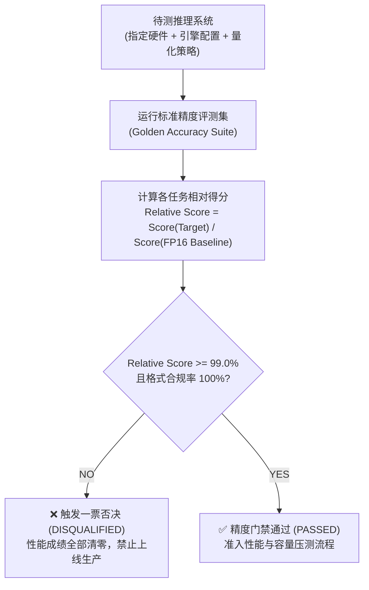
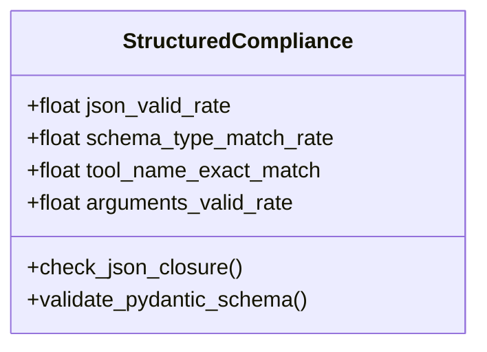

# 2. 精度评测与质量门禁体系 (Accuracy Benchmark and Gating)

> **核心定位**：确立大模型推理系统在不同加速策略（量化、投机采样、长上下文剪枝、引擎切换）下的**“质量底线”**。
> **工业界标杆对照**：吸收 **MLCommons MLPerf Inference** 的绝对精度门禁规范（Accuracy Gating $\ge 99.0\%$ 一票否决），结合应用开发者在生产环境中的格式崩溃排查需求。
> **文档关系**：隶属于 [1-Master-Architecture-and-Design-Principles.md](1-Master-Architecture-and-Design-Principles.md)，为系统提供有效性前置校验。

---

## 目录

1. [精度门禁的本质：为什么脱离精度的压测毫无意义？](#1-精度门禁的本质为什么脱离精度的压测毫无意义)
2. [MLPerf Accuracy Gating 一票否决机制](#2-mlperf-accuracy-gating-一票否决机制)
3. [维度一：结构化遵循与 Tool Calling 刚性校验（开发级 Debug）](#3-维度一结构化遵循与-tool-calling-刚性校验开发级-debug)
4. [维度二：业务语义与任务完成度评测（PM 与用户级）](#4-维度二业务语义与任务完成度评测pm-与用户级)
5. [维度三：长上下文衰减与“大海捞针”断崖（RAG 架构指导）](#5-维度三长上下文衰减与大海捞针断崖rag-架构指导)
6. [维度四：量化与算子无损验证（Infra 上线前验证）](#6-维度四量化与算子无损验证infra-上线前验证)
7. [质量门禁自动化校验器代码原型](#7-质量门禁自动化校验器代码原型)

---

## 1. 精度门禁的本质：为什么脱离精度的压测毫无意义？

在追求高吞吐与低成本的工程实践中，底层 Infra 团队常采用极端的优化手段：
* **粗暴量化**：将模型直接压缩为 INT4、W4A8 或 NVFP4，甚至激进量化 KV Cache 至 FP4；
* **截断与早停**：降低 `max_tokens` 或调整采样阈值，诱导模型提前结束输出；
* **非确定性算子加速**：采用低精度的快速注意力算子（Fast Attention Kernel），引入累加舍入误差。

这些手段往往能跑出极其亮眼的 TPS（Tokens per Second）数据，但在真实业务场景中却带来毁灭性后果：**JSON 格式截断解析崩溃、工具调用参数错位、长文本关键事实遗忘、幻觉率大幅上升**。

> [!IMPORTANT]
> **黄金法则**：在评测体系中，**精度评测永远是性能评测的前置门禁**。只有通过了精度门禁的模型与推理引擎配置，其测出的 TTFT、TPOT、QPS 等性能指标才有资格被认定为有效数据；未通过门禁者，性能成绩一律作废！

---

## 2. MLPerf Accuracy Gating 一票否决机制

MLCommons MLPerf 在大语言模型（如 Llama 3.1 8B/70B/405B、Mixtral 8x7B、DeepSeek-R1）推理评测中确立了极度严谨的门禁标准。我们将其标准化为企业落地的通用规则：



### 2.1 门禁核心规则表

| 任务类型 | 评测数据集 (Reference Dataset) | 精度度量指标 (Metric) | MLPerf 门禁合格线 | 业务场景代表 |
| :--- | :--- | :--- | :--- | :--- |
| **文本摘要与综合写作** | CNN / DailyMail (max_len=2048) | ROUGE-1 / ROUGE-2 / ROUGE-L | $\ge 99.0\%$ FP16 基准 | 新闻摘要、会议纪要 |
| **开放问答与知识检索** | OpenOrca / SQuAD v2 | ROUGE-L / Token-level F1 | $\ge 99.9\%$ FP16 基准 | 企业知识库、智能客服 |
| **数学推理与逻辑计算** | GSM8K / MATH-500 / AIME25 | Exact Match (准确率) | $\ge 99.0\%$ FP16 基准 | 财务报表分析、计算推理 |
| **代码生成与工具调用** | HumanEval / MBPP / ToolBench | Pass@1 / 参数精确匹配度 | $\ge 99.0\%$ FP16 基准 | Copilot、Agent 自主工具调用 |
| **强推理链思考 (CoT)** | DeepSeek-R1 Bench / GPQA Diamond | Exact Match / 逻辑完整度 | $\ge 99.0\%$ FP16 基准 | 深度研究、策略规划 |

---

## 3. 维度一：结构化遵循与 Tool Calling 刚性校验（开发级 Debug）

应用开发者最痛苦的线上故障，莫过于大模型吐出的数据无法被后端解析。本维度用于检测推理系统在加速后是否丢失了语法约束。



### 3.1 JSON Schema 递归校验
* **测试方法**：向模型输入 200 个复杂嵌套的业务对象定义（包含 List、Dict、Optional 字段、枚举 Enum 及正则约束 Regex）。
* **诊断指标**：
  1. **JSON 自闭合率（JSON Validity Rate）**：是否存在花括号未闭合、反引号截断或转义字符损坏；
  2. **Schema 字段完备率（Field Completeness）**：必填项（Required fields）缺失比例；
  3. **类型准确率（Type Strictness）**：本应输出 `int` 却输出为 `string`、或本应输出 `null` 却输出为字符串 `"None"` 的发生率。

### 3.2 Tool / Function Calling 契约匹配度
* **测试方法**：注入 10~20 个候选工具接口描述，给出复杂用户指令，检测模型调用的准确性。
* **判定指标**：
  * **Tool Name 命中率**：是否正确选中了期望的 Tool，未出现虚构（Hallucinated）函数名；
  * **参数合法性（Arguments AST Match）**：提取参数反序列化后与目标基准的抽象语法树（AST）匹配度。

---

## 4. 维度二：业务语义与任务完成度评测（PM 与用户级）

通用开源数据集（如 MMLU）往往存在数据污染或偏向学术，难以指导特定行业业务。我们推荐建立**“企业业务黄金数据集（Enterprise Golden Dataset）”**：

```
                              企业黄金数据集 (500 条)
       ┌───────────────────────────────┬───────────────────────────────┐
       ▼                               ▼                               ▼
  确定性逻辑集 (200 条)          长文本 RAG 检索集 (150 条)        开放性对话集 (150 条)
  - 正则模式提取 (Regex)         - 多跳事实问答 (Multi-Hop QA)   - 创意写作 / 客服安抚
  - 核心计算与分类 (Exact Match) - 矛盾信息消歧                  - 双盲裁判打分 (LLM-as-a-Judge)
  - 自动化单元测试运行           - 引用溯源校验 (Citation Check) - 人工抽检校准 (Human Calibration)
```

### 4.1 确定性任务：精确匹配（Zero-Ambiguity）
* 对于信息抽取、状态分类、数学计算等任务，直接执行 Python 断言或正则表达式匹配，得出客观绝对的通过率（Pass Rate）。
* 门禁要求：**必须达到 $100\%$ 通过，不允许任何精度妥协**。

### 4.2 开放生成任务：LLM-as-a-Judge 与双盲裁决
* 使用业界顶尖基准模型（如 GPT-4o / Claude 3.7 Sonnet / Gemini 2.5 Pro）作为裁判模型。
* **Prompt 模板设计**：采用双盲输入（打乱待测模型与基线模型的响应顺序），从“相关性、真实性、逻辑连贯性、安全性”四个维度进行 1~5 分评分，计算综合得分比率：

$$\text{Win-Tie Rate} = \frac{\text{胜出场次} + 0.5 \times \text{平局场次}}{\text{总对局场次}} \ge 50\%$$

---

## 5. 维度三：长上下文衰减与“大海捞针”断崖（RAG 架构指导）

针对当前流行的超长上下文应用（长文档研读、长代码库分析、多轮 Agent 记忆），推理系统的加速往往对长序列最为敏感。

### 5.1 阶梯式 Needle-In-A-Haystack 压测
* **测试构造**：将一段无关文本（干草堆）填充至指定 Token 长度，在不同深度位置（$0\%, 25\%, 50\%, 75\%, 100\%$）随机插入一句特定事实（针，如：*“机密通行密码是 849204”*），在末尾向模型提问。
* **上下文长度阶梯**：设置 $2\text{k}, 8\text{k}, 16\text{k}, 32\text{k}, 64\text{k}, 128\text{k}$ 六个测试档位。

```
召回准确率 (%)
 100% ┌───────────────────────┐
      │                       │
  80% │                       └────────┐
      │                                └────────┐  <- 精度断崖 (Drop Cliff)
  50% │                                         │
      │                                         └───────────
   0% └──────┬────────┬────────┬────────┬────────┬───────────►
            2k       8k       16k      32k      64k      128k (Tokens)
```

### 5.2 开发者诊断价值
1. **定位有效上下文安全边界**：
   * 许多模型宣称支持 128k，但实测在 32k 之后召回率骤降至 60% 以下。
   * **指导开发**：设定 RAG 知识库检索上下文的最大装填上限，超过该阈值强制实施摘要或切片，避免产生严重幻觉。
2. **检测长文本量化损伤**：
   * 浮点量化误差在自回归长序列中具有**累积效应**。若未做 RoPE 频域保留，长文本在量化后最先崩溃。

---

## 6. 维度四：量化与算子无损验证（Infra 上线前验证）

当 Infra 团队引入 **FP8 (E4M3/E5M2)**、**NVFP4**、**INT4 (AWQ/GPTQ)** 或自研 FlashAttention 优化算子时，必须执行双层无损回归：

### 6.1 第一层：物理数学层对齐（Perplexity & KL Divergence）
* **困惑度（Perplexity, PPL）**：在维基百科或行业垂直验证语料上测试自回归损失。
  $$\Delta \text{PPL} = \frac{\text{PPL}_{\text{quant}} - \text{PPL}_{\text{FP16}}}{\text{PPL}_{\text{FP16}}} \le 1.5\%$$
* **Logits 散度（KL 散度）**：抽取前 1000 个采样步的 Top-20 Logits 分布，计算两者对称 KL 散度，确保概率分布未发生畸变。

### 6.2 第二层：业务全量门禁检查
* 物理层通过后，挂载至前述的“黄金测试集”，重新计算 Schema 命中率与综合业务完成率。
* **双重绿灯方可发布**：
  $$\begin{cases} \text{PPL 劣化} \le 1.5\% \\ \text{黄金集业务得分} \ge 99.0\% \times \text{FP16} \\ \text{JSON Schema 崩溃率} \equiv 0\% \end{cases}$$

---

## 7. 质量门禁自动化校验器代码原型

以下提供可在 CI/CD 或评测流水线中直接调用的核心门禁判定逻辑骨架：

```python
"""
accuracy_gate_runner.py: 精度门禁校验器原型
集成 MLPerf 99% 门禁逻辑与 JSON Schema 校验
"""

import json
import jsonschema
from typing import Dict, List, Any

class AccuracyGateEvaluator:
    def __init__(self, fp16_baseline_scores: Dict[str, float], threshold: float = 0.99):
        self.baseline = fp16_baseline_scores
        self.threshold = threshold

    def validate_schema(self, output_text: str, target_schema: Dict[str, Any]) -> bool:
        """维度一：刚性 JSON 语法与 Schema 约束校验"""
        try:
            # 剥离可能存在的 markdown 标记
            clean_text = output_text.strip()
            if clean_text.startswith("```json"):
                clean_text = clean_text.split("```json")[1].split("```")[0].strip()
            elif clean_text.startswith("```"):
                clean_text = clean_text.split("```")[1].split("```")[0].strip()

            data = json.loads(clean_text)
            jsonschema.validate(instance=data, schema=target_schema)
            return True
        except (json.JSONDecodeError, jsonschema.ValidationError, IndexError):
            return False

    def evaluate_gate(self, current_scores: Dict[str, float], schema_failures: int) -> Dict[str, Any]:
        """MLPerf 规则一票否决门禁判定"""
        details = {}
        all_passed = True

        # 规则 1：Schema 解析失败率必须为 0
        if schema_failures > 0:
            all_passed = False
            details["SCHEMA_GATE"] = {
                "passed": False,
                "reason": f"检测到 {schema_failures} 次 JSON Schema 解析失败，刚性门禁未通过！"
            }
        else:
            details["SCHEMA_GATE"] = {"passed": True}

        # 规则 2：各业务任务相对得分 >= 99.0%
        for task, baseline_val in self.baseline.items():
            curr_val = current_scores.get(task, 0.0)
            ratio = curr_val / baseline_val if baseline_val > 0 else 0.0
            passed = ratio >= self.threshold
            if not passed:
                all_passed = False
            details[task] = {
                "baseline": baseline_val,
                "current": curr_val,
                "relative_ratio": round(ratio * 100, 2),
                "passed": passed
            }

        return {
            "status": "APPROVED (可准入性能压测)" if all_passed else "DISQUALIFIED (一票否决拒绝)",
            "passed": all_passed,
            "details": details
        }

if __name__ == "__main__":
    # 使用示例
    baseline = {"gsm8k": 82.5, "json_task": 98.0, "rag_qa": 88.0}
    # 假设某 FP8 量化测试结果：
    test_result = {"gsm8k": 82.1, "json_task": 97.5, "rag_qa": 87.2}

    evaluator = AccuracyGateEvaluator(baseline, threshold=0.99)
    report = evaluator.evaluate_gate(test_result, schema_failures=0)
    print(json.dumps(report, indent=2, ensure_ascii=False))
```

---

> [!TIP]
> 精度门禁确认通过后，方可进入系统性能、吞吐与带载容量的压测环节。具体性能指标定义与压测设计，请阅读 **[3. 性能压测与容量规划 (3-Performance-Benchmark-and-Capacity.md)](3-Performance-Benchmark-and-Capacity.md)**。
