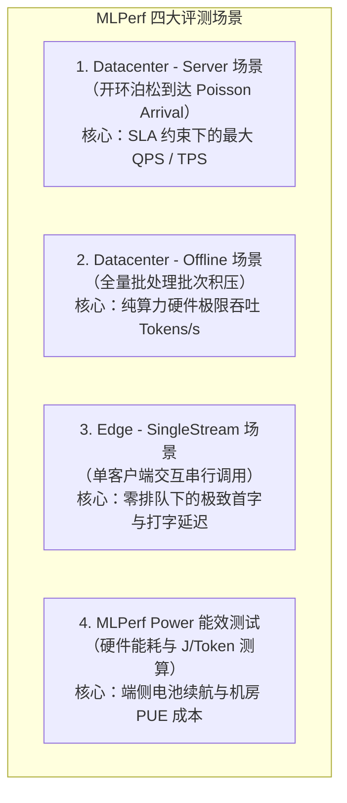
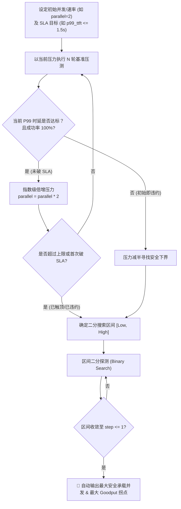

# 3. 性能压测与容量规划体系 (Performance Benchmark and Capacity)

> **核心定位**：建立可复现、可隔离、符合真实生产流量特征的**大模型推理性能与容量基准**。
> **工业界标杆对照**：吸收 **MLCommons MLPerf Inference** 的四大场景规范（Server 泊松分布、Offline 极限、Edge 单流、Power 能效），结合 **ModelScope EvalScope** 的 `sla-auto-tune` 自动二分寻优与多轮会话压测能力。
> **文档关系**：隶属于 [1-Master-Architecture-and-Design-Principles.md](1-Master-Architecture-and-Design-Principles.md)，为系统提供容量决策与硬件瓶颈下钻依据。

---

## 目录

1. [工业级性能评测的四大负载场景（MLPerf 范式）](#1-工业级性能评测的四大负载场景mlperf-范式)
2. [核心原子指标剖析与物理瓶颈定位](#2-核心原子指标剖析与物理瓶颈定位)
3. [EvalScope SLA Auto-Tune 自动寻优算法与拐点探测](#3-evalscope-sla-auto-tune-自动寻优算法与拐点探测)
4. [多轮会话与前缀缓存（Prefix Caching）评测](#4-多轮会话与前缀缓存prefix-caching-评测)
5. [硬件物理极限分析：MBU 访存带宽与 MFU 计算利用率](#5-硬件物理极限分析mbu-访存带宽与-mfu-计算利用率)
6. [生产集群容量规划测算模型（Capacity Sizing）](#6-生产集群容量规划测算模型capacity-sizing)

---

## 1. 工业级性能评测的四大负载场景（MLPerf 范式）

脱离真实业务请求分布的静态压测具有高度欺骗性。参考 MLCommons MLPerf 标准，必须将压测负载严格解耦为四类场景：



### 1.1 数据中心 Server 场景（生产在线服务标准）
* **流量模型**：采用**开环泊松过程（Open-loop Poisson Process）**模拟真实用户的随机到达。请求之间相互独立，会出现突发流量聚集（Burst Traffic）。
* **优化目标**：在满足业务双重 SLA（如 99% 的请求满足 $\text{TTFT} \le 1.5\text{s}$ 且 $\text{TPOT} \le 35\text{ms}$）的前提下，系统能稳定抗住的**最高到达率（Max QPS）与有效吞吐（Goodput）**。

### 1.2 数据中心 Offline 场景（离线批处理与重训推导）
* **流量模型**：所有请求在 $t=0$ 时刻已完全就绪，常驻请求队列深度饱和。
* **优化目标**：完全不限制单请求时延，允许调度器构建超大 Batch Size，榨干 GPU 每一个核心，测量系统的**绝对峰值吞吐量（Peak Token Throughput）**。
* **指导价值**：确定硬件算力水线，作为架构选型时的“性能上限参考”。

### 1.3 端侧 SingleStream 场景（Edge / PC / 车载场景）
* **流量模型**：客户端串行发起请求，只有收到上一个请求的完整响应后，才经过随机思考时间（Think Time）发送下一个请求（并发度严格恒等于 1）。
* **优化目标**：衡量在**零资源争用、零并发排队**状态下的物理极限延迟（TTFT 与 TPOT 的 P90/P99）。
* **适用设备**：Apple Mac Studio (M5/M6 Ultra)、NVIDIA Jetson / GB10 Spark、高通骁龙 PC 及车机座舱芯片。

### 1.4 MLPerf Power 能效场景（绿色与电池续航）
* **测算标尺**：
  $$\text{能效比 (Tokens/Joule)} = \frac{\text{系统总生成 Tokens 数}}{\text{测试期间累计功耗 (Joules)}} = \frac{\text{平均吞吐 (Tokens/s)}}{\text{平均功耗 (Watts)}}$$
* **业务价值**：在端侧评估设备发热降频（Thermal Throttling）风险与电池消耗；在数据中心评估机架配电功率约束下的每千瓦吞吐（TPS/kW）。

---

## 2. 核心原子指标剖析与物理瓶颈定位

大模型生成分为 **Prefill（首字预填充）** 与 **Decode（自回归增量生成）** 两个阶段，其计算特征与瓶颈截然相反：

```
       [Prompt 阶段 (Prefill)]               [生成阶段 (Decode, 自回归)]
  ┌───────────────────────────────┐     ┌───────────────────────────────────┐
  │ 计算特征：计算密集 (Compute-Bound)│     │ 计算特征：访存密集 (Memory-Bound)  │
  │ 核心瓶颈：Tensor Core 矩阵乘峰值 │ ──► │ 核心瓶颈：HBM / UMA 显存读取带宽  │
  │ 度量标尺：TTFT (Time To First) │     │ 度量标尺：TPOT / ITL (每 Token)    │
  └───────────────────────────────┘     └───────────────────────────────────┘
```

### 2.1 TTFT（Time To First Token，首字延迟）
* **物理定义**：从客户端发出 HTTP POST 请求到接收到流式输出（SSE）的第一个 Token chunk 的时间间隔。
* **影响因子**：输入 Prompt Token 长度、GEMM 算子吞吐、Chunked Prefill 切块粒度、网关网络延迟与调度排队时间。
* **用户体感**：决定了用户点击发送后的“等待焦虑期”。通常要求 $\text{TTFT} \le 1.0\sim2.0\text{s}$。

### 2.2 TPOT（Time Per Output Token）与 ITL（Inter-Token Latency）
* **物理定义**：
  * $\text{TPOT} = \frac{\text{接收到最后一个 Token 的时间} - \text{接收到首个 Token 的时间}}{\text{输出 Token 总数} - 1}$；
  * $\text{ITL}$：输出过程中相邻两个 Token 之间的瞬时时间差。
* **影响因子**：模型总参数量、当前 Batch Size、显存读取带宽（HBM 带宽）、多卡通信开销。
* **用户体感**：决定打字机流式输出的流畅度。人类最舒适的阅读速度是 $25\sim40\text{ tokens/s}$（对应 $\text{TPOT} = 25\sim40\text{ms}$）。若 $\text{TPOT} > 80\text{ms}$，用户会产生明显的“卡顿顿挫感”。

### 2.3 为什么必须看分位数（P50/P90/P99）而不是平均值？
大模型推理调度中存在严重的**行头阻塞（Head-of-Line Blocking）**：一个长达 32k 的长请求一旦进入 Batch 进行 Prefill 计算，会瞬间霸占 Tensor Core 数百毫秒，导致同批次内原本正在快速 Decode 输出的短对话用户出现严重的**瞬时停顿（ITL 骤增至数百毫秒）**。
因此，平均值会严重掩盖这种顿挫，必须紧盯 **P90 与 P99 分位数**。

---

## 3. EvalScope SLA Auto-Tune 自动寻优算法与拐点探测

在传统性能压测中，测试人员通常手动尝试并发数（如 1, 2, 4, 8, 16, 32...），记录结果并人工绘制图表，耗时且无法准确定位**“刚好不违约的最大吞吐拐点（Knee Point）”**。

ModelScope EvalScope 创新的 `sla-auto-tune` 机制通过**算法化二分查找**完美解决了这一难题：



### 3.1 核心寻优模式语法（EvalScope 规范）

#### 模式一：AND 复合强约束（同时满足首字与打字速度）
```json
[{"avg_ttft": "<=1.5", "avg_tpot": "<=0.035"}]
```
* **含义**：寻找同时满足“平均首字 $\le 1.5\text{s}$”且“平均每字 $\le 35\text{ms}$”的最大承载并发。任一指标超标即视为该并发级别失败。

#### 模式二：尾部 P99 严格防线
```json
[{"p99_ttft": "<=2.0"}, {"p99_latency": "<=5.0"}]
```
* **含义**：分别探索保障 99% 的请求首字不慢于 2s、以及总耗时不超过 5s 的极限抗压阈值。

#### 模式三：吞吐极值寻优（寻找算力饱和点）
```json
[{"tps": "max"}]
```
* **含义**：自动搜寻系统生成 TPS 达到峰值时对应的最佳 Batch/并发数，超过该并发数后 TPS 不再增长甚至因排队而下滑。

---

## 4. 多轮会话与前缀缓存（Prefix Caching）评测

传统压测每发一条请求都是完全随机独立的，完全无法评测生产中**多轮智能体（Agent）和系统提示词缓存（Radix Attention / APC）**的真实收益。

### 4.1 会话式压测机制对比

```
[传统单轮压测]
Request 1: [随机无关文本 1000 tok] ──► 生成 100 tok (Cache 命中率 = 0%)
Request 2: [随机无关文本 1000 tok] ──► 生成 100 tok (Cache 命中率 = 0%)

[EvalScope Multi-turn 压测]
Turn 1: [System Prompt (2k)] + [User Turn 1 (200)] ──► Prefill 2200 tok (Cache Miss)
Turn 2: [System Prompt (2k)] + [T1 Context (300)] + [User Turn 2 (200)] ──► 命中 2200 tok! (仅 Prefill 500 tok)
Turn 3: [System Prompt (2k)] + [T1+T2 Context (800)] + [User Turn 3 (200)] ──► 命中 2700 tok!
```

### 4.2 诊断与度量指标
1. **第 2~N 轮 TTFT 削减比（TTFT Reduction Ratio）**：
   $$\text{Cache 收益比} = \frac{\text{Turn 1 TTFT}}{\text{Turn } N\text{ TTFT}} \quad (\text{理想状态下应提升 } 5\sim10\times)$$
2. **KV 显存节约度**：
   * 开启 Prefix Caching 后，相同显存池内能够容纳的**并发会话数应提升 $2\sim3$ 倍**。

---

## 5. 硬件物理极限分析：MBU 访存带宽与 MFU 计算利用率

为了让底座 Infra 工程师具有明确的算子与内核级调优依据，评测系统必须引入**屋顶模型（Roofline Model）**计算实际利用率：

### 5.1 访存带宽利用率（MBU, Memory Bandwidth Utilization）
在自回归 Decode 阶段，由于 Batch 中每个 Token 都需要把数十 GB 的模型权重从显存读入缓存，系统通常处于**显存带宽瓶颈（Memory Bound）**：

$$\mathbf{MBU (\%)} = \frac{\text{实际访存吞吐 (GB/s)}}{\text{硬件理论 HBM/UMA 峰值带宽 (GB/s)}} \times 100\%$$

* **单步解码最小显存搬运量计算**：
  $$\text{单步数据搬运量} = \text{模型参数量} \times \text{权重字节数} + \sum_{b=1}^{B} (\text{上下文长度}_b \times \text{KV Cache 字节数})$$
* **工程判断标尺**：
  * $\text{MBU} \ge 75\%$：优秀，底层通信与算子已接近硬件物理极限；
  * $\text{MBU} < 50\%$：低下，说明张量并行通信阻塞、PagedAttention 内存碎片过多或 Batch 组装效率低下。

### 5.2 模型浮点计算利用率（MFU, Model Flops Utilization）
主要用于衡量 Prefill 阶段与离线批处理（Offline）阶段的矩阵乘算力利用率：

$$\mathbf{MFU (\%)} = \frac{\text{实测吞吐 (Tokens/s)} \times \text{每 Token 理论计算量 (FLOPs)}}{\text{硬件标称峰值算力 (TFLOPS)} \times \text{加速卡数量}} \times 100\%$$
* *注：对于标准稠密 Transformer 模型，单 Token 理论计算量约为 $2 \times P$ FLOPs（$P$ 为活跃模型参数量）。*

---

## 6. 生产集群容量规划测算模型（Capacity Sizing）

基于上述测试出的基准数据，Infra 工程师可以精准回答 PM 的硬件采购与算力预算问题：

```
                生产容量推导公式 (Capacity Sizing Formula)

  目标日常 QPS 需求                SLA 约束下单卡/单节点容量 (EvalScope 测得)
   [ Target QPS ]      ──► ➗ ──►    [ Max Sustained QPS under SLA ]
         │                                       │
         └───────────────────┬───────────────────┘
                             ▼
              [ 理论基准节点数 (Raw Nodes) ]
                             │
                             ▼  ✖ 安全冗余系数 (Buffer ~ 1.35)
              [ 生产最终部署规模 (Production Fleet Size) ]
```

* **测算案例**：
  * 某金融场景要求日常峰值 $\text{QPS} = 300$；
  * 业务 SLA 约束：$95\%$ 的请求 $\text{TTFT} \le 1.0\text{s}$，$\text{TPOT} \le 30\text{ms}$；
  * 经 EvalScope `sla-auto-tune` 在单台双路 NVIDIA H20 / GB10 节点上实测，满足该 SLA 的最大稳定 $\text{QPS} = 28$；
  * 则理论所需节点数 $= \lceil 300 / 28 \rceil = 11\text{ 台}$；
  * 考虑故障容灾与峰值缓冲（取冗余系数 $1.3$），建议最终生产采购集群规模为 **$15$ 台**。

---

> [!TIP]
> 掌握了精度门禁与性能测试理论后，如何快速把 EvalScope 命令与 CI/CD 自动化集成起来？请阅读 **[4. 工具链实战与看板落地 (4-Tooling-Pipelines-and-Dashboards.md)](4-Tooling-Pipelines-and-Dashboards.md)**。
