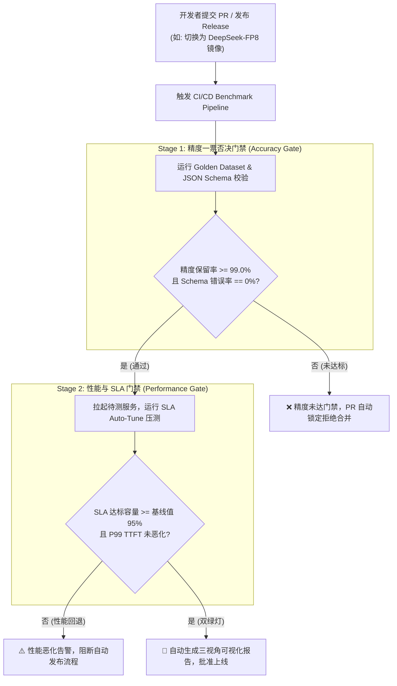

# 4. 工具链实战与看板落地 (Tooling Pipelines and Dashboards)

> **核心定位**：提供可直接执行的压测命令模板、可直接接入持续集成的 CI/CD 自动化门禁脚本、以及面向不同利益相关方的可观测监控大屏设计。
> **工程落地底座**：基于 **ModelScope EvalScope** 压测框架、OpenAI API 规范与 Grafana / Prometheus 监控生态。
> **文档关系**：隶属于 [1-Master-Architecture-and-Design-Principles.md](1-Master-Architecture-and-Design-Principles.md)，提供具体的实施脚手架。

---

## 目录

1. [环境准备与工具链安装](#1-环境准备与工具链安装)
2. [EvalScope 生产级压测命令实战库](#2-evalscope-生产级压测命令实战库)
   * 2.1 [脚本一：数据中心 SLA 自动二分寻优压测](#21-脚本一数据中心-sla-自动二分寻优压测)
   * 2.2 [脚本二：真实多轮会话与 Prefix Caching 收益验证](#22-脚本二真实多轮会话与-prefix-caching-收益验证)
   * 2.3 [脚本三：端侧设备 SingleStream 交互与能效测试](#23-脚本三端侧设备-singlestream-交互与能效测试)
   * 2.4 [脚本四：生产真实脱敏流量 Trace 回放压测](#24-脚本四生产真实脱敏流量-trace-回放压测)
3. [CI/CD 自动化基准回归门禁流水线](#3-cicd-自动化基准回归门禁流水线)
4. [三重视角可观测看板设计（Grafana 规范）](#4-三重视角可观测看板设计grafana-规范)
   * 4.1 [PM / 业务决策大屏](#41-pm--业务决策大屏)
   * 4.2 [应用开发者 Debug 面板](#42-应用开发者-debug-面板)
   * 4.3 [推理 Infra 工程师底层诊断面板](#43-推理-infra-工程师底层诊断面板)
5. [团队实施推进 CheckList](#5-团队实施推进-checklist)

---

## 1. 环境准备与工具链安装

EvalScope 原生支持主流推理框架（vLLM、SGLang、LMDeploy、TensorRT-LLM、Triton 及 Ollama 等）的兼容接口。

```bash
# 1. 创建独立虚拟环境并安装 EvalScope 全功能套件
conda create -n benchmark python=3.10 -y
conda activate benchmark
pip install --upgrade evalscope[perf]

# 2. 验证安装与支持协议
evalscope perf --help
```

---

## 2. EvalScope 生产级压测命令实战库

### 2.1 脚本一：数据中心 SLA 自动二分寻优压测
* **目标**：自动测出在满足业务要求（99% 请求 $\text{TTFT} \le 1.5\text{s}$ 且 $\text{TPOT} \le 35\text{ms}$）的前提下，单机所能承载的**极限并发数与最大有效吞吐**。

```bash
#!/usr/bin/env bash
# run_sla_tune.sh: 数据中心在线业务 SLA 极限自动寻优

evalscope perf \
  --model Qwen2.5-72B-Instruct \
  --tokenizer-path /models/Qwen2.5-72B-Instruct \
  --url http://127.0.0.1:8000/v1/chat/completions \
  --api openai \
  --dataset random \
  --min-prompt-length 2048 \
  --max-prompt-length 2048 \
  --max-tokens 512 \
  --sla-auto-tune \
  --sla-variable parallel \
  --sla-params '[{"p99_ttft": "<=1.5", "p99_tpot": "<=0.035"}]' \
  --parallel 4 \
  --sla-lower-bound 2 \
  --sla-upper-bound 128 \
  --sla-num-runs 3 \
  --extra-args '{"temperature": 0.0, "ignore_eos": true}'
```

---

### 2.2 脚本二：真实多轮会话与 Prefix Caching 收益验证
* **目标**：应用开发者验证模型在多轮对话中，开启 Prefix Cache（如 Radix Attention）前后的首字延迟下降倍数。

```bash
#!/usr/bin/env bash
# run_multi_turn_cache.sh: 多轮对话与前缀缓存收益压测

evalscope perf \
  --model Qwen2.5-72B-Instruct \
  --tokenizer-path /models/Qwen2.5-72B-Instruct \
  --url http://127.0.0.1:8000/v1/chat/completions \
  --api openai \
  --dataset /data/benchmark/multiturn_agent_cases.jsonl \
  --prompt-format multi-turn \
  --parallel 16 \
  --number 300 \
  --log-every-n-query 50
```

---

### 2.3 脚本三：端侧设备 SingleStream 交互与能效测试
* **目标**：在 Apple Mac Studio (M5/M6 Ultra)、NVIDIA GB10 Spark、高通 PC 或边缘盒子等端侧硬件上，测量**单用户纯交互下的极致低延迟**。

```bash
#!/usr/bin/env bash
# run_edge_single_stream.sh: 端侧零并发极速单流测试

evalscope perf \
  --model Qwen2.5-7B-Instruct \
  --tokenizer-path /models/Qwen2.5-7B-Instruct \
  --url http://127.0.0.1:8000/v1/chat/completions \
  --api openai \
  --dataset random \
  --parallel 1 \
  --number 100 \
  --min-prompt-length 512 \
  --max-prompt-length 512 \
  --max-tokens 256 \
  --extra-args '{"ignore_eos": true}'
```
> [!NOTE]
> 在执行端侧单流测试时，推荐在后台并行启动功耗监控（macOS 下使用 `sudo powermetrics -i 1000 --samplers cpu_power,gpu_power`，Linux/Jetson 下使用 `tegrastats`），用于同步计算单 Token 能耗（Joules/Token）。

---

### 2.4 脚本四：生产真实脱敏流量 Trace 回放压测
* **目标**：按真实流量的时间戳与 Prompt 长度分布重放历史请求，模拟生产高峰期的波峰波谷。

```bash
#!/usr/bin/env bash
# run_trace_replay.sh: 生产脱敏 Trace 真实分布回放

evalscope perf \
  --model Qwen2.5-72B-Instruct \
  --tokenizer-path /models/Qwen2.5-72B-Instruct \
  --url http://127.0.0.1:8000/v1/chat/completions \
  --api openai \
  --dataset /data/benchmark/prod_sanitized_trace.jsonl \
  --rate 25 \
  --rate-type poisson \
  --number 2000
```

---

## 3. CI/CD 自动化基准回归门禁流水线

每当 Infra 团队修改推理引擎版本（如升级 vLLM / SGLang）、启用新的量化模型（如 FP8/NVFP4）或调整调度参数时，通过流水线强制触发**双重门禁（精度门禁 $\rightarrow$ 性能门禁）**：



### GitHub Actions / GitLab CI 核心配置示意
```yaml
name: Model Inference Benchmark Gate

on:
  pull_request:
    branches: [ main ]
    paths:
      - 'models/**'
      - 'engine_configs/**'

jobs:
  benchmark-gate:
    runs-on: [self-hosted, gpu-benchmark-runner]
    steps:
      - name: Checkout Code
        uses: actions/checkout@v4

      - name: Start Inference Engine Container
        run: |
          docker run -d --name test-engine --gpus all -p 8000:8000 \
            -v /models:/models vllm/vllm-openai:latest \
            --model /models/target-model --max-model-len 8192

      - name: Stage 1 - Run Accuracy Gate
        run: |
          python scripts/accuracy_gate_runner.py \
            --base-url http://127.0.0.1:8000 \
            --threshold 0.99 \
            --output accuracy_report.json

      - name: Stage 2 - Run SLA Auto-Tune Performance Benchmark
        if: success()
        run: |
          bash scripts/run_sla_tune.sh > perf_report.txt

      - name: Post Summary to PR Comment
        uses: actions/github-script@v7
        with:
          script: |
            const fs = require('fs');
            const acc = fs.readFileSync('accuracy_report.json', 'utf8');
            const perf = fs.readFileSync('perf_report.txt', 'utf8');
            github.rest.issues.createComment({
              issue_number: context.issue.number,
              owner: context.repo.owner,
              repo: context.repo.repo,
              body: `### 🎯 Benchmark Regression Gate Report\n\n**Accuracy Gate:**\n\`\`\`json\n${acc}\n\`\`\`\n\n**Performance SLA Summary:**\n\`\`\`text\n${perf}\n\`\`\``
            });
```

---

## 4. 三重视角可观测看板设计（Grafana 规范）

在生产与测试环境中，监控数据自底向上采集，但在 Grafana 中分设**三个专有 Dashboard**，避免信息超载：

### 4.1 PM / 业务决策大屏
* **受众**：产品总监、项目经理、运维负责人。
* **核心组件**：
  1. **SLA 达标状态红绿灯**（Stat Panel）：实时显示当前时间窗口内 SLA 达标率（目标：$\ge 99.5\%$）；
  2. **生产带载用户水位表**（Gauge Panel）：当前活跃并发数 / 测定的最大安全承载并发数；
  3. **单任务业务成本曲线**（Time Series）：结合 GPU 租金与 Token 消耗，展示“每万次服务实际支出”；
  4. **首屏加载满意度指数**（Bar Gauge）：TTFT $< 1\text{s}$（绿 / 极佳）、$1\sim2\text{s}$（黄 / 可接受）、$> 2\text{s}$（红 / 严重超时）。

### 4.2 应用开发者 Debug 面板
* **受众**：AI 应用研发工程师、Agent 架构师、Prompt 工程师。
* **核心组件**：
  1. **格式解析异常率（Format Error Rate）**：JSON Schema 校验失败与非预期输出事件流；
  2. **长文本响应延迟散点图**：X 轴为 Prompt Token 长度（0~64k），Y 轴为 TTFT，直观呈现“长 Prompt 带来的性能衰减斜率”；
  3. **前缀缓存命中率（Radix Cache Hit Rate）**：分业务场景展示 System Prompt 缓存复用度；
  4. **单请求生命周期时序瀑布图**：分解 `网关排队耗时` $\rightarrow$ `Prefill 首字耗时` $\rightarrow$ `Decode 解码耗时`。

### 4.3 推理 Infra 工程师底层诊断面板
* **受众**：AI 基础设施工程师、算子优化专家、硬件选型架构师。
* **核心组件**：
  1. **TTFT / TPOT / ITL 细粒度分位曲线**：P50、P90、P99 对比，快速捕获行头阻塞长尾；
  2. **MBU（访存带宽利用率）仪表盘**：实时对比实际显存读写量与 HBM 理论峰值；
  3. **KV Cache 内存健康度**：已分配 Block 数、空闲 Block 数、PagedAttention 内存碎片率、请求抢占（Preemption）次数；
  4. **GPU 硬件深度指标（DCGM）**：SM 利用率、Tensor Core 活动率、显存温度、PCIe / NVLink 跨卡通信吞吐。

---

## 5. 团队实施推进 CheckList

| 周期 | 实施目标 | 关键交付物 | 验收标准 |
| :--- | :--- | :--- | :--- |
| **第 1 周：基准工具链就绪** | 部署 EvalScope 环境，跑通固定长宽比基线测试 | 1. 跑通 `vLLM` / `SGLang` 裸机接口测试；<br>2. 产出单卡在 $1\text{k in} / 128\text{ out}$ 下的基线数据。 | 能够稳定复现 P50/P99 TTFT 与 TPOT 指标。 |
| **第 2 周：业务测试集与门禁** | 构建企业 500 条黄金数据集，打通精度门禁判定脚本 | 1. 业务 JSON Schema 校验脚本；<br>2. 业务 Golden Dataset 构建与基线得分沉淀。 | 量化或引擎升级时，能够自动输出 $\ge 99.0\%$ 门禁判定报告。 |
| **第 3 周：SLA 自动寻优与容量测算** | 引入 `sla-auto-tune`，测定生产机型的最大带载容量 | 1. 产出各机型（如 H20 / GB10 / Mac Studio）的容量基准；<br>2. 绘制并发与 Goodput 拐点曲线。 | 给出精准的生产部署台数测算建议（Capacity Sizing）。 |
| **第 4 周：流水线与看板落地** | 接入 GitLab/GitHub CI 门禁，上线 Grafana 三视角大屏 | 1. CI 自动化回归测试流水线；<br>2. PM、开发、Infra 三套 Grafana 看板上线。 | 新模型或新配置上线完全实现“一键自动化验证与红绿灯决策”。 |
