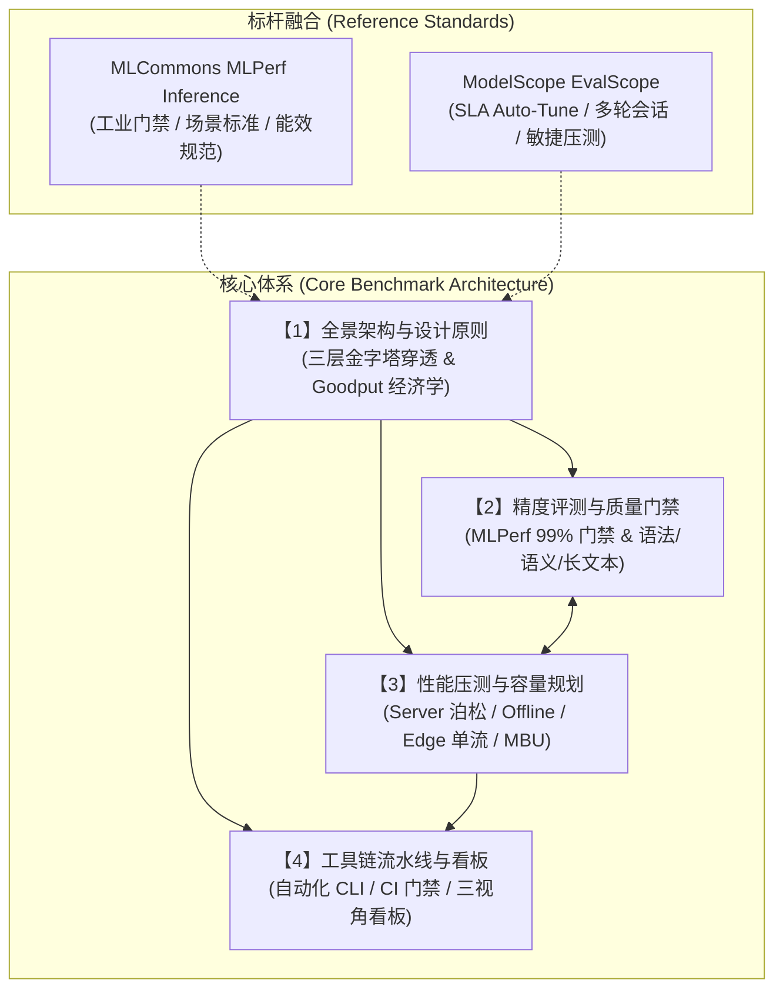

# 大模型推理 Benchmark 体系 (Inference Benchmark System)

> **核心定位**：融合工业级金标准 **MLCommons MLPerf Inference** 与敏捷全栈套件 **ModelScope EvalScope**，建立贯穿**“项目经理/业务方（PM/User）- 应用开发者（App Dev）- 推理底座工程师（Infra Eng）”**三重视角的企业级大模型推理评测体系。
>
> 🌐 **在线导读页**：👉 **[大模型推理 Benchmark 体系](index.html)**

---

## 🧭 模块知识库导航

本目录严格遵循知识库约定：**`1-Master-Architecture-and-Design-Principles.md` 为全景主文档，统领并引用其余专题文档。**

```
InferenceBenchmarkSystem/
├── README.md                                    # 📌 本文件：模块全景导航与架构速查
├── 1-Master-Architecture-and-Design-Principles.md # 🌟【主文档】全景架构、三层指标穿透金字塔与 Token 经济学模型
├── 2-Accuracy-Benchmark-and-Gating.md           # 🎯 精度评测与质量门禁（MLPerf 一票否决制、Schema 校验、长文本衰减）
├── 3-Performance-Benchmark-and-Capacity.md      # ⚡ 性能压测与容量规划（MLPerf 四大场景、SLA Auto-Tune 寻优、MBU 访存瓶颈）
├── 4-Tooling-Pipelines-and-Dashboards.md        # 🛠️ 工具链实战与看板落地（EvalScope 脚本、CI/CD 门禁、Grafana 三视角看板）
└── 5-Execution-Plan.md                          # 🚀 架构方法论执行计划（三层交付、四大技术域、七项工作流）
```

---

## 🎯 三重视角与快速导引

| 利益相关方 (Stakeholder) | 核心关注诉求 | 推荐阅读路径 | 核心关注指标 |
| :--- | :--- | :--- | :--- |
| **项目经理 / 业务方 (PM & User)** | 业务能否完成？体感卡不卡？每个任务花费多少？ | [主文档 §2.1](1-Master-Architecture-and-Design-Principles.md#21-pm--业务层极简高可解释性的业务大屏)<br>[看板指南 §3.1](4-Tooling-Pipelines-and-Dashboards.md#31-pm--业务决策看板) | 任务完成率 (Pass Rate)、SLA 承载容量、有效 Token 成本 (CPM-Q) |
| **应用开发者 (App Developer)** | 为什么长文本变笨？换量化为何 JSON 解析报错？缓存生效了吗？ | [精度评测文档 §2](2-Accuracy-Benchmark-and-Gating.md#2-结构化遵循与-tool-calling-测试)<br>[性能文档 §3](3-Performance-Benchmark-and-Capacity.md#3-多轮会话与前缀缓存-prefix-caching-评测) | JSON Schema 合规率、Needle 衰减曲线、Prefix Cache 提速比、超时率 |
| **推理底座工程师 (Infra Engineer)** | 机器带载极限在哪？瓶颈在算力还是显存带宽？量化能否上线？ | [性能压测文档 §1-§4](3-Performance-Benchmark-and-Capacity.md)<br>[工程脚本 §1-§2](4-Tooling-Pipelines-and-Dashboards.md#1-evalscope-perf-生产级实战脚本) | TTFT/TPOT (P50/P99)、Goodput 饱和拐点、MBU (访存带宽利用率)、显存碎片率 |

---

## 🏗️ 架构全景速查图


