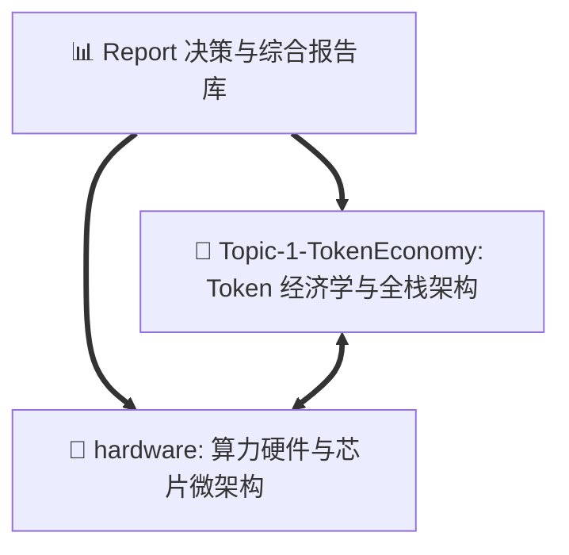

# 综合研究报告与决策简报 (Research Reports & Executive Briefings)

> **目录定位**：本目录归档面向**技术决策者（CTO / 架构师）**、**AI 基础设施团队**与**企业战略管理层**的高维综合研究报告、季度执行简报（Executive Briefing）与产业白皮书，提炼跨主题核心洞见与可落地行动指引。

---

## 📂 核心报告全景索引

| 序号与报告名称 | 报告类型 | 核心面向对象 | 核心内容与决策价值 |
| :--- | :--- | :--- | :--- |
| 🎨 [Token-Economics-and-Inference-Infra-Presentation.html](file:///Users/will/github/TokenResearch/Report/Token-Economics-and-Inference-Infra-Presentation.html) | **交互式分享展示大屏 (HTML)** | 跨团队汇报 / 同事技术分享 | **全栈降本图文汇报大屏（可直接投屏/浏览器打开）**：包含五层蛋糕动效、三大算力阵营矩阵、前沿模型全景与内置交互式 TCO 降本计算器 |
| 📘 [1-Executive-Summary-TokenEconomics-2026.md](file:///Users/will/github/TokenResearch/Report/1-Executive-Summary-TokenEconomics-2026.md) | **高管决策总简报** | CTO / 业务负责人 / 架构师 | **2026 Token 经济学与大模型推理降本全景决策手册**：涵盖五层全栈架构、三大算力阵营选型、PD/AM 两维解耦调度与 100x 企业降本路径 |
| 📑 [Topic-1-TokenEconomy/1-Infra-TokenCostReduction-Report.md](file:///Users/will/github/TokenResearch/Topic-1-TokenEconomy/1-Infra-TokenCostReduction-Report.md) | **全栈技术大白皮书** | Infra 工程师 / 系统研发 | **AI 基础设施 100 倍降本全栈技术报告**：深度剖析硬件选型、算子优化、异构调度与 SOTA 开源模型 |
| 🚀 [hardware/README.md](file:///Users/will/github/TokenResearch/hardware/README.md) | **算力硬件全景手册** | 硬件选型 / 运维专家 | **全球主流算力芯片与微架构深度剖析**：H20、Blackwell、OpenAI Jalapeño、GB10、Mac Studio 512GB UMA 等 |

---

## 🧭 全库跨主题导航指引

* **主题一**：[Topic-1-TokenEconomy: Token 经济学、全栈架构与策略实操](file:///Users/will/github/TokenResearch/Topic-1-TokenEconomy/)
* **硬件专题**：[hardware: 算力芯片、自研 ASIC 与 UMA 算子优化](file:///Users/will/github/TokenResearch/hardware/)
