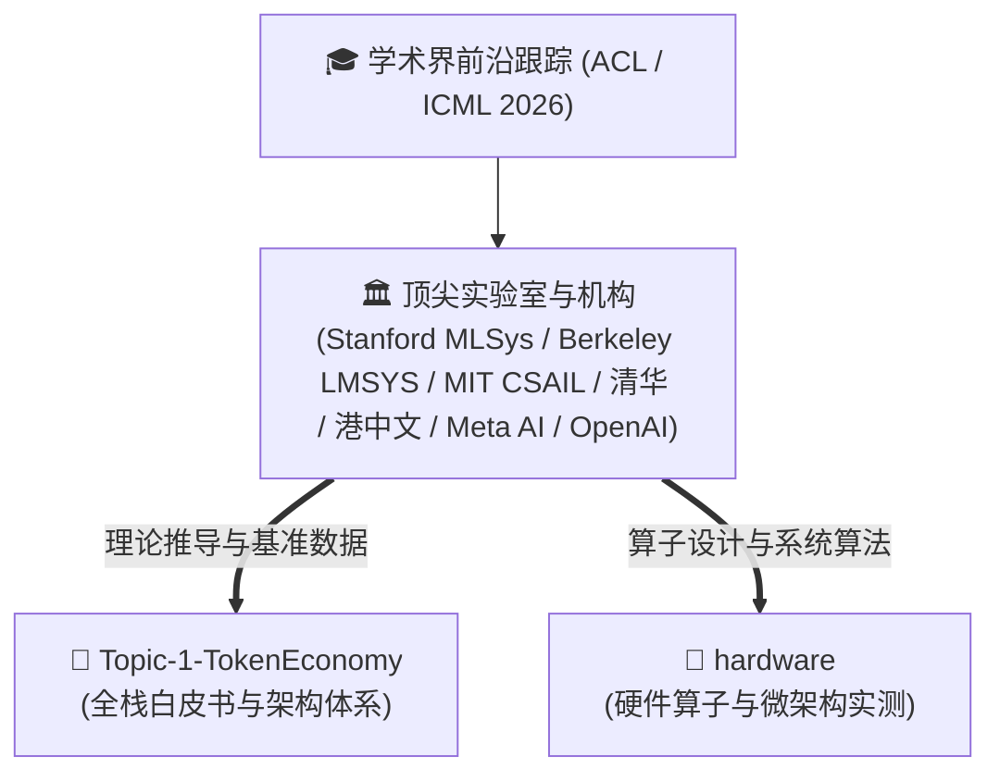

# 待办研究计划与学术前沿跟踪清单 (Research TODO & Academic Roadmap)

> **定位**：本清单跟踪记录学术界（顶级学术会议与全球顶尖实验室）在 **AI Infrastructure、大模型推理系统、Token 经济学与微架构优化** 领域的最新前沿成果，用于后续补充学术界理论证明、基准评测与演进观点。

---

## 📌 待补充学术前沿专题 (Academic Paper TODO)

### 1. ACL 2026 最值得推荐的 AI Infra 论文
- [ ] **调研与评述**：梳理 ACL 2026（计算语言学年会）中针对 **大模型推理吞吐、长上下文建模与长程 Attention 优化** 的核心 Infra / System 论文；
- [ ] **核心重点方向**：
  * **超长上下文与稀疏/线性循环注意力**：超越传统二次方复杂度的序列压缩、状态维护机制与 Needle In A Haystack 评估；
  * **多模态 Token 化与多模态高效对齐**：Text / Image / Video 统一 Token 联合推理中的计算瓶颈与端到端优化；
  * **端到端 Agent 交互中的延迟削减**：多轮 Tool Calling 与多步环境交互下的 Token 压缩与状态复用。

### 2. ICML 2026 最值得推荐的 AI Infra 论文
- [ ] **调研与评述**：梳理 ICML 2026（国际机器学习大会）中关于 **MLSys、分布式调度算法、算子自动化生成与近存/异构算力利用** 的重磅论文；
- [ ] **核心重点方向**：
  * **两维解耦分布式调度（PD 分离 × AM 分离）**：Prefill-Decode Disaggregation 与 Attention-MoE 分离在多租户异构集群下的最优调度理论与竞争比保证；
  * **新一代投机采样与扩散并行生成**：如 DFlash / DFlash 2、多 Token 并行预测（MTP）的数学收敛性与接受率上限推导；
  * **AI 驱动的高性能 Kernel 自动化生成**：如 Meta KernelEvolve、Kernel Forge 等基于 Agent 与 MCTS 树搜索的高性能异构内核编译与自动调优；
  * **近存计算与 UMA 统一内存的算子极限融合**：突破内存墙（Memory Wall）的硬件感知算子设计理论。

---

## 🧭 后续学术界观点补充规划

* **补充阶段**：待文献库检索与精读完成后，将学术界核心观点、公式推导与 Benchmark 整理为独立学术篇章，归档进 `Topic-1-TokenEconomy/` 并联动主文档。
