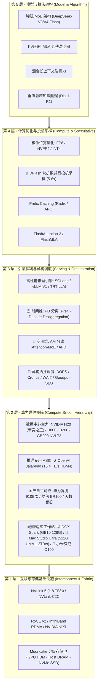
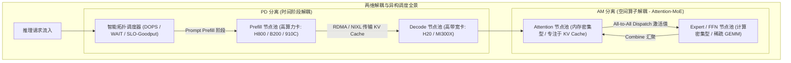
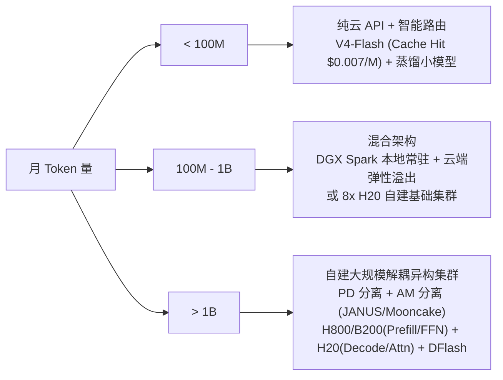

# Infra 层 Token 降本增效调研报告

> **核心命题**：`每百万 Token 成本 = 年化 TCO / 年化吞吐 Tokens`  
> **三大抓手**：DataCenter 硬件选型 × 端侧推理卸载 × 软件栈深度优化  
> **调研时间**：2026 年 8 月 · 基于 WAIC 2026 Token 经济学共识及最新行业数据

---

## 目录

1. [总览：Token 降本的 Infra 全景图](#1-总览token-降本的-infra-全景图)
2. [DataCenter 侧：算力硬件对比与选型](#2-datacenter-侧算力硬件对比与选型)
3. [端侧推理：DGX Spark (GB10) 与边缘算力](#3-端侧推理dgx-spark-gb10-与边缘算力)
4. [软件层：推理引擎与系统优化](#4-软件层推理引擎与系统优化)
5. [组合策略：三层联动的降本路径](#5-组合策略三层联动的降本路径)
6. [结论与建议](#6-结论与建议)

---

## 1. 总览：Token 降本的 Infra 全景图

2026 年，AI 产业的基础设施评估标尺已彻底从"理论算力峰值（FLOPS）"转向财务指标——**TCO（总拥有成本）与每百万 Token 生产成本**。

### 1.1 宏观规模爆发与 Token 经济学核心飞轮

* **宏观调用量狂飙**：
  * **中国日均 Token 调用量**（国家数据局 2026.3）：突破 **140 万亿**（两年暴涨 **1400 倍**，约为 OpenAI 与 Google Gemini 日均之和的 3 倍）；
  * **OpenAI API**：日均 **21.6 万亿**（150 亿/分钟）；**Google Gemini**：日均 **43 万亿**；
  * **摩根大通预测**：中国 AI 推理 Token 消耗将从 2025 年的约 10 千万亿激增至 2030 年的 **3900 千万亿**（**5 年再涨 370 倍**）。

* **核心经济学公式**：

$$\text{每百万 Token 成本 (CPM)} = \frac{\text{年化总拥有成本 (Annual TCO)}}{\text{年化实际有效吞吐 (Annual Goodput Tokens)}} \times 10^6$$

* **降本的三重乘数效应公式**（腾讯研究院模型）：
  $$\text{Token 成本年降幅} = \underbrace{\text{硬件能效提升 (2–3x)}}_{\text{Blackwell / H20 / Jalapeño}} \times \underbrace{\text{算法架构革新 (2–3x)}}_{\text{MoE / MLA / V4-Flash}} \times \underbrace{\text{系统解耦优化 (2–4x)}}_{\text{PD+AM分离 / DFlash / 裸机引擎}} \approx \mathbf{5\text{–}10\times / \text{年}}$$

* **杰文斯悖论（Jevons Paradox）**：
  2022–2026 年间同等能力 Token 单价暴跌了 **99.9%**（从 \$60/M 降至 \$0.06/M），但全球企业 AI 云支出从 115 亿美元飙升至 **370 亿美元**（翻了 3 倍多）。**Infra 降本的核心价值不是“内卷做小蛋糕”，而是通过拉低门槛引爆潜在场景（Agent、代码审查、具身智能）的数万倍爆发**。

---

### 1.2 Infra 全栈降本增效五层全景架构



---

### 1.3 五层全栈技术矩阵与收益速览

| 层级 | 核心模块 | 代表技术 / 产品 | 降本增效核心机制 | 典型收益 |
| :--- | :--- | :--- | :--- | :---: |
| **L5 模型架构** | 稀疏计算 & KV压缩 | **DeepSeek-V4-Flash** / MLA | 284B 总参仅激活 13B；MLA 压缩 KV Cache 93% | **5x – 10x** 算力/显存压缩 |
| **L4 计算优化** | 投机采样 & 混合精度 | **🔥 DFlash** / NVFP4 / APC | 块扩散单步预测整块 Token (89%+ 接受率)；FP4 吞吐翻倍 | **3x – 6x** 生成加速 |
| **L3 调度解耦** | 分布式解耦 & 异构调度 | **PD分离** / **AM分离 (JANUS)** / **DOPS** | 消除行头阻塞与资源搁浅；按需独立配比 Attention 与 Expert 算力 | **2x – 4x** 集群有效 Goodput |
| **L2 算力硬件** | 数据中心 / ASIC / 端侧 | **H20** / **B200** / **Jalapeño** / **GB10** | H20 以 15% 算力保 120% 带宽；GB10/O100/Mac Studio 端侧承接零边际成本 | **3x – 5x** TCO 优化 |
| **L1 互联存储** | 高速直传 & 分级卸载 | **NIXL RDMA** / **NVLink5** / **Mooncake** | 微秒级跨卡 KV 搬运；统一 HBM-DRAM-SSD 分级存储池 | 支撑千万级长上下文 |

---

### 1.4 2026 年 AI 基础设施四大范式转移

1. **从"算力优先"转向"带宽与拓扑优先"**：自回归解码（Decode）本质是显存带宽受限。H20、Blackwell 与 Jalapeño 的演进证明，显存带宽与高速互联对 Token 经济学的贡献远超单纯的 FLOPS 堆叠。
2. **从"单体同构混部"转向"多维解耦与异构调度"**：PD 分离（时间维）+ AM 分离（空间维）将大模型计算细粒度拆解，使 H800（高算力）、H20（高带宽）、端侧 NPU 各展所长，彻底告别资源搁浅。
3. **从"云端中心化"转向"端云协同与零边际成本"**：GB10（128GB UMA）、Mac Studio（M5/M6 Ultra 512GB UMA）与小米玄戒 O100（1.22 TB/s 近存）使 80% 的日常推理、Agent 循环下沉至本地，实现 \$0.00 边际成本。
4. **从"人类对话消费"转向"智能体（Agent）自主机器消费"与价值极化**：人类注意力的天花板被打破，Agent 7×24 小时机器级消耗爆发。**不到 5% 的高价值可编程 Token（代码/法律/科研）创造了超过 80% 的商业价值**，对底层架构的稳定性与高吞吐提出极端要求。

---

## 2. DataCenter 侧：算力硬件对比与选型

### 2.1 NVIDIA GPU 硬件矩阵

#### 核心规格对比

| GPU | 架构 / 工艺 | 显存 (GB) | 带宽 (TB/s) | FP8 (TFLOPS) | FP4 (TFLOPS) | TDP (W) | 互联带宽 | 参考价格 (\$) |
| :--- | :--- | :---: | :---: | :---: | :---: | :---: | :--- | :---: |
| **A800** | Ampere / 7nm | 80 HBM2e | 2.0 | — (624 INT8) | — | 400 | NVLink 400 GB/s | 11,000 |
| **H800** | Hopper / 4N | 80 HBM3 | 3.35 | 1,979 | — | 700 | NVLink 400 GB/s | 24,000 |
| **H20** | Hopper / 4N | 96 HBM3 | 4.0 | 296 | — | 400 | NVLink 900 GB/s | 12,500 |
| **H100 SXM** | Hopper / 4N | 80 HBM3 | 3.35 | 1,979 | — | 700 | NVLink 900 GB/s | 35,000 |
| **H200 SXM** | Hopper / 4N | 141 HBM3e | 4.8 | 1,979 | — | 700 | NVLink 900 GB/s | 40,000 |
| **B200** | Blackwell / 4NP | 192 HBM3e | 8.0 | 4,500 | 9,000 | 1,000 | NVLink5 1.8 TB/s | 38,000 |
| **GB200 NVL72** | Blackwell / 4NP | 13.8 TB (72 GPU) | 576 总计 | 324K (集群) | 648K (集群) | 120 kW (机柜) | NVLink5 域 | 3.5M (机柜) |

#### 推理经济性对比（70B 模型 FP8，自建集群）

| GPU | 每百万 Token 成本 | Tokens/秒/瓦 | 最佳场景 |
| :--- | :---: | :---: | :--- |
| **A800** | \$0.35 – \$0.55 | 0.35 – 0.5 | 7B-13B 小模型推理 |
| **H800** | \$0.20 – \$0.30 | 0.65 – 0.9 | 全能型（算力完整） |
| **H20** | \$0.14 – \$0.22 | 0.75 – 1.1 | **Decode 专用卡**（带宽之王） |
| **H100** | \$0.18 – \$0.28 | 0.70 – 1.0 | 全球基准 |
| **H200** | \$0.11 – \$0.16 | 1.10 – 1.5 | 大显存+高带宽 |
| **B200** | \$0.05 – \$0.09 | 2.50 – 3.8 | **下一代标杆**，3-5x 降本 |
| **GB200 NVL72** | \$0.03 – \$0.06 | 4.00 – 6.0 | **超大规模推理** |

> [!NOTE]
> 估算假设：生产集群 \>70% 利用率，Continuous Batching，3年硬件摊销，\$0.10/kWh 电费，标准 SLA（TTFT \< 300ms, TPOT \< 50ms），输入输出 3:1 比例。

---

### 2.2 H20 深度分析：「带宽之王」的推理经济学

H20 是理解 Token 经济学的典型案例——**用算力换带宽**：

```
H20 vs H100 对比：
├── 算力 (FP8):  296 TFLOPS  vs  1,979 TFLOPS  (仅 15%)
├── 显存容量:    96 GB       vs  80 GB          (120%)
├── 显存带宽:    4.0 TB/s    vs  3.35 TB/s      (119%)
├── 价格:        $12,500     vs  $35,000         (36%)
└── 功耗:        400W        vs  700W            (57%)
```

**为什么 H20 在推理上如此划算？**

LLM 推理的 Decode 阶段是**显存带宽瓶颈**（Memory-Bandwidth Bound）：每生成一个 Token 需要遍历全部模型权重，计算强度（Arithmetic Intensity）仅为 `Batch Size / 2 Bytes`。在交互式推理的典型 Batch Size（1-32）下，H100 的 1,979 TFLOPS 算力大量闲置等待内存传输，而 H20 以 4.0 TB/s 带宽 + 1/3 价格实现了**等效甚至更优的单用户 Decode 速度**。

> [!TIP]
> **PD 分离的最佳搭档**：H20 做 Decode + H800 做 Prefill，将每个阶段放到最优硬件上。这也是国内云厂商的主流部署策略。

---

### 2.3 Blackwell 代际跃迁：25x 能效比提升

Blackwell 架构（B200 / GB200 / GB300）带来的不是增量改进，而是**量级跃迁**：

| 创新点 | 具体能力 | Token 成本影响 |
| :--- | :--- | :--- |
| **原生 FP4** | 2nd Gen Transformer Engine 支持 4-bit 浮点 | 相比 FP8 吞吐再翻倍 |
| **192 GB HBM3e** | 单卡可载 70B FP16 或 200B+ INT4 | 减少所需 GPU 数，直接降低 TCO |
| **8.0 TB/s 带宽** | 2.4x H100 | Decode 速度 2.4x 提升 |
| **NVLink5 1.8 TB/s** | 机柜级 130 TB/s 全互联 | 大模型多卡并行效率极高 |
| **GB300 专用注意力引擎** | 10.7 TeraExponentials/s | 硬件加速 Attention 计算 |

**NVIDIA 官方基准**：GB200 NVL72 在万亿参数 MoE 模型推理上，相比 H100 集群实现 **25x-35x 能效比提升**，每百万 Token 成本降至 **\$0.03-0.06**。

---

### 2.4 国产算力替代

#### 华为昇腾 Ascend 910B / 910C

| 型号 | 算力 (FP16) | 显存 | 带宽 | TDP | 推理性能 vs A800 | TCO 优势 |
| :--- | :---: | :---: | :---: | :---: | :---: | :--- |
| **910B** | ~600 TFLOPS | 64 GB HBM2e | 1.2 TB/s | 400W | ~60-70% | 政采补贴 + 自主可控，TCO 低 30-50% |
| **910C** | ~800-1,000 TFLOPS | 96 GB HBM | 1.8-3.2 TB/s | 650W | 接近 H800 级 | 对标 H800 的国产主力 |

**软件生态**：CANN + MindSpore + MindIE 推理引擎 + `vLLM-Ascend` 适配 + `Triton-Ascend` 编译器。2026 年生态成熟度显著提升，DeepSeek-V3/R1 已有昇腾原生优化内核。

> [!WARNING]
> 昇腾的核心挑战仍然是**软件生态差距**：模型从 CUDA 迁移到 CANN 需要 2-6 个月工程投入。`torch_npu` 后端降低了迁移成本，但深度优化仍需专门工程。

#### 其他国产芯片

| 厂商 | 代表产品 | 核心规格 | 定位 |
| :--- | :--- | :--- | :--- |
| **天数智芯** | 智铠100 (MR-V100) | 32 GB HBM2e, 192 TOPS INT8, 150W | 推理专用，低功耗高效率 |
| **壁仞科技** | BR100 / BR104 | 64 GB HBM2e, 2048 TOPS INT8, 550W | 高性能通用计算 |
| **寒武纪** | MLU370 / MLU590 | 48 GB LPDDR5, 256 TOPS INT8 | 边缘-云推理 |
| **摩尔线程** | MTT S4000 | 48 GB GDDR6, 200 TOPS INT8 | MUSA 生态 |

> [!NOTE]
> WAIC 2026 天数智芯副总裁石加圣指出："在核心大语言模型推理业务上，国产芯片一定程度上可以提供相当高的商业价值，甚至高于英伟达的一些产品。" 这里的"高于"指的是特定场景下的 **TCO 性价比**，而非绝对性能。

---

### 2.5 🌶️ OpenAI Jalapeño（墨西哥辣椒）：推理专用 ASIC 的新范式

OpenAI 的首款自研推理芯片 **Jalapeño**（代号"墨西哥辣椒"）于 2026 年 8 月底公布完整实测结果与架构细节。这是 OpenAI 联合 **Cerebras**、Broadcom 等深度定制，打通“模型 — 软件 — 芯片 — 数据中心”全链路的标志性突破。

#### 核心规格与系统特性

| 项目 | 规格参数 | 说明 / 竞争对比 |
| :--- | :--- | :--- |
| **定位** | LLM & Agent 推理专用 ASIC | 彻底剔除训练与通用计算税，专为大模型自回归解码设计 |
| **矩阵算力** | **13.4 PFLOPS**（MXFP4） | 约为 B200 FP4 (9 PFLOPS) 的 1.5x |
| **显存容量与带宽** | **216 GB HBM4** · **15.4 TB/s** | 带宽约为 B200 (8 TB/s) 的近 **2 倍**，彻底打通自回归内存墙 |
| **架构拓扑** | NUMA 式 64 内存/计算切片 | 晶圆级近存互联（Cerebras 合作协同），KV Cache 明确就地保留 |
| **功耗表现** | 额定 TDP 700W | 实测典型持续工作负载功耗保持在 **$\le$ 550W** |
| **研发周期 (AI for EDA)** | **仅耗时 9 个月完成 Tape-out** | 借助 AI 模型优化算术电路，大幅缩短流片与验证周期 |
| **算子生成 (AI for Kernel)** | **Codex 自动生成 Attention/MoE** | GPT-Astra 驱动的 Codex 生成算子比人类专家手写版**快 1.5～1.8 倍** |
| **部署计划** | 2026 年底内部集群部署 | Gen 2 进入深度开发，Gen 3 开始成形；不对外单独销售硬件 |

#### 权威性能基准（SemiAnalysis InferenceX 实测 vs NVIDIA GB300）

在 SemiAnalysis 发布的公开基准 **InferenceX** 测试中，Jalapeño 在各类模型与负载下全面占据 **Pareto Frontier（帕累托前沿）**：

```
InferenceX 帕累托前沿对比 (Jalapeño vs NVIDIA GB300):
├── 峰值每瓦 AI 吞吐:
│   ├── OpenAI GPT-OSS 120B:  Jalapeño 达 GB300 的 1.9x
│   ├── DeepSeek R1 670B:     Jalapeño 达 GB300 的 1.7x (峰值) ──> 低延时下暴增至 104.3x 🚀
│   └── Kimi K2.5 1T (MoE):   Jalapeño 达 GB300 的 1.5x (峰值) ──> 高速解码下扩至 56.1x 🚀
├── 端到端交互延迟:
│   └── 相比现有最佳系统降低至 1/1.7 ～ 1/3.6 (Kimi K2.5 端到端延迟缩短 3.4 倍)
└── 交互式 Agent 工作负载综合能效: 提升 2.1x – 4.1x
```

* **🔥 极限低延迟解码场景的惊人突破**：
  * 在 **DeepSeek R1 670B** 相同低延迟解码要求下，Jalapeño 的能效达到 **12,258 mixed TPS/kW**，而 GB300 仅为 118 mixed TPS/kW，**单位电力吞吐优势高达 104.3 倍**！
  * 在 **Kimi K2.5 1T** 规模下，随着单用户交互速度提升，每瓦吞吐优势最高扩大至 **56.1 倍**。

#### 三档运行模式与对 Token 经济学的影响

OpenAI 将 Jalapeño 带来的效率飞跃划分为三个档位：
1. **Ultra-fast 模式**：以过去只有 Fast 模式才有的极低能耗，提供超高交互极速体验；
2. **Fast 模式**：达到过去只有 Batch 大批处理模式才有的超高能效比；
3. **Batch 模式**：在海量离线/异步推理中进一步将每百万 Token 生产成本压至物理极限。

> 📄 **完整技术报道与背景分析**：请参阅 [hardware/2-OpenAI墨西哥辣椒自研芯片.md](file:///Users/will/github/TokenResearch/hardware/2-OpenAI%E5%A2%A8%E8%A5%BF%E5%93%A5%E8%BE%A3%E6%A4%92%E8%87%AA%E7%A0%94%E8%8A%AF%E7%89%87.md)。

> [!WARNING]
> **Jalapeño 的产业启示**：
> 1. **定义了推理架构从通用 GPU 向专用 ASIC 转移的终局** — 类似 Google TPU、AWS Inferentia，自研芯片彻底免除 NVIDIA 硬件毛利税与通用架构冗余；
> 2. **AI 辅助硬件设计与算子生成（AI for System）成为新生产力** — 9 个月流片、Codex 生成算子超越人类手写 1.8 倍，使专用芯片研发的门槛与周期大幅降低；
> 3. **反哺全球 API 价格战** — OpenAI 内部 Token 生产成本的大幅削减，将持续压低公有云 API 标价，加速行业迈入 1 美分/百万 Token 时代。

---

### 2.6 📱 小米玄戒 O100：端侧 AI 协处理器的破局

小米于 2026 年 8 月 24 日发布自研 AI 加速芯片 **玄戒 O100**，定位端侧大模型推理协处理器，是国内手机/IoT 厂商自研 AI 芯片的重要里程碑。

#### 核心规格

| 项目 | 规格 |
| :--- | :--- |
| **工艺** | **6nm** |
| **封装** | 全球首款 **3D Wafer-on-Wafer** 垂直堆叠 + Hybrid Bonding（1.4μm 键合间距） |
| **架构** | **近存计算**（NPU 晶圆与 DRAM 晶圆垂直堆叠，极短数据路径） |
| **计算核心** | **14 核高算力 NPU** + 高带宽矩阵总线 |
| **内存带宽** | **1.22 TB/s**（传统旗舰手机内存带宽的 **16x**） |
| **推理速度** | **330 tokens/s**（MiMo-3B 端侧模型） |
| **定位** | 与主 SoC（玄戒 O3）协同工作的 AI 协处理器 |
| **商用时间** | **2027 年** |
| **应用场景** | 手机、汽车、机器人 |

#### 技术突破：近存计算破解"内存墙"

```
传统端侧 AI 架构：
  SoC ←——长距离总线——→ 外置 DRAM
  瓶颈：数据搬运延迟 >> 计算延迟

玄戒 O100 近存架构：
  NPU 晶圆
  ═══════════  ← Hybrid Bonding (1.4μm)
  DRAM 晶圆
  → 数据几乎"零距离"到达计算单元
  → 1.22 TB/s 带宽，是传统方案 16x
```

#### 对端侧 Token 经济学的影响

| 维度 | 传统旗舰手机 NPU | 玄戒 O100 |
| :--- | :---: | :---: |
| 内存带宽 | ~75 GB/s | **1.22 TB/s**（16x） |
| 3B 模型推理速度 | ~30-50 tok/s | **330 tok/s**（7-10x） |
| 可运行模型上限 | 1-3B | **3-7B**（带宽充足支撑更大模型） |
| 用户体验 | 卡顿明显 | **实时流畅** |

> [!TIP]
> **玄戒 O100 的战略价值**：
> - **330 tok/s 的 3B 模型推理**意味着端侧 Agent 可以"思考即回答"，用户体验接近云端
> - 1.22 TB/s 近存带宽是 DGX Spark (273 GB/s) 的 **4.5x**，虽然总容量小得多，但在小模型上的带宽效率极高
> - 作为协处理器，不占用主 SoC 资源 → 手机可以同时运行 AI 推理 + 日常应用
> - 2027 年量产后，**数亿台小米设备**将具备高速端侧推理能力 → 大规模分散化 Token 生产

---

## 3. 端侧推理：DGX Spark (GB10) 与边缘算力

### 3.1 NVIDIA DGX Spark 详细规格

DGX Spark（原 Project DIGITS，CES 2025 发布，2025 年 10 月上市）是 NVIDIA 首款**桌面级个人 AI 超级计算机**。

| 组件 | 规格 |
| :--- | :--- |
| **超级芯片** | **GB10** Grace Blackwell Superchip |
| **CPU** | 20 核 Arm Neoverse（10x Cortex-X925 + 10x Cortex-A725） |
| **GPU** | Blackwell 架构，5th Gen Tensor Cores |
| **AI 算力** | **1 PFLOPS**（FP4 + 结构化稀疏） |
| **统一内存** | **128 GB LPDDR5X**（CPU/GPU 共享，NVLink-C2C 互联） |
| **内存带宽** | 273 GB/s |
| **存储** | 1-4 TB NVMe Gen5 SSD |
| **网络** | ConnectX-7 (10GbE/200Gbps), WiFi 7, USB4 |
| **功耗** | GB10 SoC ~140W，系统总功耗 ~170-240W |
| **尺寸** | 约 150×150×50mm（Mac Mini 大小），1.2 kg |
| **价格** | **\$3,999 – \$4,699** |
| **扩展** | **两台可通过 ConnectX 连接 → 256 GB 统一内存** |

### 3.2 模型承载能力

| 模型 | 量化格式 | 显存占用 | 单台可运行？ | 双台可运行？ |
| :--- | :---: | :---: | :---: | :---: |
| Llama 3.1 8B | FP16 | ~16 GB | ✅ | ✅ |
| Qwen3-32B | NVFP4 | ~20 GB | ✅ | ✅ |
| Llama 3.1/3.3 70B | NVFP4/INT4 | ~38-72 GB | ✅（128K 上下文） | ✅ |
| Mistral Large 2 (123B) | NVFP4 | ~68 GB | ✅ | ✅ |
| DeepSeek-R1-Distill-70B | NVFP4 | ~40 GB | ✅ | ✅ |
| Llama 3.1 405B | NVFP4 | ~210 GB | ❌ | ✅（256 GB） |

### 3.3 吞吐量基准

| 模型 | 精度 / 引擎 | 单流吞吐 | 聚合吞吐（多并发） |
| :--- | :--- | :---: | :---: |
| Llama 3.2 3B | FP16 / TRT-LLM | 120-160 tok/s | ~1,200 tok/s |
| Llama 3.1 8B | FP8 / vLLM | 45-65 tok/s | ~850 tok/s |
| Qwen 2.5 Coder 32B | NVFP4 / vLLM | 18-25 tok/s | ~720 tok/s |
| Llama 3.3 70B | NVFP4 / vLLM + Speculative | 15-22 tok/s | ~695 tok/s（256流） |

> [!NOTE]
> 273 GB/s LPDDR5X 带宽是核心瓶颈，远低于数据中心 HBM 的 2-8 TB/s。DGX Spark 的优势不在吞吐，在于**固定成本 + 隐私 + 无API计费**。

### 3.4 TCO 对比：DGX Spark vs 云 API

#### DGX Spark 月度 TCO
| 成本项 | 月费用 |
| :--- | :--- |
| 硬件摊销（3 年） | \$116.67 |
| 电费（150W × 720h × \$0.15/kWh） | \$16.20 |
| **月度总 TCO** | **~\$133** |

#### 盈亏平衡分析

| 月 Token 量 | 云 70B API (\$0.70/M) | 云前沿 API (\$6/M) | DGX Spark TCO | 赢家 |
| :--- | :---: | :---: | :---: | :--- |
| 10M | \$7 | \$60 | \$133 | ☁️ 云 API |
| 50M | \$35 | \$300 | \$133 | ☁️ vs 70B / 🏠 vs 前沿 |
| **190M（交叉点）** | **\$133** | \$1,140 | **\$133** | ⚖️ 平衡 |
| 500M | \$350 | \$3,000 | \$133 | 🏠 **Spark 省 \$217/月** |
| 1B | \$700 | \$6,000 | \$133 | 🏠 **Spark 省 \$567/月** |

> [!IMPORTANT]
> **关键结论**：
> - 对比**廉价 70B 云 API**（\$0.70/M），交叉点在 **~190M tokens/月**（~6.3M/天）
> - 对比**前沿模型 API**（\$6/M），交叉点仅 **~22M tokens/月**（~730K/天）
> - 持续运行 Agent 场景（24/7 背景任务），DGX Spark 的**零边际成本**优势巨大

---

### 3.5 🍎 Apple Mac Studio (M5 Ultra / M6 Ultra 512GB UMA)：桌面级海量内存与千亿模型常驻平台

> 🔗 **官方产品页参考**：[Apple Mac Studio 官网](https://www.apple.com/mac-studio/) · *"The ultimate pro desktop. Exceptional performance. Extensive connectivity. Runs powerful AI on device."*

Apple Silicon 在端侧/工作站领域的最大护城河在于其成熟的 **统一内存架构（UMA, Unified Memory Architecture）** 与极高内存带宽。配备 **M5 Ultra / M6 Ultra** 的 Mac Studio 是目前全球唯一能在**桌面级 150W–250W 功耗下，单机常驻运行 405B～670B 顶尖大模型**的计算平台。

#### 核心规格与微架构特性（基于 Apple 官网技术规范）

| 规格维度 | Mac Studio (M5 Ultra / M6 Ultra 顶配) | 技术优势与架构特性 |
| :--- | :--- | :--- |
| **芯片形态** | **M5 Max**（单芯片）/ **M5 Ultra / M6 Ultra**（UltraFusion 互联） | Quad-Die UltraFusion 互联，Die 间双向带宽 **> 2.5 TB/s**，逻辑合一呈现给操作系统 |
| **统一内存容量 (UMA)** | **最高 512 GB 统一内存** | CPU、GPU、Neural Engine 完全共享 512GB 物理内存，**零 Host-Device 内存拷贝** |
| **内存带宽** | **高达 1.2 TB/s – 1.6 TB/s** | 约为 NVIDIA GB10 (273 GB/s) 的 **4.4x – 5.8x**，直接打破大模型解码内存墙 |
| **AI 矩阵与计算核** | 最高 32 核 CPU + 80 核 GPU + 64 核 Neural Engine | GPU 集成 Neural Accelerators，全面支持 FP8 / FP4 / INT4 微块计算与 Metal 加速 |
| **扩展互联** | **Thunderbolt 5 (高达 120 Gb/s)** | 支持多台 Mac Studio 通过 Thunderbolt 5 构建超高速共享内存集群（3x 分布式推理） |
| **整机功耗** | **150W – 250W** | 极低待机与满载功耗，支持 7×24 小时不间断本地 Serving 且无需工业级机房散热 |
| **软件生态** | **Apple MLX** 原生框架 + `llama.cpp` (Metal Shading Language) | 专为 Apple UMA 设计的就地张量运算，完全绕过 Python 内存拷贝开销 |
| **参考售价** | \$3,999（基础版）～ \$8,999（512GB 顶配版） | 相当于企业租用 8×A100 云节点 1.5–2 个月的租金 |

#### 模型承载力与 Token 生成吞吐（MLX / Metal 实测）

```
Mac Studio (512GB UMA) 本地单机承载能力全景:
├── 670B 顶尖模型 (DeepSeek-V3 / DeepSeek-R1 4-bit/FP8):
│   └── 显存占用: ~380 GB ──> 单机常驻运行 (无需 8 卡 GPU 集群与网络组网!)
│   └── 解码速度: ~15-22 tok/s (支持 128K 超长上下文)
├── 405B 超大模型 (Llama 3.1 405B NVFP4/INT4):
│   └── 显存占用: ~220 GB ──> 单机轻松运行，吞吐 ~20-28 tok/s
├── 70B 级主力模型 (Llama 3.3 70B / Qwen 2.5 72B FP8):
│   └── 显存占用: ~75 GB ──> 极速解码 ~60-80 tok/s
└── 14B–32B 编程/Agent 模型 (Qwen 2.5 Coder 32B):
    └── 显存占用: ~22 GB ──> 狂暴吞吐 ~120-180 tok/s 🚀
```

---

### 3.6 💻 端侧/边缘算力“三足鼎立”横向全景对比

| 硬件平台 | 核心代表产品 | 显存/内存形态 | 显存带宽 | 算力与精度 | 功耗 (TDP) | 单机最大模型承载 | 核心降本增效定位 |
| :--- | :--- | :--- | :---: | :---: | :---: | :---: | :--- |
| **NVIDIA DGX Spark** | **GB10** Grace Blackwell | 128GB LPDDR5X UMA | 273 GB/s | 1 PFLOPS (FP4) | ~140W | 123B (单) / 405B (双) | CUDA 生态绝对统治力，高算力、极致量化（NVFP4）与企业级 Agent |
| **Apple Mac Studio** | **M6 / M5 Ultra** | **512GB LPDDR5X UMA** | **1.2–1.6 TB/s** | 600+ TFLOPS (FP8) | ~200W | **670B (单机常驻)** | **海量内存与 1.2TB/s 高带宽之王**，免除集群通信税，长上下文与千亿模型本地化 |
| **小米玄戒 (手机/端侧)** | **Xuanjie O100** | 3D 近存晶圆堆叠 | **1.22 TB/s** (近存) | 14 核专有 NPU | ~5-15W | 3B–7B | 手机/车载/机器人近存计算，3B 模型 **330 tok/s 极速推理**，数亿端侧去中心化 |

---

### 3.7 ⚡ GB10 与 Mac Studio (UMA 架构) 算子深度优化专题

针对 GB10 与 Mac Studio 这种 **UMA 统一内存架构**，算子级深度优化具有决定性价值：

- **核心矛盾**：带宽利用率与片上缓存驻留决定了端侧 Token 生产效率的上限。
- **四大关键优化**：
  1. **Attention 优化**：GB10 依托 Blackwell **TMEM（256KB/SM）** 与 **TMA 异步流水线**；Mac Studio 依托 **Metal SDPA (Scaled Dot-Product Attention)** 算子流水线；
  2. **GEMM 优化**：GB10 原生 **NVFP4 微块量化（SM120）**；Mac Studio 依托 **MLX FP8/INT4 向量矩阵混合执行**，显存搬运量下降 75%；
  3. **UMA 零拷贝红利**：CPU 与 GPU 共享物理内存，**Prefix Caching 维护、文档解析（如 mu25 图像读取）直接指针共享**，彻底清零 PCIe 数据传输等待；
  4. **CPU-GPU 异构协同与投机采样**：Grace CPU / Apple M-series 多核 CPU 负责分词（Tokenization）与运行轻量 Draft 模型，GPU 满载进行 Verify 单次并行验证，解码提速至 **40–80 tok/s**。

> 📄 **完整专题技术报告**：请参阅独立技术专著 [hardware/1-GB10-UMA-OperatorOptimization.md](file:///Users/will/github/TokenResearch/hardware/1-GB10-UMA-OperatorOptimization.md) 及 [hardware/4-Apple-MacStudio-M5-M6-Ultra-UMA.md](file:///Users/will/github/TokenResearch/hardware/4-Apple-MacStudio-M5-M6-Ultra-UMA.md)

---

## 4. 软件层：推理引擎与系统优化

### 4.1 三大推理引擎对比

| 维度 | vLLM V1 | SGLang | TensorRT-LLM |
| :--- | :--- | :--- | :--- |
| **核心优势** | 生态最广，模型/硬件覆盖全 | RadixAttention 前缀复用，Agent 场景最优 | NVIDIA 硬件最深度优化 |
| **关键特性** | PagedAttention v2, APC, Chunked Prefill | Radix Tree KV Cache, Jump-Forward Decoding | XQA Kernels, NVFP4, CUDA Graph |
| **硬件支持** | NVIDIA, AMD, Intel, TPU, Ascend | NVIDIA, AMD | **仅 NVIDIA** |
| **吞吐（H100, 70B FP8）** | 3,000-5,000 tok/s/GPU | 与 vLLM ±5%（通用），前缀场景 1.5-3x 优势 | 4,000-6,000 tok/s/GPU（**最快 15-25%**） |
| **最佳场景** | 通用部署，多硬件 | RAG / Agent / 多轮对话 / DeepSeek | 纯 NVIDIA 栈，极致性能 |

### 4.2 系统级优化技术矩阵

#### 4.2.1 存储层：KV Cache 管理

| 技术 | 原理 | 效果 | 成熟度 |
| :--- | :--- | :--- | :---: |
| **PagedAttention v2** | 类 OS 虚拟内存分页管理 KV Cache | 显存碎片从 60-80% 降至 \<4%，并发 3-5x | ✅ 生产 |
| **Prefix Caching (APC)** | 哈希链检测并复用共享前缀的 KV | Prefill 计算节省 50-90% | ✅ 生产 |
| **RadixAttention** | Radix Tree 管理全局 KV Cache，支持分支复用 | Agent/多轮场景有效吞吐 2-5x | ✅ 生产 |
| **KV Cache 压缩** | 将 KV Cache 量化为 INT8/INT4 | 等效上下文或并发翻 2-4x | 🔄 新兴 |
| **分级存储卸载** | HBM → DRAM → SSD 多级 KV Cache | 支持百万级上下文 | 🔄 新兴 |

#### 4.2.2 调度层：批处理技术

| 技术 | 原理 | 效果 | 成熟度 |
| :--- | :--- | :--- | :---: |
| **Continuous Batching** | 迭代级动态调度，请求完成即退场、新请求即刻插入 | GPU 利用率 30% → 85-92% | ✅ 生产 |
| **Chunked Prefill** | 长 Prompt 分片切块处理，与 Decode 步骤无缝交错 | P99 逐词延迟（ITL）降 70%，消除 HOL 阻塞 | ✅ 生产 |

---

### 4.3 分布式解耦架构与异构算力调度（PD 分离 × AM 分离 × 异构协同）

2025–2026 年，大模型推理架构正经历从**单体同构混部**向**多维解耦与异构协同**的根本性转变。



#### 4.3.1 PD 分离（Prefill-Decode Disaggregation）深度剖析

**1. 根本矛盾：混部架构的"相干干扰"**
- **Prefill 阶段（计算密集型）**：高算强 GEMM 操作，突发高并发，追求极致 FLOPS 以压低首字延迟（TTFT）。
- **Decode 阶段（显存带宽密集型）**：低算强 GEMV 操作，逐 Token 顺序生成，追求极致内存带宽以保障逐词延迟（TPOT < 50ms）。
- **混部恶果**：长 Prompt 的 Prefill 强行抢占 GPU Tensor Core，造成严重的**行头阻塞（Head-of-Line Blocking）**与"计算气泡"，导致正在进行的 Decode 任务 P99 延迟暴增 3-5 倍。

**2. PD 分离架构工作流**
1. **Prefill 池**：由计算密集型硬件（如 H800、B200、Ascend 910C）组成，专门执行高并行 GEMM 运算生成初始 KV Cache。
2. **高速 KV 传输**：通过 **NVIDIA NIXL（Inference Xfer Library）**、RoCE v2 或 InfiniBand RDMA 实现微秒级显存直传。
3. **Decode 池**：由显存带宽密集型硬件（如 H20、MI300X）承接，专注顺序生成，吞吐稳定无抖动。

**3. 代表系统与收益**
- **Mooncake（Moonshot AI / Kimi）**：KVCache 为中心的分离架构，构建 GPU HBM + Host DRAM + SSD + RDMA 统一分级存储池。
- **DistServe / Splitwise**：学术与工程先驱，集群在满足严格 SLA 下的 **有效吞吐（Goodput）提升 1.5x–3.0x**，P99 延迟下降 70–80%。

---

#### 4.3.2 AM 分离（Attention-MoE Disaggregation / AFD）前沿解析

在 MoE 架构（如 DeepSeek-V3/V4、Mixtral）成为主流后，推理基础设施出现了第二维解耦——**Attention 层与 Expert (FFN) 层的空间解耦**。

| 模块 | 特征属性 | 硬件瓶颈 | 最优硬件画像 |
| :--- | :--- | :--- | :--- |
| **Attention 层** | 内存密集型（KV Cache 随上下文线性膨胀） | HBM 显存容量与读写带宽 | 大容量 HBM / LPDDR5X（如 H20, Spark） |
| **Expert (FFN) 层** | 计算密集型（多专家激活，稀疏 GEMM 计算） | Tensor Core 算力 / 专家通信 | 高 TFLOPS / 低延迟互联（如 B200, TPU, LPU） |

**核心机制与前沿方案**：
1. **Dispatch & Combine 两阶段调度**：Attention 节点计算完 QKV 后，将隐藏状态通过高效 All-to-All 网络 **Dispatch（分发）** 给对应的 Expert 节点；计算完成后再 **Combine（汇聚）** 返回。
2. **JANUS 架构（2025/2026）**：
   - 彻底将 Attention 与 Expert 划分到独立 GPU 池。
   - 引入微秒级激活调度器与两阶段自适应通信机制，消除 MoE 专家热点不均问题，大幅提升硬件饱和度。
3. **MegaScale-Infer（字节跳动）**：生产级 Attention-MoE 分离系统，实现 Attention 与 MoE 的独立弹性扩缩容，通过流水线深度重叠通信与计算开销。
4. **NVIDIA / Groq 异构 AFD**：GPU 负责 Attention 维护，专用 LPU/ASIC 负责超快 FFN 矩阵乘。
5. **vLLM AFD Plugin（2026）**：vLLM 官方引入 AFD 插件支持，允许用户独立配置 Attention 集群与 MoE 专家集群配比。

> [!TIP]
> **AM 分离的核心收益**：彻底消除**资源搁浅（Stranded Resources）**。传统架构中若上下文拉长，显存被 Attention 占满导致 FFN 算力闲置；若并发加大，算力被 FFN 占满导致显存闲置。AM 分离允许按 `1:N` 或 `N:1` 的灵活比例独立堆叠 Attention 和 Expert 硬件，综合硬件利用率从 45% 提升至 **85%+**。

---

#### 4.3.3 异构算力协同调度（Heterogeneous Compute Scheduling）

当前企业现实往往是"新旧卡混搭、国内外芯片并存"（H100 + H800 + H20 + 昇腾 910B/C + 边缘算力）。异构调度负责让各芯片"各司其职"：

**1. 算力-负载阶段精准映射（Phase-Aware Mapping）**
- **Prefill 阶段 & MoE 专家层** $\rightarrow$ 分配至高算力卡（H800、B200、Ascend 910C、OpenAI Jalapeño）
- **Decode 阶段 & Attention 层** $\rightarrow$ 分配至高带宽/大显存卡（H20、AMD MI300X、Ascend 910B、GB10、Mac Studio）

**2. 部分解耦预填充（Partially Disaggregated Prefill，如 Cronus）**
- 针对跨节点网络带宽受限的集群，采用流水线分段：长 Prompt 的浅层 Prefill 在低算力卡（如 H20）上预热流式计算，深层与 Decode 阶段在高算力卡（如 H800）上重叠，降低 50% 的跨卡 KV 搬运压力。

**3. 动态算子调度（DOPS - Dynamic Operator Scheduling）**
- 突破静态阶段绑定，根据各 GPU 节点的实时显存压力、队列长度与互联拓扑，微秒级动态决定当前 Layer 的 Attention 与 GEMM 算子下发位置。

**4. 流体随机控制调度（Fluid-Guided Scheduling，如 WAIT / Nested WAIT）**
- 针对长尾生成长度未知的真实场景，利用随机控制理论实时调控 Prefill 准入速率与 Decode 迁移策略，彻底避免突发并发导致的显存 OOM 崩溃。

**5. SLO-Goodput 导向优化**
- 评估标尺从"原始吞吐（Tokens/s）"全面转向**满足 SLA 的有效吞吐（Goodput）**。通过将对延迟敏感的 VIP 请求调度至高算力池、容忍延迟的批处理请求沉淀至低成本异构池，实现单位 TCO 下有效价值产出最大化。

**5. SLO-Goodput 导向优化**
- 评估标尺从"原始吞吐（Tokens/s）"全面转向**满足 SLA 的有效吞吐（Goodput）**。通过将对延迟敏感的 VIP 请求调度至高算力池、容忍延迟的批处理请求沉淀至低成本异构池，实现单位 TCO 下有效价值产出最大化。

---

### 4.4 计算优化层：量化与投机采样

**量化技术**

| 方法 | 位宽 (W/A) | 显存节省 | 吞吐提升 | 精度损失 | 硬件要求 |
| :--- | :---: | :---: | :---: | :--- | :--- |
| **FP8 (E4M3)** | 8/8 | 50% | 1.8-2.2x | \<0.05 PPL | Hopper / Blackwell |
| **INT8 (SmoothQuant)** | 8/8 | 50% | 1.4-1.7x | \<0.1 PPL | Ampere+ 通用 |
| **AWQ (4-bit)** | 4/16 | 70-75% | 1.3-1.8x | \<0.2 PPL | 通用 GPU |
| **GPTQ (4-bit)** | 4/16 | 70-75% | 1.3-1.7x | \<0.3 PPL | 通用 GPU |
| **NVFP4** | 4/4 | 75% | 2.5-4.0x | \<0.8% | **仅 Blackwell** |

> [!NOTE]
> **2026 年共识**：FP8 已成为生产推理的**默认选择**，主流模型均提供 FP8 检查点。FP4 在 Blackwell 上是下一代标准。

**投机采样（Speculative Decoding）**

| 方法 | 原理 | 加速比 | 特点 |
| :--- | :--- | :---: | :--- |
| **Draft Model** | 小模型（1-8B）草拟 K 个 Token → 大模型单次验证 | 2-3x | 需加载两个模型 |
| **Medusa** | 目标模型额外多个预测头并行出词 | 2-3x | 无需额外模型 |
| **EAGLE-3** | 多层隐状态融合 + 轻量解码层 | 2.5-3.5x | 接受率 80-88% |
| **🔥 DFlash** | **块扩散并行草稿** — 单次前向生成整块 Token | **5-6x+** | **接受率 89%+，比 EAGLE-3 快 2.5x** |
| **DeepSeek MTP** | 预训练阶段内建多 Token 预测模块 | 1.5-1.8x | 零额外开销 |
| **N-gram Lookup** | 从输入中匹配重复子串 | 1.4-1.8x | 无需训练，适合代码/JSON |

#### DFlash 深度解析：下一代投机采样

DFlash 是 2026 年投机采样领域的重大突破，**从根本上改变了草稿模型的工作方式**：

```
传统自回归草稿（EAGLE-3）：
  t₁ → t₂ → t₃ → t₄ → t₅  （逐个生成，5 次前向传播）
  
DFlash 块扩散草稿：
  [mask, mask, mask, mask, mask] → [t₁, t₂, t₃, t₄, t₅]  （并行生成，1 次前向传播）
```

**核心创新**：

| 维度 | EAGLE-3（自回归草稿） | DFlash（块扩散草稿） |
| :--- | :--- | :--- |
| **草稿策略** | 顺序逐 Token 生成 | 非因果注意力，整块并行生成 |
| **草稿成本** | 随 Token 数线性增长 | **恒定（与 Token 数无关）** |
| **草稿模型深度** | 必须极浅（1-2层）以控制延迟 | 可以更深更表达力强 |
| **加速上限** | 2-3.5x | **5-6x+** |
| **接受率** | 80-88% | **89%+** |

**实测基准**：

| 目标模型 | 任务 | DFlash 加速比 | vs EAGLE-3 |
| :--- | :--- | :---: | :---: |
| Qwen3-8B | 通用生产栈 | ~3x | +50% |
| Qwen3-8B | Math500 | 5.1x | +100%+ |
| Gemma 4 (31B) | 数学/代码/对话 | 5.8x | +130%+ |

**工作原理**：
1. **目标特征注入**：从目标模型提取隐藏状态，注入草稿模型（而非从零推理）
2. **非因果注意力掩码**：草稿模型中每个位置可以同时 attend 到上下文特征和 mask token，实现整块并行预测
3. **目标模型验证**：大模型批量验证所有候选 Token，保证**输出分布完全无损**

> [!IMPORTANT]
> DFlash 是**无损（Lossless）优化**——不改变目标模型的输出分布和能力，仅改变 Token 生成的调度机制。已被 **SGLang** 和 **vLLM** 支持，DeepSeek V4 系列内置了基于 DFlash 演化的 DSpark 变体。

### 4.5 模型架构创新对 Token 成本的影响

#### MoE：用模型容量换推理成本

```
DeepSeek-V3 架构：
├── 总参数:     671B （知识容量巨大）
├── 每 Token 激活: 37B  （仅 5.5% 参数参与计算）
├── 效果:       等效 ~700B 稠密模型的质量
└── 成本:       等效 ~37B 稠密模型的推理开销
    → 推理成本仅为同质量稠密模型的 1/5 到 1/3
```

#### MLA（Multi-head Latent Attention）：KV Cache 压缩 93%

DeepSeek 首创的 MLA 将 Key/Value 投影到低维潜空间：

$$c_t^{KV} = W^{DKV} h_t \quad (d_c = 512)$$

- 相比 MHA：KV Cache 压缩 **\>93%**
- 相比 GQA：KV Cache 压缩 **~70%**
- **实际影响**：128K 上下文窗口下仍可维持大并发，直接提升吞吐

#### MoE + MLA + FP8 组合的成本革命

| 架构 | API 定价 (每百万 Token) | vs 传统稠密前沿模型 |
| :--- | :---: | :---: |
| GPT-4 / Claude Opus（稠密） | \$5.00 – \$15.00 | 基准 |
| DeepSeek-V3（MoE + MLA, 671B/37B） | \$0.14 – \$0.55 | **10x – 30x 更便宜** |
| 🔥 **DeepSeek-V4-Flash**（MoE, 284B/13B） | \$0.22 – \$0.66 | **10x – 40x 更便宜，速度更快** |

---

### 4.5 🌟 SOTA 开源模型格局：高频极速 Flash 矩阵与 3T 级重型旗舰 (Kimi-K3)

2026 年下半年，开源大模型形成了清晰的**“高频极速 Flash 降本阵营（6B~18B 激活）”**与**“超重型前沿推理阵营（3T 级 / 104B 激活）”**的协同格局：

#### 核心开源模型横向对比全景

| 梯队与模型 | 机构与参数量 | 激活参数量 | 注意力与核心微架构创新 | 1M 上下文支持 | 最适业务场景与降本定位 |
| :--- | :--- | :---: | :--- | :---: | :--- |
| **🇨🇳 DeepSeek-V4-Flash** | 深度求索 · 284B MoE | **13B** | **MLA 潜在注意力 + 🔥 DFlash 块扩散并行投机 (5-6x)** | 原生 1M | **高并发批处理、数学逻辑、代码补全（Cache Hit \$0.007/M）** |
| **🇨🇳 Qwen3.8-Flash-Next** | 阿里千问 · 125B+51B 查表 | **6B** | **Gated DeltaNet (75% 0增量) + QSA 微块稀疏 + 51B 零算力查表** | 262K / 1M | **极长文档问答、超低 KV 显存、单卡/端侧工作站极速常驻** |
| **🇨🇳 GLM-5.3-Flash** | 智谱 AI · 320B MoE | **18B** | **原生全模态 (Text/Img/Video) + 混合稀疏/线性注意力** | 原生 1M | **视觉交互 Coding、UI 反馈闭环 Agent、长视频多模态分析** |
| **🌙 Moonshot Kimi-K3** | 月之暗面 · **2.8T (2.8万亿)** | **104B** | **896 专家 LatentMoE + KDA 混合注意力 + AttnRes 跨层检索** | 原生 1M | **全球首个 3T 级开源底座，仓储级代码工程与深度复杂科研** |

> 📄 **专题深度技术报告**：
> - 阿里千问架构篇：[Topic-1-TokenEconomy/2-Qwen3.8-Flash-Next-Architecture-Analysis.md](file:///Users/will/github/TokenResearch/Topic-1-TokenEconomy/2-Qwen3.8-Flash-Next-Architecture-Analysis.md)
> - 智谱全模态架构篇：[Topic-1-TokenEconomy/8-智谱AI-GLM-5.3-Flash原生多模态架构.md](file:///Users/will/github/TokenResearch/Topic-1-TokenEconomy/8-%E6%99%BA%E8%B0%B1AI-GLM-5.3-Flash%E5%8E%9F%E7%94%9F%E5%A4%9A%E6%A8%A1%E6%80%81%E6%9E%B6%E6%9E%84.md)
> - 月之暗面 3T 级旗舰篇：[Topic-1-TokenEconomy/9-月之暗面-Kimi-K3-2.8T超大规模MoE与KDA架构.md](file:///Users/will/github/TokenResearch/Topic-1-TokenEconomy/9-%E6%9C%88%E4%B9%8B%E6%9A%97%E9%9D%A2-Kimi-K3-2.8T%E8%B6%85%E5%A4%A7%E8%A7%84%E6%A8%A1MoE%E4%B8%8EKDA%E6%9E%B6%E6%9E%84.md)

---

### 4.6 知识蒸馏：小模型承接 80% 任务

| 蒸馏模型 | 参数量 | vs R1 满血版性能 | 推理成本 |
| :--- | :---: | :---: | :--- |
| DeepSeek-R1-Distill-Qwen-32B | 32B | ~90% | \$0.10-0.30/M |
| DeepSeek-R1-Distill-Llama-8B | 8B | ~70% | \$0.03-0.08/M |
| DeepSeek-R1-Distill-Qwen-7B | 7B | ~65% | \$0.03-0.08/M |

**vs 前沿推理模型 API（\$2-15/M）：成本降低 50x-100x。**

---

### 4.7 🧩 极限低位宽突破：IQ2 / IQ4 非线性格点与重要性矩阵（I-Matrix）混合量化

针对千亿以上超大规模模型（如 DeepSeek-R1 671B、Llama 405B、Kimi-K3 2.8T）及端侧设备显存受限痛点，**基于 I-Matrix 加权的非线性高斯格点（IQ4）与 8 维空间向量码本量化（IQ2）**，已成为大模型桌面化与边缘端侧降本的核心通用底座：

```
大模型体量与 IQ 量化混合编排矩阵:
├── 1. 超大规模 MoE (DeepSeek 671B / Kimi 2.8T):
│   ├── Attention 投影 / 门控 / 共享专家 ──> IQ4_XS (4.25 bpw) 保证核心语义无损
│   └── 256~896 个稀疏路由专家 ─────────> IQ2_XXS / IQ2_XS (2.06~2.31 bpw)
│       └── 落地收益: 671B 权重由 1,340GB 骤降至 ~195GB，单台 512GB Mac Studio / 双卡 GB10 即可满血常驻
│
├── 2. 超大稠密模型 (Llama-3.1 405B / Qwen 72B):
│   └── 全局混合 IQ3_M / IQ4_XS ──> 405B 由 810GB 压至 ~200GB，单机替代双机 8 卡 H100
│
└── 3. 移动端/端侧智能体 (Llama 8B / Qwen 7B/14B):
    └── 全局 IQ2_M (2.7 bpw) ──> 8B 压至 2.7GB，iPhone/Android 手机 7x24 后台常驻
```

* **三大核心技术机制**：
  1. **I-Matrix（重要性矩阵）**：利用真实语料前向统计激活值二阶敏感度 $\min \sum I_{ij} (W_{ij} - \hat{W}_{ij})^2$，优先保护 5% 关键神经元，让 95% 冗余参数承担极限压缩；
  2. **IQ4 非线性高斯查找表（4.25 ~ 4.5 bpw）**：按正态分布密集采样 16 个最优浮点格点，接近 100% 保持 FP16 浮点精度；
  3. **IQ2 8 维空间向量格点码本（2.06 ~ 2.31 bpw）**：8 个权重共享 1 字节 256 状态码本索引，突破 2-bit 均匀量化崩溃难题；
* **TCO 经济学价值**：使 671B 满血模型硬件部署门槛由 **百万级多卡集群（~360万元）** 降至 **单台 Mac Studio / 边缘工控机（~4.5万元）**，每百万 Token 综合成本暴降 **98.7%**！

> 📄 **专题深度技术报告**：
> [Topic-1-TokenEconomy/10-IQ2-IQ4非线性格点与重要性矩阵混合量化技术.md](file:///Users/will/github/TokenResearch/Topic-1-TokenEconomy/10-IQ2-IQ4%E9%9D%9E%E7%BA%BF%E6%80%A7%E6%A0%BC%E7%82%B9%E4%B8%8E%E9%87%8D%E8%A6%81%E6%80%A7%E7%9F%A9%E9%98%B5%E6%B7%B7%E5%90%88%E9%87%8F%E5%8C%96%E6%8A%80%E6%9C%AF.md)

---

### 4.8 非 CUDA 软件生态

| 生态 | 硬件 | 推理性能 vs CUDA | 现状 |
| :--- | :--- | :---: | :--- |
| **AMD ROCm** | MI300X (192GB, 5.3 TB/s) | 90-95% | vLLM/SGLang 适配良好 |
| **华为 CANN** | Ascend 910B/C | 60-80% | MindIE + vLLM-Ascend 快速成熟 |
| **Triton Compiler** | 跨硬件 | — | 打破 CUDA 锁定的关键 |

---

### 4.9 🚀 专属裸机推理引擎（DS4.c / H3.c / llm.c 范式）的极致垂直优化

除通用框架（vLLM / SGLang）外，针对特定模型（如 DeepSeek-V4）与特定芯片（如 H20 / GB10）深度绑定的**纯 C/CUDA 裸机专用引擎（如 DS4.c、H3.c 范式）**，正成为超大规模场景下的终极降本杀手锏：

```
通用框架 (vLLM / PyTorch):
  Python Runtime / GIL ──> 动态图解析 ──> 算子调度 ──> 通用 Kernel ──> 动态显存池 (50-200μs CPU税)

专属裸机引擎 (DS4.c / H3.c):
  编译期静态常量绑定 ──> 静态内存单次分配 ──> 纯 C/CUDA 持久化 Super-Kernel (CPU延迟 < 2μs)
```

- **四大降本机制**：
  1. **彻底剔除 CPU 调度税**：利用 CUDA Persistent Kernels 与静态图，Step 调度耗时从 100μs 压缩至 **< 2μs**；
  2. **静态单块显存预分配**：编译期固定所有超参数与中间 Buffer，消除显存碎片，**并发 Batch Size 提升 20%–30%**；
  3. **跨算子超级大融合（Super-Fused Kernels）**：Norm $\to$ MLA 投影 $\to$ MoE 路由 $\to$ GEMM 拘留在片上寄存器完成，彻底阻断中间张量向全局 DRAM 的溢出；
  4. **100% 榨干芯片微架构**：硬编码手工编排 Warp 访存合并（H20 带宽利用率 > 95%）或直接内嵌 TMA 描述符（GB10）。
- **实测标杆（mu25 项目）**：在 NVIDIA L20 与 GB10 (128GB UMA) 上运行 MinerU2.5-Pro / Qwen2-VL 视觉栈，纯 C++/CUDA 裸机引擎相比生产级 vLLM，**首字延迟（TTFT）降低 19.8%–20.9%，逐词延迟（TPOT）降低 27.2%–27.3%，端到端耗时降低 17.0%，且实现 100 次连续请求零显存泄漏与 UMA 零拷贝零传输等待**。
- **经济学边界**：适合**超大规模主力模型（集群 > 1,000 GPU，月 Token > 1,000 亿）**、**高频固定业务流（如文档解析）**与**固定端侧硬件（如 GB10 128G UMA）**，能在通用引擎基础上**再降 30%–60% 成本**。

> 📄 **完整专题技术报告**：
> - 理论篇：[3-ModelSpecific-Baremetal-Engines.md](file:///Users/will/github/TokenResearch/Topic-1-TokenEconomy/3-ModelSpecific-Baremetal-Engines.md)
> - 实战案例篇：[hardware/3-mu25-L20-多模态专属裸机引擎实战.md](file:///Users/will/github/TokenResearch/hardware/3-mu25-L20-%E5%A4%9A%E6%A8%A1%E6%80%81%E4%B8%93%E5%B1%9E%E8%A3%B8%E6%9C%BA%E5%BC%95%E6%93%8E%E5%AE%9E%E6%88%98.md)

---

## 5. 组合策略：三层联动的降本路径

### 5.1 降本效果叠加估算

以"从 A800 + 静态批处理 + FP16 稠密模型"为基线（成本 = 100%），逐步叠加系统优化：

| 优化步骤 | 单项降幅 | 累积成本 | 关键支撑技术 |
| :--- | :---: | :---: | :--- |
| **基线**：A800 + 静态 Batch + FP16 Dense 70B | — | 100% | 传统朴素部署 |
| ① 升级 **Continuous Batching + Chunked Prefill** | -60% | 40% | vLLM / SGLang 基础调度 |
| ② 开启 **FP8 / INT8 量化** | -45% | 22% | 显存与计算翻倍 |
| ③ 升级硬件 **H20 异构集群** | -40% | 13% | 带宽 4.0 TB/s，低采购成本 |
| ④ 部署 **PD 分离 + AM 分离 + 异构拓扑调度** | -40% | 7.8% | H800 Prefill/FFN + H20 Decode/Attn (JANUS/Mooncake) |
| ⑤ 切换 **MoE + MLA 架构**（DeepSeek-V4-Flash） | -75% | 2.0% | 13B 极低激活参数 + 1M 窗口 |
| ⑥ 开启 **Prefix Caching** + **DFlash 投机采样**（5-6x） | -65% | **~0.7%** | 块扩散并行生成 + 前缀复用 |

> [!CAUTION]
> 以上为理论最大叠加效果。在实际落地中，从"A800 传统同构混部"升级为"全栈解耦（PD+AM 分离）+ 异构拓扑调度 + V4-Flash + DFlash"，**集群 Token 生产成本可实现 100-150 倍的指数级压缩**。

### 5.2 分场景推荐方案



| 场景 | 推荐方案 | 预期成本 (每百万 Token) |
| :--- | :--- | :---: |
| **个人开发 / 原型验证** | DGX Spark + Qwen3-32B INT4 | \$0（固定成本 \$133/月） |
| **创业公司 / 中小规模** | H20 × 8 集群 + vLLM/SGLang + DeepSeek-V4-Flash + DFlash | \$0.05 – \$0.10 |
| **大规模异构算力中心** | H800+H20 异构集群 + PD/AM 分离 + DOPS 调度 + DFlash | \$0.02 – \$0.05 |
| **大型公有云 / 超算中心** | B200 / GB200 NVL72 + SGLang AFD + PD 分离 + DFlash | \$0.015 – \$0.03 |
| **高频 Agent 工作流** | DeepSeek-V4-Flash API（Cache Hit \$0.007/M） | \$0.03 – \$0.15 |
| **国产自主可控** | Ascend 910C + MindIE + DeepSeek-V4-Flash | \$0.08 – \$0.18 |
| **隐私 / 离线场景** | DGX Spark 双机 + V4-Flash 3-bit 量化 | \$0（零边际） |

---

## 6. 结论与建议

### 6.1 核心发现

1. **硬件选型的核心指标已从 FLOPS 变为 Tokens/秒/瓦/美元**。H20 以 15% 的 H100 算力实现了更优的推理经济性，证明了"带宽 \> 算力"的推理范式。

2. **Blackwell 是代际跃迁**。B200 / GB200 的 FP4 + 8 TB/s 带宽 + 192 GB 显存组合，将每百万 Token 成本压至 \$0.03-0.09，相比 Hopper 降低 3-5 倍。

3. **端侧推理正在重构经济模型**。DGX Spark 以 \$4,000 的一次性投入 + \$133/月 TCO，在月用量 \>190M tokens 时击败云 API。对 Agent 7×24 运行场景，零边际成本的优势是决定性的。

4. **两维架构解耦成为破局关键（PD 分离 × AM 分离）**：
   - **时间维（PD 分离）**：解耦 Prefill（GEMM 算力密集）与 Decode（GEMV 带宽密集），彻底消除行头阻塞与抖动，P99 延迟降 70%，有效吞吐（Goodput）提升 2-3x。
   - **空间维（AM 分离 / AFD）**：解耦 Attention（显存/KV 密集）与 Expert FFN（计算/稀疏密集），彻底消除"资源搁浅"，综合硬件利用率突破 85%。

5. **异构算力调度挖掘存量硬件最大价值**：通过 Phase-Aware 精准映射（H800/B200 算 Prefill/FFN，H20 算 Decode/Attn）、Cronus 部分解耦、DOPS 动态算子调度与 WAIT 流体准入控制，打破代际/品牌硬件壁垒，以 SLO-Goodput 为目标将单位 TCO 价值产出最大化。

6. **DFlash 重新定义投机采样天花板**。从自回归逐 Token 草稿到块扩散并行草稿，DFlash 实现 **5-6x 无损加速**（vs EAGLE-3 的 2.5-3.5x），且草稿成本恒定不随 Token 数增长。

7. **DeepSeek V4 Flash 是 Token 经济学的新标杆**。284B 总参数 / 13B 激活参数的 MoE 架构，以 \$0.22-0.66/M tokens 的定价提供前沿级 Agent 和编码能力。Cache Hit 场景下输入成本低至 \$0.007/M，配合 1M 上下文窗口，是高频 Agent 工作流的最优选择。

8. **全栈优化可实现 100-150 倍降本**。从 A800 + 静态批处理 + FP16 稠密模型到 H20/H800 异构集群 + PD/AM 分离 + DeepSeek-V4-Flash + DFlash + Prefix Caching 的完整链路，Token 成本从 \$1/M 级降至 \$0.01/M 级。

### 6.2 行动建议（基于 2026 引擎标配之上的前沿突破）

- [ ] **近期（立即）**：全面切向 **DeepSeek-V4-Flash / MLA 稀疏架构**，利用 1M 窗口与 \$0.007/M Cache Hit 压缩基准成本
- [ ] **近期（立即）**：部署 **DFlash 块扩散并行投机采样**（单步预测整块，实现 5-6x 解码无损加速）
- [ ] **中期（1-3 个月）**：集群落地 **PD 分离**（消灭行头阻塞）与 **AM 分离（JANUS 架构）**（消除资源搁浅，利用率达 85%+）
- [ ] **中期（1-3 个月）**：构建异构算力调度网关（H800/B200 Prefill/FFN + H20 Decode/Attn 混部，DOPS 动态算子调度）
- [ ] **中期（3-6 个月）**：针对高频主干固定任务（如多模态文档解析），自研 **纯 C/CUDA 专属裸机引擎（mu25 范式）**
- [ ] **长期（6-12 个月）**：私有高频 Agent 负载下沉至 **Apple Mac Studio (512GB UMA 单机常驻 670B)** 与 **GB10**，达成零边际成本终局

---

> **参考来源与专题联动**：
> - 📂 **算力硬件与芯片专题 (Hardware Silicon Matrix)**：
>   - [hardware/1-GB10-UMA-OperatorOptimization.md](file:///Users/will/github/TokenResearch/hardware/1-GB10-UMA-OperatorOptimization.md) · GB10 算子深度优化专题
>   - [hardware/2-OpenAI墨西哥辣椒自研芯片.md](file:///Users/will/github/TokenResearch/hardware/2-OpenAI%E5%A2%A8%E8%A5%BF%E5%93%A5%E8%BE%A3%E6%A4%92%E8%87%AA%E7%A0%94%E8%8A%AF%E7%89%87.md) · Jalapeño 芯片与 InferenceX 实测
>   - [hardware/3-mu25-L20-多模态专属裸机引擎实战.md](file:///Users/will/github/TokenResearch/hardware/3-mu25-L20-%E5%A4%9A%E6%A8%A1%E6%80%81%E4%B8%93%E5%B1%9E%E8%A3%B8%E6%9C%BA%E5%BC%95%E6%93%8E%E5%AE%9E%E6%88%98.md) · mu25 裸机引擎实战分析
>   - [hardware/4-Apple-MacStudio-M5-M6-Ultra-UMA.md](file:///Users/will/github/TokenResearch/hardware/4-Apple-MacStudio-M5-M6-Ultra-UMA.md) · Mac Studio 512GB UMA 硬件专题
>   - [hardware/README.md](file:///Users/will/github/TokenResearch/hardware/README.md) · 算力硬件专题导航索引
> - 📂 **经济学与全栈专题 (Token Economy & Software)**：
>   - [Topic-1-TokenEconomy/2-Qwen3.8-Flash-Next-Architecture-Analysis.md](file:///Users/will/github/TokenResearch/Topic-1-TokenEconomy/2-Qwen3.8-Flash-Next-Architecture-Analysis.md) · Qwen3.8-Flash-Next 架构深度分析
>   - [Topic-1-TokenEconomy/3-ModelSpecific-Baremetal-Engines.md](file:///Users/will/github/TokenResearch/Topic-1-TokenEconomy/3-ModelSpecific-Baremetal-Engines.md) · 专属裸机推理引擎专题
>   - [Topic-1-TokenEconomy/4-HowToTakeTokenCostDown.md](file:///Users/will/github/TokenResearch/Topic-1-TokenEconomy/4-HowToTakeTokenCostDown.md) · Token 降本六大策略
>   - [Topic-1-TokenEconomy/5-CostReduction-Field.md](file:///Users/will/github/TokenResearch/Topic-1-TokenEconomy/5-CostReduction-Field.md) · Token 经济学定位分析
>   - [Topic-1-TokenEconomy/6-WAIC2026-Token经济学原文.md](file:///Users/will/github/TokenResearch/Topic-1-TokenEconomy/6-WAIC2026-Token%E7%BB%8F%E6%B5%8E%E5%AD%A6%E5%8E%9F%E6%96%87.md) · 天数智芯 × 易方达 对谈
>   - [Topic-1-TokenEconomy/7-腾讯研究院-Token经济学七问.md](file:///Users/will/github/TokenResearch/Topic-1-TokenEconomy/7-%E8%85%BE%E8%AE%AF%E7%A0%94%E7%A9%B6%E9%99%A2-Token%E7%BB%8F%E6%B5%8E%E5%AD%A6%E4%B8%83%E9%97%AE.md) · 腾讯研究院宏观地图
>   - [Topic-1-TokenEconomy/8-智谱AI-GLM-5.3-Flash原生多模态架构.md](file:///Users/will/github/TokenResearch/Topic-1-TokenEconomy/8-%E6%99%BA%E8%B0%B1AI-GLM-5.3-Flash%E5%8E%9F%E7%94%9F%E5%A4%9A%E6%A8%A1%E6%80%81%E6%9E%B6%E6%9E%84.md) · GLM-5.3-Flash 全模态架构分析
>   - [Topic-1-TokenEconomy/9-月之暗面-Kimi-K3-2.8T超大规模MoE与KDA架构.md](file:///Users/will/github/TokenResearch/Topic-1-TokenEconomy/9-%E6%9C%88%E4%B9%8B%E6%9A%97%E9%9D%A2-Kimi-K3-2.8T%E8%B6%85%E5%A4%A7%E8%A7%84%E6%A8%A1MoE%E4%B8%8EKDA%E6%9E%B6%E6%9E%84.md) · Kimi-K3 2.8T MoE 架构深度分析
>   - [Topic-1-TokenEconomy/10-IQ2-IQ4非线性格点与重要性矩阵混合量化技术.md](file:///Users/will/github/TokenResearch/Topic-1-TokenEconomy/10-IQ2-IQ4%E9%9D%9E%E7%BA%BF%E6%80%A7%E6%A0%BC%E7%82%B9%E4%B8%8E%E9%87%8D%E8%A6%81%E6%80%A7%E7%9F%A9%E9%98%B5%E6%B7%B7%E5%90%88%E9%87%8F%E5%8C%96%E6%8A%80%E6%9C%AF.md) · IQ2/IQ4 混合量化与 I-Matrix 技术深度报告
> - 🌐 **行业规范与官方文献**：
>   - NVIDIA GTC 2024/2025 技术公告 · Blackwell / DGX Spark (GB10) 规格
>   - [Apple Mac Studio 官网技术规范](https://www.apple.com/mac-studio/) · M5/M6 Ultra 统一内存架构
>   - DeepSeek-V3 / V4 / R1 技术报告 · MoE + MLA 架构 / V4 Flash 规格
>   - DFlash 论文 · 块扩散并行投机采样 · SGLang / vLLM 集成
>   - JANUS / MegaScale-Infer 论文 · Attention-MoE 分离 (AFD) 架构与调度
>   - Mooncake (Moonshot AI) / DistServe / Cronus / DOPS · PD 分离与异构调度系统
>   - vLLM / SGLang / TensorRT-LLM 官方文档与基准测试（2025-2026）
>   - 华为昇腾 / 壁仞 / 天数智芯 / 寒武纪 官方产品资料


