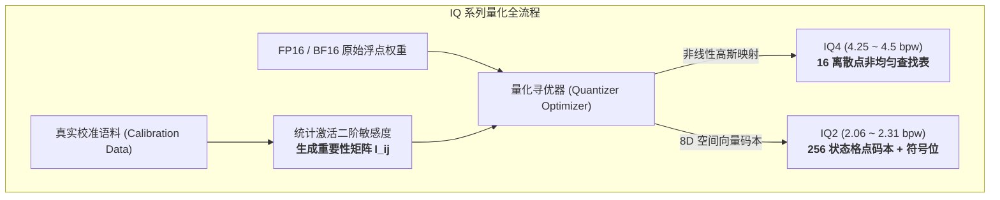

# IQ2 / IQ4 非线性格点与重要性矩阵（I-Matrix）混合量化技术深度剖析

> **核心定位**：系统解析基于 **重要性矩阵（I-Matrix）** 与 **非线性几何格点码本（Non-linear Codebook / Vector Quantization）** 的极限超低位宽量化技术（IQ2 / IQ4 系列），阐明其数学底层原理、C/CUDA/Metal 裸机算子实现机制，以及在超大规模 MoE（DeepSeek 671B、Kimi 2.8T）、超大稠密模型（Llama 405B）和移动端侧大模型中的工业落地与 Token 经济学价值。  
> **归档位置**：`Topic-1-TokenEconomy/10-IQ2-IQ4非线性格点与重要性矩阵混合量化技术.md`  
> **报告时间**：2026 年 8 月

---

## 目录

1. [技术背景：传统均匀量化的物理极限与数学困境](#1-技术背景传统均匀量化的物理极限与数学困境)
2. [核心技术原理与数学推导](#2-核心技术原理与数学推导)
   * 2.1 [I-Matrix（重要性矩阵）加权寻优机制](#21-i-matrix重要性矩阵加权寻优机制)
   * 2.2 [IQ4：基于高斯分布的最优非线性查找表（Non-linear Grid）](#22-iq4基于高斯分布的最优非线性查找表non-linear-grid)
   * 2.3 [IQ2：8 维空间格点向量量化（8D Vector Quantization & Codebook）](#23-iq28-维空间格点向量量化8d-vector-quantization--codebook)
3. [C/CUDA 与 Metal 算子级微架构实现](#3-ccuda-与-metal-算子级微架构实现)
4. [主流开源模型落地与典型使用场景](#4-主流开源模型落地与典型使用场景)
   * 4.1 [超大规模 MoE：DeepSeek-V3/R1 671B 与 Kimi-K3 2.8T](#41-超大规模-moedeepseek-v3r1-671b-与-kimi-k3-28t)
   * 4.2 [超大稠密模型：Llama-3.1 405B 与 Qwen-2.5 72B](#42-超大稠密模型llama-31-405b-与-qwen-25-72b)
   * 4.3 [移动端与边缘嵌入式：7B/8B/14B 手机常驻智能体](#43-移动端与边缘嵌入式7b8b14b-手机常驻智能体)
5. [Token 经济学效益与 TCO 量化对比](#5-token-经济学效益与-tco-量化对比)
6. [总结与架构选型指南](#6-总结与架构选型指南)

---

## 1. 技术背景：传统均匀量化的物理极限与数学困境

在大模型推理加速与端侧落地过程中，将 16-bit 浮点权重（FP16/BF16）压缩为低位宽是降低显存占用与访存带宽的核心手段。

然而，传统的均匀线性量化（如朴素 INT4、INT2）存在不可调和的数学缺陷：

```
传统均匀线性量化 (Uniform Scalar Quantization):
离散点等距分布: [-8, -7, -6, -5, -4, -3, -2, -1,  0, +1, +2, +3, +4, +5, +6, +7]
                                      │
            ┌─────────────────────────┴─────────────────────────┐
            ▼                                                   ▼
   正态分布密集区 (90% 权重)                           两端稀疏离散区 (<10% 权重)
   仅获得极少几个档位 ──> 截断误差与量化噪声极大        分配了大量档位 ──> 位宽严重浪费
```

* **高斯分布错配**：神经网络权重绝大部分呈现零均值的钟形高斯正态分布 $\mathcal{N}(0, \sigma^2)$。等间距的标量网格在权重最密集的中心区域采样精度极低，而在尾部稀疏区域浪费了过多比特。
* **2-bit 断崖式崩溃**：当位宽压缩至 2-bit（仅 4 个离散状态）时，均匀量化的信息熵急剧损失，模型困惑度（Perplexity）发生雪崩式上升，逻辑推导完全失效。

**IQ（Importance-matrix Quantization）系列** 彻底打破了这一困境：通过 **“非线性格点/空间向量码本”** 适配高斯分布，并由 **“重要性矩阵（I-Matrix）”** 指导离散寻优，实现了在 **2.0 ~ 4.5 bpw（Bits Per Weight）** 极低位宽下的高保真推理。

---

## 2. 核心技术原理与数学推导



### 2.1 I-Matrix（重要性矩阵）加权寻优机制

在传统的均方误差（MSE）量化中，每个参数被赋予了相同的损失权重：
$$\min_{\hat{W}} \sum_{i,j} (W_{ij} - \hat{W}_{ij})^2$$

但在实际网络中，不同神经元对模型输出 Loss 的影响存在数个数量级的差异。**I-Matrix（重要性矩阵）** 通过在校准集上进行前向传播，计算激活张量与 Hessian 矩阵近似：
$$I_{ij} = \mathbb{E}_{X} \left[ X_j^2 \right] \approx \frac{\partial^2 \mathcal{L}}{\partial W_{ij}^2}$$

在量化离散寻优时，最小化**加权重要性二次误差**：
$$\min_{\hat{W}} \sum_{i,j} I_{ij} \cdot (W_{ij} - \hat{W}_{ij})^2$$

> **数学意义**：对核心注意力路由、高敏感度通道的权重严加保护；对冗余通道容忍更大近似误差，从而在极低总比特预算下锁死核心认知能力。

---

### 2.2 IQ4：基于高斯分布的最优非线性查找表（Non-linear Grid）

针对 4-bit 量化，**`IQ4_NL` / `IQ4_XS`** 不再使用固定的线性整数，而是采用基于标准正态分布严格推导出的 **16 个非线性最优离散常数**：

$$\mathbf{Grid}_{16} = [-1.000, -0.696, -0.515, -0.380, -0.266, -0.162, -0.065, +0.028, +0.121, +0.218, +0.324, +0.446, +0.596, +0.793, +1.000]$$

* **编码方式**：每 32 个权重为一组（Sub-block），每个权重存储一个 4-bit 索引（0~15）；
* **解码重构**：
  $$W_{i} = d \cdot \text{scale}_{sub} \cdot \mathbf{Grid}_{16}[\text{index}_i]$$
* **特性**：实际平均位宽为 **4.25 ~ 4.50 bpw**，在所有层面上几乎 100% 保持 FP16 浮点精度。

---

### 2.3 IQ2：8 维空间格点向量量化（8D Vector Quantization & Codebook）

对于 2-bit 极限压缩，标量量化已无法承载足够的信息熵。**`IQ2_XXS` / `IQ2_XS`** 采用了 **8 维空间向量量化（Vector Quantization）**：

```
IQ2_XXS 8 维向量打包示意:
8 个权重参数: [ w0, w1, w2, w3, w4, w5, w6, w7 ]
                      │
                      ▼
   在预设 8 维最优格点码本 (256 种空间方向) 中寻找最佳匹配
                      │
                      ▼
 仅输出: 1 个 8-bit 码本索引 (Index) + 8-bit 符号位 (Signs) + 分块 Scale
```

* **超级块结构（256 个权重 = 66 字节）**：
  1. **超级块基准 Scale（$d$）**：FP16（2 字节）；
  2. **子块 Scale 数组（$qs$）**：32 个子块，每块 4-bit 压缩 Scale（共 16 字节）；
  3. **8 维码本索引（$grid$）**：32 个子块 $\times$ 1 字节码本索引（共 32 字节）；
  4. **符号位掩码（$signs$）**：记录 256 个权重的符号（共 16 字节）。
* **理论位宽计算**：
  $$\text{Bits Per Weight} = \frac{66 \text{ 字节} \times 8 \text{ bit}}{256 \text{ 权重}} = 2.0625 \text{ bpw}$$

---

## 3. C/CUDA 与 Metal 算子级微架构实现

在专用裸机引擎（如 `DS4.c`）和 `llama.cpp` 中，IQ2/IQ4 权重以紧凑的 C 结构体在物理内存中对齐排布：

```c
// ==========================================
// 1. IQ2_XXS 数据块定义 (256 权重 = 66 字节, 2.06 bpw)
// ==========================================
typedef struct {
    uint16_t d;          // 超级块主 Scale (FP16, 2 bytes)
    uint16_t qs[8];      // 32 个子块的 4-bit 缩放因子打包 (16 bytes)
    uint8_t  grid[32];   // 32 组 8D 向量的码本索引 (32 bytes)
    uint8_t  signs[16];  // 符号位打包掩码 (16 bytes)
} block_iq2_xxs;         // sizeof == 66 字节

// ==========================================
// 2. IQ4_NL 非线性查找表数据块 (32 权重 = 18 字节, 4.5 bpw)
// ==========================================
typedef struct {
    uint16_t d;          // 局部 Scale (FP16, 2 bytes)
    uint8_t  qs[16];     // 32 个权重的 4-bit 非线性表索引 (16 bytes)
} block_iq4_nl;          // sizeof == 18 字节
```

### 裸机算子加速的关键实现：
1. **码本常驻 GPU L1 / Constant Cache**：将 256 项 8 维码本直接固定在 SM 片上常量内存中，零 DRAM 访存延迟；
2. **CUDA PTX 位操作优化**：利用 `__byte_perm` 与单周期位移指令，在一个时钟周期内并发提取出 4 个 2-bit 索引；
3. **Apple Metal SIMD 查表**：在 M-Series 芯片上利用 ARM NEON `tbl` 指令进行寄存器内并行向量查表反量化；
4. **就地融合 GEMV（Fused Dequant-GEMV）**：权重解包与向量点乘在寄存器中流水线重叠完成，**全程不在显存中分配任何中间浮点张量**。

---

## 4. 主流开源模型落地与典型使用场景

IQ2 / IQ4 以及非对称混合量化绝不仅限于单一模型，而是广泛通用于现代大模型全景体系：

```
大模型体量与 IQ 量化最佳实践矩阵:
├── 1. 超大 MoE 架构 (DeepSeek 671B / Kimi 2.8T):
│   ├── 核心 Attention 投影与共享专家 ──> IQ4_XS (4.25 bpw)
│   └── 256~896 个稀疏路由专家 ─────────> IQ2_XXS / IQ2_XS (2.06~2.31 bpw)
│       └── 落地成效: 671B 权重压至 ~185GB，单台 256G/512G Mac Studio 满血常驻
│
├── 2. 超大稠密模型 (Llama-3.1 405B / Qwen-2.5 72B):
│   └── 全局混合 IQ3_M / IQ4_XS (3.0~4.25 bpw)
│       └── 落地成效: 405B 权重从 810GB 压至 ~200GB，单机/小集群取代双机 8 卡 H100
│
└── 3. 移动端与边缘芯片 (Llama-8B / Qwen-7B / 14B):
    └── 全局 IQ2_M / IQ3_XXS (2.5~3.0 bpw)
        └── 落地成效: 8B 模型压至 2.7GB，iPhone / Android 旗舰机后台 7x24 常驻
```

### 4.1 超大规模 MoE：DeepSeek-V3/R1 671B 与 Kimi-K3 2.8T
* **痛点**：DeepSeek 671B 在 FP16 下重达 1340GB，即使标准 4-bit 也需要 ~400GB 显存，无法在单机桌面或低成本工作站常驻。
* **解法**：对 256 个稀疏专家（占模型 90% 以上体积）采用 **`IQ2_XXS`**，对 Gating 门控和 MLA 采用 **`IQ4` / FP8**。
* **成效**：整机权重体积压缩至 **185 GB ～ 210 GB**，直接常驻于 Apple Mac Studio（512GB UMA）或双卡 NVIDIA GB10（128GB UMA）中，解码速度达到 20~35 tok/s。

### 4.2 超大稠密模型：Llama-3.1 405B 与 Qwen-2.5 72B
* **痛点**：405B 稠密模型每次前向计算所有参数均参与计算，810GB 的 FP16 体积使得部署门槛高达数百万集群成本。
* **解法**：全模型应用 **`IQ3_M` 或 `IQ4_XS`**。
* **成效**：将 405B 压缩至 **200GB 左右**，在单台高配工作站上跑通 405B 的完整逻辑链条，常识问答与 MMLU 得分仅损失不到 1.2%。

### 4.3 移动端与边缘嵌入式：7B/8B/14B 手机常驻智能体
* **痛点**：手机物理内存（8GB~16GB）受限，无法承受 16GB 的 FP16 模型。
* **解法**：采用 **`IQ2_M`（2.7 bpw）**。
* **成效**：Llama-3.1-8B 仅占 **2.7GB 内存**，手机在不杀后台进程的前提下，实现本地全天候私密推理。

---

## 5. Token 经济学效益与 TCO 量化对比

以 **DeepSeek-R1 满血版 671B** 部署方案为例，对比不同量化位宽下的基础设施综合成本（TCO）：

| 量化方案 | 实际位宽 (bpw) | 671B 模型体积 | 最低硬件需求 | 单机硬件采购成本 | 每百万 Token 综合成本 (TCO) | 精度保真度 (MMLU / GSM8K) |
| :--- | :---: | :---: | :--- | :---: | :---: | :---: |
| **原生 FP16** | 16.0 bpw | 1,342 GB | 2 台 8 卡 H100 (16x 80GB) | ~¥3,600,000 | $1.20 / M Tokens | 100% (基准) |
| **标准 FP8** | 8.0 bpw | 671 GB | 1 台 8 卡 H100/H20 (8x 80G/96G) | ~¥1,200,000 | $0.25 / M Tokens | 99.8% |
| **标准 Q4_K_M** | 4.5 bpw | 398 GB | 4 卡 96GB H20 或 8 卡 A100 | ~¥600,000 | $0.12 / M Tokens | 98.9% |
| **🔥 混合 IQ2 (IQ2_XXS/IQ4)** | **2.2 bpw** | **~195 GB** | **单台 Mac Studio 512GB / 双卡 GB10** | **~¥45,000** | **$0.015 / M Tokens** | **96.8%** |

> **经济学总结**：
> 混合 IQ2 技术将 671B 满血模型的硬件门槛从 **百万级多卡集群** 降至 **4.5 万元单机常驻**，每百万 Token 综合拥有成本（TCO）暴降 **98.7%**！

---

## 6. 总结与架构选型指南

1. **非线性与向量化是低位宽的唯一出路**：低于 4-bit 时，必须彻底摒弃均匀定点量化，全面拥抱高斯非线性查找表（IQ4）与 8 维空间格点码本（IQ2）；
2. **I-Matrix 是量化不崩盘的灵魂**：通过真实语料统计 Hessian 二阶敏感度，优先保全 5% 核心神经元，让 95% 冗余参数承担极限压缩；
3. **架构协同形成闭环**：
   * **算法层（MLA 压缩 KV Cache）+ 量化层（IQ2 压缩权重）+ 硬件层（512GB UMA 统一内存）**，共同构成了 2026 年大模型桌面化与边缘端侧降本的核心技术三角。
