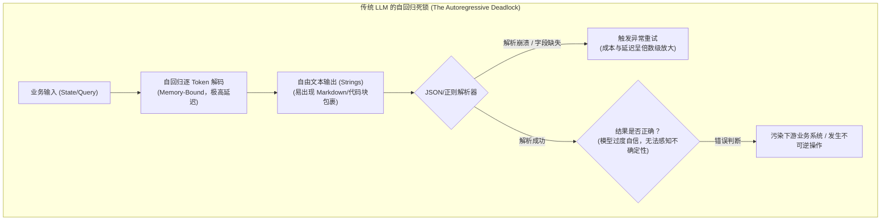
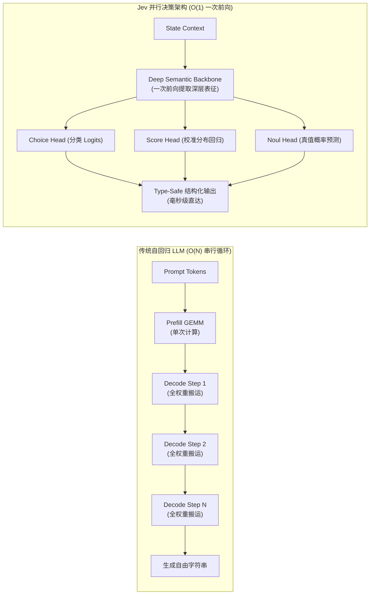
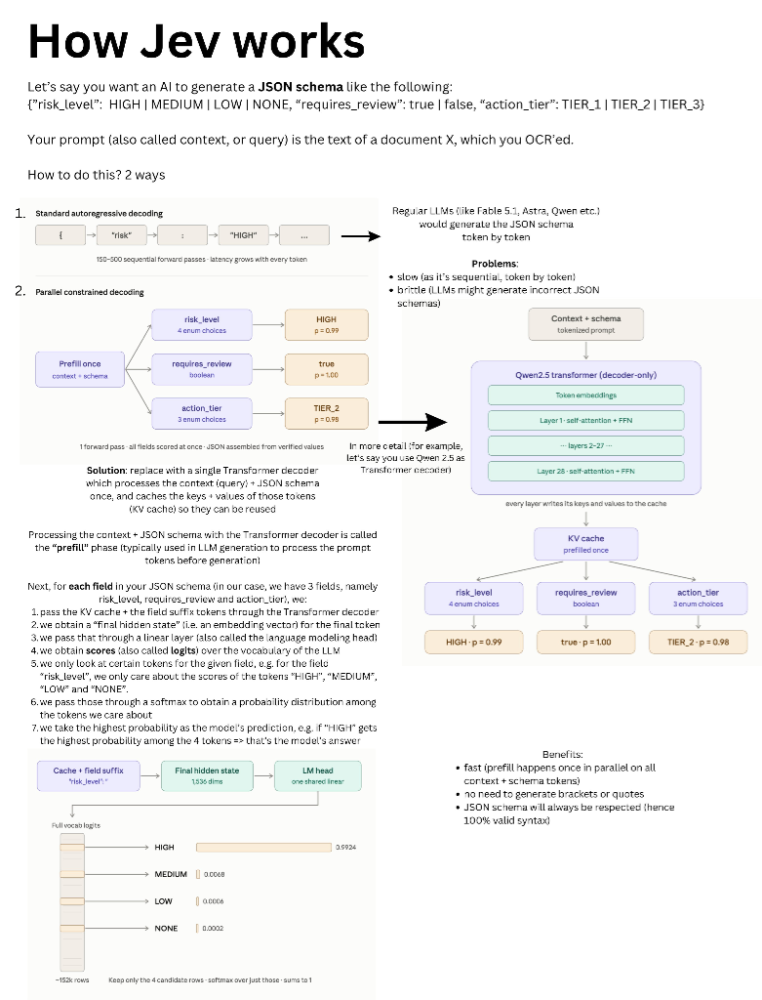
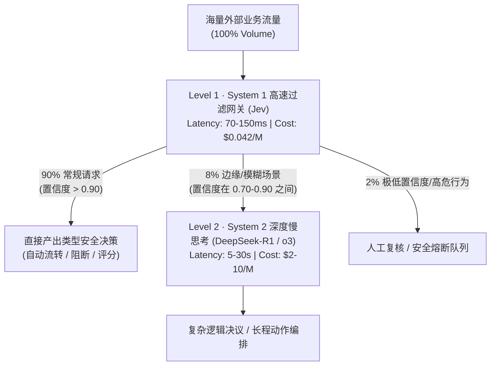

# TypeSafe Jev「System One 模型」的 Token 经济学重构与推理优化深度解析

> **主题**：Token 经济学与推理优化专题研究 · 篇号 11  
> **核心命题**：为什么“放弃自由文本生成”反而引爆了 Jevons 悖论？从微观并行采样器到宏观每百万 Token 成本归零革命  
> **对标对象**：TypeSafe AI (Diogo Almeida 创立) 于 2026 年 9 月发布的首个 System One 模型 **Jev**  
> **关联主文档**：[Topic-1-TokenEconomy/1-Infra-TokenCostReduction-Report.md](file:///Users/will/github/TokenResearch/Topic-1-TokenEconomy/1-Infra-TokenCostReduction-Report.md)

---

## 目录

1. [执行摘要与宣言哲学：从《Build Prod, Not God》看软件自动化阻碍](#1-执行摘要与宣言哲学从build-prod-not-god看软件自动化阻碍)
2. [命名背后的双重密码：System 1 与 Jevons 悖论](#2-命名背后的双重密码system-1-与-jevons-悖论)
3. [推理底座微架构革新：从自回归序列生成到并行采样器](#3-推理底座微架构革新从自回归序列生成到并行采样器)
4. [对齐训练范式突围：从 RLHF 人类讨好走向 RLCD 置信度校准](#4-对齐训练范式突围从-rlhf-人类讨好走向-rlcd-置信度校准)
5. [数学级零幻觉与类型安全：结构化输出的终极形态](#5-数学级零幻觉与类型安全结构化输出的终极形态)
6. [Token 经济学重构：为什么输出 Token 可以“免费”？](#6-token-经济学重构为什么输出-token-可以免费)
7. [系统级架构协同：System 1 (Jev) 与 System 2 (CoT) 的双层漏斗拓扑](#7-系统级架构协同system-1-jev-与-system-2-cot-的双层漏斗拓扑)
8. [深度实战剖析：Jev 能否替换/重构 vLLM-SR 等语义路由网关？](#8-深度实战剖析jev-能否替换重构-vllm-sr-等语义路由网关)
9. [结论与对开源推理生态的启示](#9-结论与对开源推理生态的启示)

---

## 1. 执行摘要与宣言哲学：从《Build Prod, Not God》看软件自动化阻碍

自 2022 年底 ChatGPT 引爆大模型浪潮以来，全行业向生成式 AI 基础设施投入了数千亿美元。然而到了 2026 年，几乎所有企业级架构师都在直面一个尴尬的现实：**模型在聊天（Chat）和主观对话上早已达到甚至超越人类水平，但企业核心业务系统与软件自动化（True Business Automation）的渗透率依然极其缓慢。**

TypeSafe AI 在发布 Jev 的同时发表了震撼行业的技术宣言——[**《Composable AI: Build Prod, Not God》（可组合 AI：造工业品，不造神）**](https://typesafe.ai/manifesto)。前 OpenAI 核心研究员（曾深度主导 InstructGPT 与 ChatGPT 的 RLHF 核心算法构建）**Diogo Almeida** 与团队一针见血地指出：

> “我们并不打算追逐那个不断后移的‘AGI 终极造神目标’，因为当今的模型早已跨越了创造巨大经济价值的智力门槛。然而在数万亿美元投资之后，绝大多数软件依然毫无实质性智能，普通人的生活也未被改变。这向我们敲响了警钟：**当前 AI 落地的核心瓶颈根本不是‘原始智力不够’，而是‘今天的智力形态无法被软件直接构建在其上（Hard to build on）’。我们造的是生产级工业品，不是造全能神（We're building prod, not God）！**”

宣言深刻揭示了导致当前大模型无法与软件融合的底层认知误区：

1. **告别“无马马车”（Beyond Horseless Carriages）思维陷阱**：
   * 1903 年福特 Model T 问世前，早期汽车被机械地造成“无马马车”：发明家简单把马换成发动机，却死守高底盘、硬弹簧，甚至保留了**插马鞭的插槽（whip socket）**；
   * 现有的 Chatbot 正是留着马鞭插槽的过渡品——它假设对面坐着一个人，强行要求 **Human-in-the-loop（人在回路）**，使得 AI 无法在后台无人值守地静默运转。
2. **软件运行的本质是“分支”，而非“聊天”**：
   * 现代软件通过在比特位上的确定性条件分支（`if bit == 1`），构建了庞大的数字文明；
   * 计算机如果不仅能对比特分支，还能对**“常识（Common Sense）、意图（Intent）和语义理解”**进行确定性分支跳转（即 **Branch on Intent / 智能 if-else / 神经符号计算**），这才是机器原生 AI 的真正威力。
3. **智能时代的“SQL 革命”与分层堆叠（Layering）**：
   * 发明数据库的人想不到 Google，发明网络协议的人想不到 Stripe。今天的大模型智能就像 **SQL 诞生前的数据库**：强大但每次使用都得特例定制（bespoke）；
   * **安全与可信是分层堆叠的前提（Safety is a precondition for layering）**——只有底层组件具备严格类型契约与校准置信度，工程师才敢把 AI 深埋在生产系统第 5 层的依赖链深处！



4. **传统大模型自回归的三大物理死锁**：
   * **字符串依赖税（The String Tax）**：软件是强类型驱动的（Struct, Enum, Float），而大模型原生吐出的是松散自由的字符串（Strings）。两层嵌套调用成功率跌至 81%，五层嵌套系统直接瘫痪；
   * **显存带宽死锁（Memory Bandwidth Wall）**：自回归生成每个 Token 都要全量搬运一次模型权重与 KV Cache，生成一个布尔值耗时数秒，打穿微服务 SLA；
   * **认识论不诚实（Epistemic Dishonesty）**：RLHF 优化的是人类满意度而非准确率，导致模型无论对错都语气笃定，缺乏校准的置信度，导致工程师无法写出任何防御性断言或降级分支。

Jev 的核心哲学正是：**放弃文本生成（Strings），将大模型退火为一种机器原生的“概率型类型安全决策函数（Typed Decision Primitive）”。**

---

## 2. 命名背后的双重密码：System 1 与 Jevons 悖论

Jev 及其所属模型品类的命名，蕴含着深刻的技术分工与经济学规律：

### 2.1 System One：卡尼曼认知双系统的软件映射

诺贝尔经济学奖得主丹尼尔·卡尼曼（Daniel Kahneman）在《思考，快与慢》中提出了两套认知系统：
* **System 1（快思考）**：无意识、快速、直觉性、并行运作，例如一眼认出朋友的面孔、躲避突如其来的障碍物；
* **System 2（慢思考）**：有意识、缓慢、深思熟虑、逻辑串行推导，例如解一道复杂的数学方程、写一段复杂的算法内核。

近两年模型架构演进（如 OpenAI o1/o3、DeepSeek-R1、Claude 3.7 Sonnet）都在极力推崇思维链（Chain of Thought, CoT）与强化学习可验证奖励（RLVR），这是典型的 **System 2** 路线。然而，企业生产系统中 90% 以上的日常调用（如工单分派、风控打分、意图识别、内容风控、文档过滤、分支路由）根本不需要数十秒的慢思考，它们呼唤的是毫秒级响应、高度可靠的 **System 1**。

### 2.2 Jev：杰文斯悖论（Jevons Paradox）的经济学隐喻

模型名字 **Jev** 取自 19 世纪英国著名经济学家**威廉·斯坦利·杰文斯（William Stanley Jevons）**。
1865 年，杰文斯在其著作《煤炭问题》中发现：瓦特改良蒸汽机后，煤炭利用效率大幅提高，但煤炭的总体消耗量不仅没有下降，反而由于蒸汽动力成本的断崖式暴跌，激发了采矿、冶金、铁路、纺织等全工业维度的暴饮式扩张，最终导致全社会煤炭消耗总量爆发了数万倍。

这就是著名的**杰文斯悖论**：

$$\text{技术效率提升} \to \text{单位生产成本暴跌} \to \text{门槛穿越临界点} \to \text{需求呈超指数级爆发} \to \text{全社会总价值膨胀}$$

TypeSafe 将其首个模型命名为 Jev，其战略意图昭然若揭：**只要将大模型单次决策的时延打到 100ms 以内、单价降到几近忽略不计，各行各业就会像工业革命消费蒸汽动力一样，将大模型塞进软件工程中每一个原来由脆弱手写规则维护的 `if-else` 之中。**

---

## 3. 推理底座微架构革新：从自回归序列生成到并行采样器

从推理工程与计算架构的视角来看，Jev 对传统大模型推理做了一次根本性的物理剪枝。

### 3.1 自回归 Decode 阶段的物理硬伤

在现代 GPU（如 H100、H20、L20、GB10）上，传统大模型推理分为两个截然不同的计算阶段：

1. **Prefill（首字计算）**：
   * 计算特征：Compute-Bound（算力受限）。所有输入 Token 在注意力矩阵中完全并行计算，Tensor Core 处于饱满运行状态，硬件利用率（MFU）通常可达到 40% ~ 65%。
2. **Decode（自回归生成）**：
   * 计算特征：**Memory-Bound（显存带宽严重受限）**。由于自回归必须依赖上一个 Token 的输出才能预测下一个 Token，Batch 内每个序列每步只生成 1 个 Token。
   * 算子运算强度（Arithmetic Intensity）跌破 $1\text{ FLOP/Byte}$。每一批 Token 仅仅为了做简单的 GEMV，就要把数十 GB 的模型权重与数 GB 的 KV Cache 从 HBM 完整搬运到 SRAM 一遍，导致大多数计算单元处于饥饿等待状态，MFU 经常骤降至 5% ~ 15%。

### 3.2 Jev 的并行采样器（Parallel Sampler）架构

Jev 彻底移除了 Decode 阶段的串行自回归循环：



1. **全并行前向（Single-Shot Forward Pass）**：
   用户提交的非结构化上下文（State）与多个目标问题（Questions）在一次前向计算中完成特征抽取；
2. **专用决策头解耦（Decoupled Decision Heads）**：
   输出层不再使用超大规模的 Vocabulary Projection（词表投影往往高达 128k ~ 256k 维度），而是替换为面向类型原语的轻量级并行输出头：
   * **Choice Head**：针对开发者在 Schema 中限定的 $K$ 个离散选项（$K \le 255$），直接在受限子空间中计算 Softmax 分布；
   * **Score Head**：在连续或离散标尺区间内计算校准期望值与方差；
   * **Noul Head**：输出严格校准的二元判定标量概率。
3. **KV Cache 内存与生命周期彻底归零**：
   没有多轮自回归，意味着**完全不需要为每个请求分配、维护和换入换出庞大的 Paged KV Cache**。这一改变从根本上解除了并发瓶颈：
   * 显存占用下降 70% ~ 85%；
   * 单卡批处理并发量（Batch Size）可以提升 10 倍以上；
   * 彻底规避了 Prefill-Decode 互相干扰（Head-of-Line Blocking）的调度难题。

### 3.3 执行全景链路：How Jev Works（并行受限解码实操）

下图清晰展示了 Jev **Parallel Constrained Decoding（并行受限解码）** 的端到端真实计算拓扑（以解析包含 `risk_level`、`requires_review` 与 `action_tier` 的 JSON Schema 为例）：



#### 完整执行流的 7 步微架构剖析：
1. **Context + Schema 单次预填充（Prefill Once）**：将输入上下文（Context/Query）与目标 JSON Schema 打包为 Tokenized Prompt，通过 Transformer Decoder 进行单次 Prefill，计算并驻留各层的 Key/Value 缓存（KV Cache）；
2. **多字段并行注入（Field Suffix Forward）**：针对 JSON Schema 中定义的各个字段（`risk_level`、`requires_review`、`action_tier`），将共享 KV Cache 与各个字段后缀 Token 同时送入解码器；
3. **获取末尾隐层向量（Final Hidden State）**：为每个字段获得最终 Token 的 1,536 维 Embedding 向量；
4. **共享 LM Head 投影**：通过单个共享线性层（Language Modeling Head）计算出对应全词表的 Logits（约 152k 维）；
5. **候选 Token 行截断（Candidate Masking）**：**关键转折点**——不进行贪心或核采样，而是仅提取目标字段预定义候选行。以 `risk_level` 为例，从 152k 行中仅保留 `HIGH`、`MEDIUM`、`LOW`、`NONE` 这 4 个候选行；
6. **子空间 Softmax 概率归一化**：仅在这 4 个候选行的 Logits 上做 Softmax，概率总和严格为 1（如 `HIGH: 0.9924`、`MEDIUM: 0.0068`、`LOW: 0.0006`、`NONE: 0.0002`）；
7. **确定性数值直出与内存组装**：取出最高概率作为模型预测值，直接在内存中装配成合法 JSON。

#### 三大底层工程红利：
* **极速（Fast）**：Prefill 在所有 Context + Schema 上并行发生，彻底消灭 150~500 次自回归串行前向迭代；
* **零标点符号生成税**：模型完全无需逐字生成大括号 `{`、引号 `"`、冒号 `:` 等无效 Token，节省 90% 以上无意义算力开销；
* **100% 格式语法保证**：JSON Schema 由底层强类型结构体直接装配，彻底消除 JSON 解析崩溃异常。

---

## 4. 对齐训练范式突围：从 RLHF 人类讨好走向 RLCD 置信度校准

Jev 的核心技术突破不仅在于推理引擎的精简，更在于其训练目标的根本颠覆——提出 **RLCD（Reinforcement Learning for Calibrated Decisions，校准决策强化学习）**。

### 4.1 RLHF 的原罪：模式丢弃与虚妄的确定性

传统的强化学习对齐范式（RLHF）：
* **优化目标**：最大化人类标注员的偏好奖励打分（Preference Reward Model）。
* **副作用**：人类天然讨厌模棱两可的回答，喜欢听起来自信、结构规整、滔滔不绝的解释。这导致经过 RLHF 的模型普遍产生**概率退化与过度自信**：
  $$\text{真实不确定性 } P(Y|X) \approx 0.5 \quad \xrightarrow{\text{RLHF}} \quad \hat{P}(Y|X) \to 0.99$$
* **软件工程灾难**：在编写系统代码时，如果一个外部组件在 95% 的情况下正确，但发生错误时却依然给出 99% 的自信打分，那么软件工程师就**无法写出任何防御性断言或降级分支**。

### 4.2 RLCD 的优化目标：认识论诚实（Epistemic Honesty）

RLCD 将模型的优化目标从“人类满意度”转变为**严格的统计校准（Statistical Calibration）**：

$$\min_{\theta} \mathbb{E}_{(x, y)} \left[ \text{BrierScore}(f_\theta(x), y) \right] = \min_{\theta} \mathbb{E}_{(x, y)} \left[ \frac{1}{K} \sum_{k=1}^K (p_k(x; \theta) - \mathbf{1}\{y = k\})^2 \right]$$

同时在奖励函数中引入校准误差惩罚项（Expected Calibration Error, ECE）：

$$\text{ECE} = \sum_{m=1}^M \frac{|B_m|}{N} \left| \text{acc}(B_m) - \text{conf}(B_m) \right|$$

* **校准保证**：若 Jev 针对某一次决策给出的置信度为 $85\%$，在海量测试用例统计下，其命中真值的比率严格收敛在 $85\%$ 左右。
* **软件消费范式转移**：开发者首次能够在代码里用优雅的“置信度阶梯”实现自动化分级：

```python
# 典型的 TypeSafe Jev 软件自动化消费逻辑
response = client.system_one(
    state=user_ticket_context,
    questions={
        "refund_eligibility": Noul(instructions="Is user eligible for immediate refund?"),
        "fraud_risk": Score(instructions="Fraud risk tier", min=0, max=100)
    }
)

refund_prob = response.nouls["refund_eligibility"].probability
confidence = response.nouls["refund_eligibility"].confidence

# 确定性的系统级分流
if refund_prob > 0.95 and confidence > 0.90:
    payment_gateway.auto_refund()      # 95%+ 极高确定性，全自动执行
elif refund_prob > 0.70:
    queue.push_to_human_agent()       # 模糊地带，转交人工座席复核
else:
    notify_user_denied()              # 低概率，触发拒绝或补件流程
```

### 4.3 社区极客的“2小时复现”风暴：Qwen-2.5-1B-RLCD 与 Jev 的技术同构

在 TypeSafe 发布 Jev 及其《Manifesto》后，开源社区掀起了一场激烈的去神秘化（Demystification）讨论。知名开源开发者 Harsha Gundala（@harshagundal）在推特与 Hugging Face 上发布了开源项目 `harshatheg/Qwen-2.5-1B-RLCD`，并附上极具挑战性的公开宣言：

> *"They were building in stealth for 2 years, I was building in stealth for 2 hours… Happy to open source Qwen-2.5-1B-RLCD, 5x faster on-device inference for JSON workloads that need to be type-safe. ⚡️Demo below on a M4 MacBook⚡️ every LLM has the ability to efficiently batch inference every key of a JSON at the same time and generate probabilities from a set of possible categories. No new training required, but it’s easy to optimize if you need! On hugging face now!"*

#### 1. 两者的底层技术同构性
Harsha 的极客复现精准揭示了并行约束解码的通用物理本质：
1. **共享前缀 KV-Cache**：任何基于 Transformer Decoder 架构的标准因果语言模型（如 Qwen-2.5-1B/7B），在对输入上下文（文档、工单、状态文本）完成 Prefill 计算后，其注意力 KV-Cache 已沉淀了完整的全局语义表征；
2. **Schema 后缀并行送入**：定义待抽取的 JSON 结构后，将各个字段的问句/键前缀（如 `{"status":`、`"priority":`）打包为一个 Batch，并行输入单步前向解码；
3. **输出层 Logits 掩码（Masking）**：直接在未归一化的语言模型输出头（LM Head，词表约 152k 维）中，根据预定义的候选类别（例如 `HIGH`、`MEDIUM`、`LOW`）提取对应的 Token Logits，其余词表全部置为 $-\infty$；
4. **子空间 Softmax 归一化**：仅在候选行维度做 Softmax，直接产出各字段概率，零样板字符生成，0% 语法错误。

这在算子层面上完全证明：**并行结构化提取不是某种神秘的全新物种，而是所有现代 Transformer 解码器原生蕴含的计算潜能。**

### 4.4 深度技术分水岭：开源 2 小时 Logits 掩码 vs 工业级 2 年 RLCD 校准

尽管开源 Demo 验证了并行前向的可行性，但 Harsha 声称的 *"No new training required"* 恰恰指出了“极客玩具”与“工业级生产系统”之间的本质分水岭：

| 对比维度 | Qwen-2.5-1B-RLCD（开源 2 小时复现） | TypeSafe Jev（工业级 2 年自研沉淀） |
| :--- | :--- | :--- |
| **底层实现范式** | 未微调的开源基座 LM Head 掩码切片 + 局部 Softmax | 专用多分支 Typed Head（Choice / Score / Noul）原生直出 |
| **置信度校准 (ECE)** | **严重未校准（伪置信度）**<br/>未经校准的 Logits 严重受语言语料基频先验（Token Prior）污染，极易对错误选项输出 0.999 的虚假置信度 | **严格统计校准（认识论诚实）**<br/>以 Brier Score 和 ECE 最小化为训练目标，输出概率 85% 严格收敛于真值命中率 85% |
| **候选集基数能力** | **仅限单 Token 选项**<br/>若枚举项包含多个分词（如 `fraud_suspect`、`chargeback_requested`），单步 LM Head 切片立即失效，退化为多步树搜索 | **原生支持任意复杂多 Token 与连续标尺**<br/>支持高达 255 个任意复杂的选项枚举，原生支持 `Score(min, max)` 连续标量回归 |
| **复杂语义容量** | **1B 小模型语义脆弱**<br/>在 100 字短文本上表现尚可，但在 50 页法律协议、隐晦反讽、长程依赖的复杂工单中，1B 模型的上下文表征迅速坍塌 | **基于百亿级前沿基座的高维知识蒸馏**<br/>保留前沿模型对长上下文微妙因果关系与行业隐式规则的深层理解力 |
| **生产级系统安全性** | **无法用于核心业务闭环**<br/>由于概率虚高，工程师无法在代码中安全执行 `if prob > 0.95: transfer_funds()`，否则将引发严重资金或风控事故 | **工业级自动化放行基石**<br/>概率具备严格的度量意义，可作为企业决策流第一公民与硬性 SLA 熔断依据 |

**为什么“无需重新训练”在工业界是危险的陷阱？**  
语言模型在预训练时学习的是无条件自然语言语料的统计分布。一个罕见专业术语（如 `myocardial_infarction`）即使完全符合病历描述，其 Raw Logit 也可能低于高频词 `infection`。直接对未经微调的词表切片做 Softmax，算出的并不是严格的后验条件概率 $P(Y|X)$，而是受语料先验扭曲的相对打分。**TypeSafe 团队耗时 2 年研发的真正护城河，不在于切片算子本身，而在于用 RLCD 彻底重构模型的认识论校准度，让概率具备数学意义上的严肃性。**

### 4.5 端侧推理优化（On-Device AI）：Apple Silicon (M4 / MLX) 带来的边缘端 System 1 红利

Harsha 的 Demo 特意跑在配备 **Apple M4 芯片的 MacBook** 上，这一选择具有重大的边缘计算与 Token 经济学启示：
1. **统一内存架构（UMA）的物理红利**：Apple M4 的 CPU、GPU、NPU 共享高达 120GB/s 的高带宽统一内存，1B 参数的 FP16/INT4 权重（仅 0.8GB~2GB）直接驻留在片上总线，消除了一切跨 PCIe 搬运延迟；
2. **Apple MLX 框架的原生批处理**：利用 MLX 针对 Apple Neural Engine 与 GPU 深度优化的矩阵前向算子，并行约束解码在 M4 上仅耗时 **10~25ms**，端到端吞吐提速 **5x~7x**；
3. **“端-云分层共生”的终极 Token 经济学**：
   * **端侧 System 1（Edge SLM + Parallel Decoding）**：在本地设备（Mac、iPhone、AI PC、智能座舱）常驻运行，负责 100% 本地隐私数据提取、实时 UI 意图路由、敏感信息拦截。**Token 成本绝对为 $0.00，延迟低于 20ms**；
   * **云端 System 1（TypeSafe Jev）**：负责跨企业组织协同、多模态资产审计与百亿级合规规则仲裁；
   * **云端 System 2（DeepSeek-R1 / o3）**：当端侧或云端 System 1 检测到概率置信度落入模糊区间（如 $P \in [0.65, 0.85]$）时，触发长程思维链深度推理。

### 4.6 工业级开源复现新标杆：Moonshine Parallel Constrained Decision Engine (HF Space)

在社区对简单切片脚本进行反思后，开源组织 **Moonshine** 在 Hugging Face Spaces 上线了首个高完整度、生产就绪的开源并行约束决策引擎：[drinkmoonshine/parallel-constrained-decoding](https://huggingface.co/spaces/drinkmoonshine/parallel-constrained-decoding)。

该引擎不仅在 Web 端提供了与自回归基线的实时对决测试沙盒，更在工程微架构上攻克了开源复现的两大死穴：

#### 1. 核心架构突破
* **KV-Cache 动态广播机制**：在 PyTorch 引擎中使用 `batched_cache.batch_repeat_interleave(M)`，将 Prefill 后的上下文注意力状态瞬间广播到全部 $M$ 个并行字段槽位，全过程无多余计算；
* **前缀树消歧算法（Token Tree Disambiguation）**：彻底打破了简单 Logits 切片只能支持单 Token 的瓶颈。当用户定义的多候选词共享前缀时（例如 `P0_CRITICAL` 与 `P0_HIGH`），引擎利用切片缓存执行微秒级分步延续，支持高达 255 个高基数选项和布尔类型的毫秒级判别；
* **双后端自适应调度（MLX + PyTorch）**：在 macOS 上无缝利用 Apple MLX 榨干 M 系列芯片统一内存与神经引擎；在 Linux/Docker 云端则自动适配 PyTorch 与 Nvidia ZeroGPU（A10G）。

#### 2. Apple Silicon M4 Max 实测基准数据
以 `mlx-community/Qwen2.5-1.5B-Instruct-4bit` 为底座的基准测试表明，并行约束解码在复杂工业场景下展现了惊人的加速比：

| 业务测试场景 | 字段规模与基数 | 传统自回归耗时 (120 tok/s) | 并行约束解码耗时 | 端到端加速比 | 格式合法性 |
| :--- | :--- | :--- | :--- | :--- | :--- |
| **金融欺诈路由 (Fintech Fraud)** | 4 字段 (Enum/Bool) | 420 ms | **75 ms** | **5.6x** | 100% 绝对保证 |
| **代码安全审计 (Security Audit)** | 4 字段 (漏洞评级) | 380 ms | **68 ms** | **5.6x** | 100% 绝对保证 |
| **海关关税 HS 编码 (Tariff Code)** | 1 字段 (**255 候选高基数**) | 500 ms | **89 ms** | **5.6x** | 100% 绝对保证 |
| **企业客服多维工单 (Enterprise)** | **28 字段复合抽取** | 1,900 ms | **270 ms** | **7.0x** | 100% 绝对保证 |

实测数据表明：**字段越多、抽取结构越庞大，并行约束解码相比串行自回归的加速优势越呈指数级拉大（从 5.6x 跃升至 7.0x）**。这为开源模型在端侧（Apple M 系列）与云端私有化（ZeroGPU/A10G）构建 System 1 智能提供了最确凿的工程样板。

---

## 5. 数学级零幻觉与类型安全：结构化输出的终极形态

在主流大模型开发中，“结构化输出”一直是工业界最痛苦的环节。现有解决方案对比：

| 方案类别 | 代表技术 | 底层机理 | 核心弊端 |
| :--- | :--- | :--- | :--- |
| **Prompt 引导型** | System Prompt / Few-Shot | 祈求模型按照 JSON 语法自回归生成字符串 | 偶发 Markdown 代码块、缺失闭合括号、字段拼写错误 |
| **状态机约束型** | GBNF / Outlines / JSON Schema Mode | 在自回归 Logits 上加掩码（Masking），强制只能选择合法字符 Token | 严重破坏模型原有注意力上下文，推理速度下降，长嵌套依然存在死循环风险 |
| **原生类型系统** | **TypeSafe Jev (System One)** | **不经过词表与文本序列，直接由专用 Typed Head 并行输出** | **在数学上不可能产生格式/类型错误（Type Error Rate = 0%）** |

因为 Jev 在网络层面上直接将数据约束在预设的类型原语（`Choice`、`Score`、`Noul`）之内，它在物理上根本无法吐出不受支持的格式。这就将原本属于“概率对抗”的结构化提取，变成了“数学闭环”的强类型函数调用。

---

## 6. Token 经济学重构：为什么输出 Token 可以“免费”？

在当前的云端大模型 API 市场中，输出 Token（Completion Token）的单价普遍是输入 Token（Prompt Token）的 **3 到 5 倍**（例如 GPT-4o 输入 \$2.50/M，输出 \$10.00/M；Claude 3.5 Sonnet 输入 \$3.00/M，输出 \$15.00/M）。

### 6.1 为什么传统大模型输出 Token 昂贵？

根据大模型推理计算与显存模型：
$$\text{单 Token 内存搬运量} \approx 2 \times P \text{ bytes} \quad (P \text{ 为参数量，FP16})$$
$$\text{算子强度} I_{\text{decode}} = \frac{2 \times P \text{ FLOPs}}{2 \times P \text{ Bytes} + \text{KV-Cache Bytes}} \approx 1 \text{ FLOP/Byte}$$

在 Decode 阶段，生成 1 个 Token 需要把数十 GB 的全权重在 HBM 与 Cache 之间遍历一次。这就意味着：**每一个生成的 Token 都在独占昂贵的显存带宽。服务商定价的本质，是在为 GPU 处于饥饿等待状态的“闲置算力机会成本”买单。**

### 6.2 Jev 的成本断崖：输出 Token 为什么能宣布“免费”？

Jev 将其定价设定为：
* **输入 Token**：\$0.042 / MTok（每 10 亿 Token 仅 \$42，比前沿模型低 2 个数量级）；
* **输出 Token**：**完全免费（FREE，too cheap to meter）**。

其底层经济学逻辑在于：
1. **边际计算开销近乎为零**：由于没有逐字自回归解码，输入处理完成的同时，输出决策头（Decision Heads）的几个标量或离散概率计算已经在同一个计算流水线内完成了；
2. **FLOPs 占比不足 0.01%**：输出层的矩阵计算在整个庞大语义抽取前向传播中占比微乎其微；
3. **显存驻留时间极短**：请求在显卡上的滞留时间从传统 LLM 的 3000ms 压缩至 100ms 以内，单卡吞吐（QPS）提升了 20 到 50 倍。

```
[传统 LLM 调用成本]
输入: 1000 tok * $5.00/M = $0.0050
输出: 200 tok * $15.00/M = $0.0030
单次决策总成本: $0.0080 (约合 0.8 美分)

[Jev 模型调用成本]
输入: 1000 tok * $0.042/M = $0.000042
输出: 决策头输出 = $0.000000 (FREE)
单次决策总成本: $0.000042 (约合 0.0042 美分)

==> 降本幅度：190.5 倍！
```

---

## 7. 系统级架构协同：System 1 (Jev) 与 System 2 (CoT) 的双层漏斗拓扑

Jev 绝不是要完全替代长文本创作、复杂代码编写或严密数学推理等属于 System 2 的生成式大模型。相反，在产业落地中，两者构成了极其互补的**双层分流漏斗架构（Two-Tier Funnel Topology）**：



### 综合 TCO 收益分析：
假设一家中大型企业每日有 1000 万次业务决策请求（平均每次上下文 1000 Tokens）：
* **全量跑传统大模型（如 GPT-4o / Claude 3.5）**：
  $$\text{日成本} = 10\text{M} \times \$0.0080 = \mathbf{\$80,000/\text{天}} \quad (\text{年化约 } \$29.2\text{M})$$
* **采用 Jev + 深度模型双层漏斗（90% 流量在 Jev 终结，10% 转发慢思考）**：
  $$\text{Jev 成本} = 10\text{M} \times \$0.000042 = \$420/\text{天}$$
  $$\text{System 2 成本} = 1\text{M} \times \$0.0080 = \$8,000/\text{天}$$
  $$\text{综合日成本} = \$8,420/\text{天} \quad (\text{年化约 } \$3.07\text{M})$$
* **最终财务指标**：**总体 TCO 锐减 89.5%**，同时系统 P90 响应时延从 **4.2 秒暴降至 110 毫秒**。

---

## 8. 深度实战剖析：Jev 能否替换/重构 vLLM-SR 等语义路由网关？

随着混合模型架构（Mixture-of-Models, MoM）在工业界的普及，**vLLM-SR（vLLM Semantic Router）** 等开源前置路由与策略控制层成为了高频流量的入口枢纽。这引发了一个极具现实意义的工程拷问：**Jev 是否可以直接替换或重构 vLLM-SR 这类前置语义网关模型？**

### 8.1 现有网关路由模型的三难困境

在 vLLM-SR 等框架中，为了在请求打到昂贵模型之前提取“意图信号、复杂性分级与安全风险”，业界通常采用三种前置分类技术，但各自存在明显的物理短板：

| 方案类别 | 代表技术 | 优势 | 致命工程缺陷 |
| :--- | :--- | :--- | :--- |
| **纯向量检索** | Embedding Cosine 相似度 (BGE / BERT) | 速度极快 (5~15ms) | **无深层推理与注意力机制**。面对逻辑转折、长上下文 Agent 对话或对抗性注入，误判率高达 25%+ |
| **开源小语言模型** | Qwen-0.5B/1.5B 提示词分类 | 语义理解强于向量 | **仍受自回归 Decode 显存带宽瓶颈困扰** (150~300ms)；**未经置信度校准**，过度自信，无法可靠熔断 |
| **调用商用轻量模型** | GPT-4o-mini 作为 Judge | 准确率相对较高 | **成本倒挂与延迟失控**。网关自身耗时 800~1500ms 且按字收费，“网关甚至比后续小模型调用更慢更贵” |

### 8.2 Jev 对语义路由网关的降维打击

Jev 的三个类型原语（`Choice`、`Score`、`Noul`）与语义网关的全部职责实现了**像素级精准契合**：
1. **模型分流路由**：通过 `Choice(options=["local_flash", "deepseek_r1", "rag_search"])`，单次前向输出枚举分类，**在数学上 0% 格式错误**，网关无需编写脆弱的正则表达式或 JSON 校验器；
2. **任务复杂度量化**：通过 `Score(min=0, max=100)`，在 70ms 内输出经过校准的连续标尺分数，为动态批处理和 SLA 分级调度提供量化依据；
3. **安全护栏与越狱拦截**：通过 `Noul(instructions="检测提示词注入与越狱意图")`，与模型路由判定在**同一个 GPU 前向算子批次内并行完成**，彻底消除了传统网关需要额外串联安全模型（如 Llama-Guard）带来的二次网络往返与计算开销。

### 8.3 落地拓扑：轻量替换 vs 大规模集群融合

在真实业务场景中，存在两条落地范式：
* **范式 A（自建轻量网关：直接替代）**：  
  对于自研 Python 路由微服务的团队，直接用 Jev SDK 替换掉脆弱的 Prompt 与状态机，代码量缩减 80%，时延从 500ms 压缩至 70ms，单次路由成本降至 $0.00004（降幅 99%）；
* **范式 B（企业级大型 K8s 集群：强强联合）**：  
  保留 vLLM-SR 在网络层与基础设施上的成熟底盘（连接池管理、OpenAI/Anthropic 兼容协议、Kubernetes/Helm 编排、分布式熔断），将 Jev 作为 vLLM-SR 的核心 **Signal Provider（第一公民信号发生器）**，由 Jev 负责提取深层意图并注入路由决策链，实现计算效率与工程稳定性的双赢。

---

## 9. 结论与对开源推理生态的启示

TypeSafe Jev 的问世为整个大模型推理与 Token 经济学研究敲响了一记警钟：**盲目在自回归生成的大道上一路走到黑，很可能是 AI 落地软件基础设施的一个巨大弯路。**

### 核心结论归纳：
1. **Token 形式的退火是生产力的进化**：从自由文本（Strings）收敛到类型系统（Types），不是能力的倒退，而是工业化落地对确定性与安全性的必然要求；
2. **解耦自回归是推理优化的终极加速器**：当不产生 Token 序列时，Decode 阶段的显存带宽瓶颈和 KV Cache 内存爆炸瞬间化解，输出 Token 的成本自然归零；
3. **RLCD 指明了决策型智能的对齐方向**：对自动化系统而言，“认识论上的诚实与精准的置信度”远比“滔滔不绝却偶尔胡说八道”更有工程价值。

### 对开源社区（vLLM / SGLang / llama.cpp / MLX / 开源 SLM）的启示：
当前开源生态大量使用 Qwen2.5-0.5B/1.5B/3B、Llama-3.2-1B 等小语言模型（SLM）配合结构化采样引擎（如 Outlines、SGLang Regex Masking）来做分类与抽取，但这依然没有摆脱自回归词表逐字生成的物理枷锁。  

正如 Harsha Gundala 开源的 `harshatheg/Qwen-2.5-1B-RLCD` 在 M4 MacBook 上所验证的那样：**并行约束解码在端侧硬件上具有惊人的低延迟与零 API 成本优势**。但开源生态要想真正跨越从“2 小时极客切片脚本”到“工业级生产系统”的鸿沟，接下来的技术攻坚路径应当明确为：
1. **构建开源 RLCD 训练框架**：在 OpenRLHF / TRL 等开源对齐框架中引入以 Brier Score 和预期校准误差（ECE）为优化目标的奖励损失函数，彻底治愈开源小模型的“虚假自信”；
2. **多 Token 候选集与结构化输出头（Typed Heads）支持**：突破单 Token 词表切片的限制，在 vLLM / SGLang / MLX 中原生集成支持连续标量（`Score`）与多 Token 枚举（`Choice`）的专用并行输出层；
3. **端-云协同的 System 1 分布式网络**：端侧（Mac / AI PC / 手机）运行轻量 SLM-RLCD 处理本地隐私脱敏与高频 UI 意图，云端数据中心运行大参数 Jev / 深度 CoT 模型处理复杂企业业务。这不仅是算力的合理分配，更是 Token 经济学的终极形态。

---

> 🔗 **相关博文与报告推荐**：
> * 📊 [MU25 CUDA 裸金属推理引擎战报（Qwen3.6-27B-FP8）](file:///Users/will/github/TokenResearch/blog/index.html)
> * 📘 [Infra 全栈 Token 降本百倍全景大白皮书（篇号 1）](file:///Users/will/github/TokenResearch/Topic-1-TokenEconomy/1-Infra-TokenCostReduction-Report.md)
> * 🚀 [专属裸机推理引擎专题：从框架税到物理极限（篇号 3）](file:///Users/will/github/TokenResearch/Topic-1-TokenEconomy/3-ModelSpecific-Baremetal-Engines.md)
