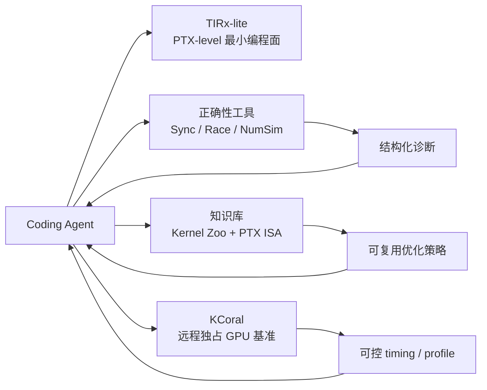

# MLC TIRx Harness：Agentic GPU Kernel 优化的编译器环境范式

> **来源**：MLC Community《TIRx Harness: An Open Compiler Harness for Agentic GPU Programming》（2026-09-29）
> **原文**：<https://blog.mlc.ai/2026/09/29/tirx-harness-an-open-compiler-harness-for-agentic-gpu-programming>
> **代码**：<https://github.com/mlc-ai/TIRx-harness> · <https://github.com/mlc-ai/tirx-kernels>
> **调研时间**：2026 年 9 月
> **一句话结论**：TIRx Harness 的价值不在“Agent 会写 GPU kernel”，而在把编译器语义、静态检查、可复用 kernel 证据与独占 GPU 基准包装成 Agent 可消耗的高密反馈环境；它能提高 agent 搜索的 **token 效率**，但公开数据仍是 kernel time 加速，不能直接折算为端到端每 Token 成本下降。

---

## 1. 核心判断

### 1.1 问题定义：Agent 的 token 花在了哪里

高性能 GPU kernel 开发不是一个纯代码生成问题，而是“搜索-测量-归因”循环。MLC 观察到，coding agent 的多数预算消耗在四类环境不确定性上：

| 不确定性 | 典型表现 | TIRx Harness 对应组件 |
| :--- | :--- | :--- |
| 编译语义不确定 | Agent 知道目标执行策略，却不知道源代码如何 lower 成该策略 | TIRx-lite 贴近 PTX 的最小 IR |
| 正确性不确定 | 偶发同步、数据竞争、数值错误只给 pass/fail | Synccheck、Racecheck、NumSim、Compute Sanitizer |
| 知识不可复用 | 每次运行重新学习编程模型和优化套路 | 60+ 具体 kernel 组成的 Kernel Zoo 与 PTX ISA 文档 |
| 测量不确定 | 多 agent 共享 GPU 时，计时受并发负载污染 | KCoral 远程基准服务器集中调度 |

这与智谱 Infra Agent 的“高密反馈”结论一致：端到端指标太稀疏，必须给 agent 局部、廉价、可客观验证的反馈。TIRx Harness 把该思想从推理系统调优推进到 Blackwell kernel 生成。

### 1.2 技术形态：不是自动调参器，而是 Compiler Harness

TIRx Harness 由四层组成：

**TIRx-lite** 保留循环、条件、寄存器、共享内存、tensor map、CTA/warp/lane 坐标和 PTX 指令，但不提供高层 tile 和通用 tensor layout 抽象。其取舍是降低 agent 的语义预测成本：PTX ISA 成为语义真相，GPU 指令和调度策略更直接暴露给 agent。

**Kernel Zoo** 不让 agent 只写自然语言总结，而是保留具体实现、输入构造、正确性检查与 benchmark 入口。这解决了 agent-written summary 容易过拟合单次调试、丢失实现上下文的问题。

**KCoral** 将 GPU 评测从 agent 环境剥离：agent 本地做 CPU 检查和代码修改，GPU 请求交给集中调度的服务器，避免不同 agent 的并发执行污染 timing。这也是后续扩展到 Thor 等边缘硬件的关键边界。

---

## 2. 公开性能结果与解释边界

### 2.1 结果摘要

官方评测在 NVIDIA Blackwell GPU 上运行，使用 Humanize 2 flame chase workflow，优化期间关闭 web access；基线为 2026-09-25/26 curated sweep 记录的实现版本。指标是 **GPU kernel time**，不是端到端应用延迟。

| Workload family | 对比对象 | 官方几何平均加速 | 解释 |
| :--- | :--- | ---: | :--- |
| KDA forward | FlashKDA | **2.94x** | 从 GDN 迁移层级逆分解，替代串行 32x32 递推 |
| KDA backward | FLA chunk backward | **6.84x** | 将转置、对角缩放与逐行点积移到 Tensor Core 路径 |
| MSA prefill | 优化参考实现 | **2.59x** | 利用 PTX `tcgen05.mma` output-lane masking 等硬件能力 |
| MSA decode | 优化参考实现 | **3.99x** | 覆盖不同 dispatch 路线 |
| KDA decode | 优化参考实现 | **1.33x** | 小幅但仍有价值 |
| MLA | 优化参考实现 | **1.71x** | 针对 sparse MLA / DeepSeek-V4 形态 |
| VSA | 优化参考实现 | **1.68x** | 视频稀疏注意力 |

### 2.2 三个高价值优化案例

1. **用更多算力换关键路径缩短**：KDA backward 中，agent 计算完整 64x64 矩阵再只保留对角线，用看似浪费的 Tensor Core 算力替代共享内存 partials 与 busy compute warp 的 reduction，官方称约 15% latency 改善。
2. **硬件文档扩展搜索空间**：MSA sparse-prefill 中，agent 从 PTX ISA 发现 `tcgen05.mma` output-lane masking。该 mask 不减少 MMA 计算量，却提升观测 GPU 频率，带来 2-3% 收益。
3. **策略迁移而非代码复制**：MSA 借用 FlashAttention-4 的 native/software exponential 混合策略，用普通 FMA 缓解原生 exp 路径，约 2.9% 改善；KDA forward 借用 GDN 的层级逆分解，约 17% 改善。

### 2.3 必须保留的四个限定

1. **不同 family 的参考实现不同**，加速倍数只能 family 内部解释，不能横排成“KDA 比 MLA 更强”。
2. **kernel time 不等于 serving 延迟或 token 成本**。KDA 2.94x/6.84x 不能推出 Kimi K3 线上成本等比例下降。
3. **基线随日期快速变化**。官方明确说 agent、workflow、compiler 与 reference implementation 都可能在数天内改进，结果不是永久排名。
4. **公开复现数据尚不完整**。截至 2026-09-30，`tirx-kernels` main 分支的 `bench_suite/baseline.md` 已包含 KDA backward 等部分 pinned 数据，但博客图中的 KDA forward、MSA、VSA 等 native workload 逐 shape 数据未完整出现在该 Markdown 表中；生产评估需自行运行 `--with-references` 或等待 baseline promotion。

---

## 3. 与 CAKE / Jalapeño 的关系

TIRx Harness 不是孤立项目，而是 2026 年“compiler-agent co-design”趋势的一个实现：

| 项目 | 共同点 | 差异 |
| :--- | :--- | :--- |
| **NVIDIA/CMU CAKE** | 同样认为高层 DSL 隐藏调度决策是 agent 的主要障碍，主张 typed、hardware-explicit IR 与可操作诊断 | CAKE 论文报告 matched Flash-KMeans、KDA、KNN/KMeans 与 upstream PR 结果；其 KDA forward 为 2.05x over FlashKDA，与 TIRx 2.94x 的预算、shape 与 baseline 不同，不可直接比较 |
| **OpenAI Jalapeño** | 官方引用其为“让编程目标对 AI 足够清晰、可预测”的全栈设计思想 | Jalapeño 偏芯片与系统目标设计；TIRx 是 GPU kernel 编译器外设环境 |
| **TIRx Harness** | 开源、可安装、带 agent skills 与远程 GPU server | 更强调 artifact-level 自我改进：成功 kernel 进 Kernel Zoo，失败 trace 改进工具 |

这三者共同指向一个方向：未来基础设施优化的竞争不只是模型能力，而是谁能为 agent 提供更低的语义不确定性、更短的验证周期和更强的归因能力。

---

## 4. 对 Token 经济学的影响

### 4.1 直接影响：降低优化成本，而非直接降低推理单价

Token 成本公式仍然成立：

$$
\text{每百万 Token 成本} =
\frac{\text{年化 TCO} + \text{工程优化成本}}{\text{年化有效吞吐}}
$$

TIRx Harness 主要改变右侧工程项与时间项：

* 减少 agent 反复读文档、猜编译行为、重复发现已知策略的上下文 token；
* 用 CPU 侧 Sync/Race/NumSim 先过滤错误候选，降低 GPU 算力浪费；
* 用集中调度基准减少不可信测量导致的错误选择；
* 把成功 kernel 固化为可复用 artifact，让下一次优化从更高起点开始。

这属于 **研发 token 效率** 与 **硬件算力利用率** 的改善，不等于线上 serving token 单价等比例下降。只有当目标 kernel 是端到端瓶颈，且优化后的 kernel 通过端到端 serving、精度、SLA 与稳定性验证后，才能进入每 Token 成本模型。

### 4.2 最适合的落地场景

TIRx Harness 的投入产出比在以下条件最高：

1. **Blackwell 数据中心集群**：KDA、MSA、MLA、VSA 等注意力与线性注意力 kernel 已有公开实现，且主要面向 `sm_100a`，部分支持 `sm_103a`/`sm_107a`。
2. **长上下文 / 线性注意力模型规模化服务**：KDA、GDN、MLA 等 kernel 的 prefill、decode、backward 优化会直接影响长上下文吞吐与训练/微调成本。
3. **多 agent 并行优化团队**：KCoral 的价值依赖“多 agent 共享 GPU 会污染测量”这一问题；单机单人小规模使用时，收益会下降。
4. **已有严格正确性门禁的推理平台**：TIRx 的诊断能减少搜索，但最终仍需与上游实现、端到端 serving benchmark 与生产监控闭环。

### 4.3 不建议立即押注的场景

* **非 NVIDIA Blackwell 主力集群**：公开 kernel 与性能调优集中在 `sm_100a`，迁移成本未知。
* **只想获得直接推理降本的团队**：应优先量化模型端到端瓶颈。如果瓶颈在调度、KV cache、网络、MoE routing 或批处理，kernel harness 不是第一优先级。
* **合规风险敏感的商业集成**：`tirx-kernels` 是 Apache-2.0，但截至 2026-09-30 `TIRx-harness` 仓库未标注 license；商用前需确认授权。

---

## 5. 可借鉴的系统设计原则

即使不采用 TIRx，以下四条原则值得移植到推理基础设施团队：

1. **给 agent 具体证据，而不是总结**：优化知识应保存为可运行 kernel、输入、正确性断言、benchmark 命令与 trace。
2. **先 CPU 检查，后 GPU 验证**：同步、竞态与数值数据流检查能显著减少昂贵 GPU 试错。
3. **测量必须是独占、集中、可归因的**：共享 GPU 上被污染的 timing 会把 agent 引向错误方向。
4. **失败也进入闭环**：工具 bug、unsupported behavior 与缺失检查应变成可复现 reproducer，成功候选则进入知识库。

这与本库 [12-智谱AI-10万卡国产集群与Infra-Agent推理优化实战.md](12-智谱AI-10万卡国产集群与Infra-Agent推理优化实战.md) 的 Dense Feedback 原则互补：智谱展示了生产推理系统中的反馈设计，TIRx 展示了编译器与 kernel 层的反馈设计。

---

## 6. 风险与待验证问题

1. **许可证**：`TIRx-harness` 仓库当前无 license 文件，开源可用性与商用授权需确认。
2. **成熟度**：harness 与 kernels 均在 2026-09-29 公开，PyPI 0.1.x，历史很短，API 与基准可能快速变动。
3. **平台覆盖**：主要面向 Linux x86_64、Python 3.12/3.13、CUDA 13.x 与 Blackwell；Thor 等边缘目标还处于架构设想阶段。
4. **端到端收益**：需要补充 serving 级 TTFT、TPOT、goodput、精度衰减与 P99 稳定性数据。
5. **基准可复现性**：官方图与 public pinned baseline 的覆盖范围尚未完全对齐，复现时应固定 commit、依赖版本、GPU 型号、温度/频率与 workload sweep。

---

## 参考来源

1. MLC Community, “TIRx Harness: An Open Compiler Harness for Agentic GPU Programming”, 2026-09-29.
   <https://blog.mlc.ai/2026/09/29/tirx-harness-an-open-compiler-harness-for-agentic-gpu-programming>
2. `mlc-ai/TIRx-harness` GitHub: <https://github.com/mlc-ai/TIRx-harness>
3. `mlc-ai/tirx-kernels` GitHub: <https://github.com/mlc-ai/tirx-kernels>
4. Zihao Ye et al., “CAKE: Compiler-Agent Co-Design for Frontier Kernel Evolution”, arXiv:2608.12629, 2026.
   <https://arxiv.org/abs/2608.12629>
5. TIRx Harness Documentation: <https://tirxharness.mlc.ai/docs/>
