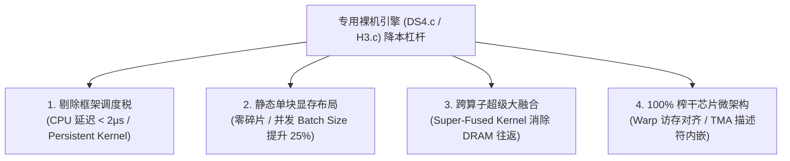

# 专用裸机推理引擎（DS4.c / H3.c / llm.c）的 Token 经济学与降本分析

> **核心命题**：针对特定模型架构与特定芯片微架构的“纯 C/CUDA 裸机专用引擎”（如 DS4.c、H3.c、llm.c 范式），如何通过彻底消除软件框架税、编译期静态常量绑定与极限 Kernel 融合，实现 Token 生产成本的断层式下降。  
> **归档位置**：`Topic-1-TokenEconomy/3-ModelSpecific-Baremetal-Engines.md`  
> **调研时间**：2026 年 8 月

---

## 目录

1. [概念界定：从通用软件框架到极致垂直专用引擎](#1-概念界定从通用软件框架到极致垂直专用引擎)
2. [专用裸机引擎实现 Token 降本的四大核心机制](#2-专用裸机引擎实现-token-降本的四大核心机制)
3. [关键分水岭：朴素单流 C 引擎 vs 生产级专用 C 引擎](#3-关键分水岭朴素单流-c-引擎-vs-生产级专用-c-引擎)
4. [经济学盈亏平衡模型：何时值得自研专用引擎？](#4-经济学盈亏平衡模型何时值得自研专用引擎)
5. [工业界标杆印证与落地范式](#5-工业界标杆印证与落地范式)
6. [总结与架构决策指引](#6-总结与架构决策指引)

---

## 1. 概念界定：从通用软件框架到极致垂直专用引擎

当前大模型推理服务主要依托通用推理引擎（如标准 vLLM、SGLang、HuggingFace TGI、TensorRT-LLM）。为了兼容成百上千种模型架构（Llama、Qwen、Mistral、DeepSeek）、多种硬件平台（NVIDIA、AMD、Intel、Ascend）以及动态变化的上下文长度，通用引擎必须引入多层抽象：
* Python 运行时环境与全局解释器锁（GIL）；
* 动态计算图解析与算子分发调度器；
* 复杂的通用内存池与跨框架张量格式转换。

而类似 **`DS4.c`**（针对 DeepSeek-V4 纯 C/CUDA 定制引擎）、**`H3.c`** 或 Andrej Karpathy 的 **`llm.c` / `llama2.c`**，代表了 AI Infra 的另一种极端演进路径——**极致垂直一体化（Extreme Vertical Specialization）**：

```
通用框架 (vLLM / PyTorch):
  Python Runtime / GIL ──> 动态计算图 ──> 算子分发调度 ──> 通用 CUDA Kernel ──> 动态显存池
  (代价: 50-200μs CPU 调度税 / 显存内部碎片 / 通用内存往返开销)

专属裸机引擎 (DS4.c / H3.c):
  编译期静态常量 (Head/Dim/Layer/SM) ──> 静态内存单一分配 ──> 纯 C/CUDA 持久化 Super-Kernel
  (收益: CPU 调度开销 < 2μs / 显存零碎片 / 寄存器内就地计算)
```

---

## 2. 专用裸机引擎实现 Token 降本的四大核心机制



### 2.1 彻底剔除 CPU 调度税与 Python 运行时开销
* **通用痛点**：在高吞吐连续批处理或微秒级交互场景中，Python 运行时的对象创建、垃圾回收与分发调度，使得每个 Forward Step 存在 **50–200 微秒的 CPU 侧固定损耗**。对于 MoE 架构（需高频计算专家路由 Gating），CPU 往往成为隐藏瓶颈。
* **专用优化**：
  * `DS4.c` 使用纯 C 编写主循环，采用 **CUDA Persistent Kernels（持久化内核）** 或极简静态 CUDA Graphs；
  * GPU 各 SM 在初始化后常驻执行，通过片上原子信号量完成同步，CPU 仅负责监听网络 I/O，**Step 调度延迟直接压缩至 < 2 微秒**。

### 2.2 全生命周期静态内存预分配（零显存碎片，做大并发分母）
* **通用痛点**：通用引擎为了支持任意请求尺寸，普遍采用伙伴算法或多级内存池，导致 10%–20% 的显存处于内部碎片或预留缓冲状态。
* **专用优化**：
  * 在编译期，DeepSeek-V4 的所有超参数（隐藏层维度 $d=7168$、MLA 潜空间维度 $d_c=512$、专家总数 256、激活专家数 8、层数 $L=64$）均被定义为编译期常量宏；
  * 整个系统启动时**仅调用一次 `cudaMalloc`** 预分配一块完全连续的物理显存，所有中间激活值（KV Cache、Logits、Scratchpad）位置在编译期计算完毕；
  * **在相同硬件显存（如 H20 96GB 或 GB10 128GB）下，能比通用框架多容纳 20%–30% 的并发 Batch Size**，直接做大 Token 吞吐分母。

### 2.3 跨算子“超级大融合”（Super-Fused Kernels）
* **通用痛点**：在通用计算图中，`RMSNorm`、`MLA 矩阵投影`、`MoE Top-K Gating`、`FP8/NVFP4 反量化` 分属不同算子 Kernel，中间特征图必须反复写回 GPU 显存（DRAM）。
* **专用优化**：
  * `DS4.c` 可以针对目标芯片（如 H20 或 B200）编写手写汇编级超级融合 Kernel；
  * 激活向量从读取进 SM 寄存器（Registers）后，在片上完成从归一化、低秩投影到 MoE GEMM 的全部数学运算；
  * **彻底阻断中间张量向全局显存的溢出**，在内存带宽受限的硬件上将有效算强提升 **40%–60%**。

### 2.4 100% 榨干特定硬件的微架构指令集
* **针对 H20（高带宽 4.0 TB/s，低算力 296 TFLOPS）**：硬编码手工排布每个 Warp 的 128-byte 连续内存合并加载，将全局带宽利用率推升至理论物理上限的 **95%+**（通用 Triton Kernel 通常在 75%–85%）。
* **针对 GB10（273 GB/s 带宽，1 PFLOPS FP4）**：直接在 C 结构体中嵌入 Blackwell SM120 专属的 `TMA` 异步张量描述符与 `TMEM` 片上存储指令，完全掩盖 LPDDR5X 的内存延迟。

---

## 3. 关键分水岭：朴素单流 C 引擎 vs 生产级专用 C 引擎

在评估专用引擎时，必须警惕一个常见的**技术与经济学误区**：

| 引擎类型 | 架构特征 | 实际每百万 Token 成本 (CPM) | 经济学归因 |
| :--- | :--- | :---: | :--- |
| **朴素单流专用 C 引擎**<br/>(如原始 `llama2.c` 范式) | 纯 C 编写，但仅支持单请求串行生成 (Batch Size = 1) | ❌ **极其高昂 (比通用框架贵 5–10 倍)** | 虽然单请求延迟极低，但单流下 GPU Tensor Core 利用率低于 10%，硬件折旧与电费按时间流逝，单位时间产出 Token 总数过低。 |
| **生产级专属 C 引擎**<br/>(如完整实现的 `DS4.c`) | 纯 C/CUDA + 编译期绑定 + 高性能并发调度 | ✅ **大幅降低 (比通用框架便宜 30%–60%)** | 在保留裸机微秒级执行的同时，实现了动态连续批处理与显存分页复用。 |

> [!IMPORTANT]
> **生产级 `DS4.c` 实现降本的必要条件**：
> 1. **Iteration-level Continuous Batching**：必须在 C 层面支持迭代级请求动态插拔；
> 2. **Paged KV Cache / Radix Prefix Caching**：必须在 C 层面管理非连续物理显存页与前缀复用；
> 3. **极低位宽量化与微块加速**：原生支持 FP8 / NVFP4 / INT4 微块计算。

---

## 4. 经济学盈亏平衡模型：何时值得自研专用引擎？

开发与维护一套像 `DS4.c` / `H3.c` 这样的专属引擎，需要顶尖的底层系统与 CUDA 工程师，研发前期 CapEx 与维护成本极高，且丧失了模型结构快速迭代的灵活性。

### 4.1 盈亏平衡决策公式

$$\text{净收益 (Net ROI)} = (\text{通用引擎单月算力 TCO} - \text{专属引擎单月算力 TCO}) \times \text{模型服役月数} - (\text{专属引擎研发人力成本} + \text{持续维护成本})$$

```
专属引擎经济效益平衡曲线：
  Token 总生产量 (Volume) < 临界点: 研发人力成本占主导 ──> 研发专用引擎亏损 ❌
  Token 总生产量 (Volume) > 临界点: 硬件 TCO 节省 30%-50% ──> 净收益呈数倍爆发 ✅
```

### 4.2 场景决策矩阵

| 业务场景 | 硬件规模与用量 | 是否推荐自研专用引擎？ | 核心决策理由 |
| :--- | :--- | :---: | :--- |
| **初创团队 / 探索期业务** | 单月 Token < 5 亿，模型频繁更换 | ❌ **强烈不推荐** | 模型寿命可能短于引擎开发周期，软件重构成本吞噬一切收益。使用 **vLLM / SGLang** 是最优解。 |
| **中等规模企业业务** | 单月 Token 10 亿 – 100 亿，模型架构稳定 | ⚠️ **审慎评估** | 优先选择 vLLM/SGLang 官方插件化扩展（如编写定制 Triton Kernel），而非全量重写 C 引擎。 |
| **超大规模主力模型 (Hyperscale)**<br/>(如字节、阿里、Kimi 运营主力大模型) | 集群规模 > 1,000 张 GPU，单月 Token > 1,000 亿 | ✅ **极其推荐 (ROI 爆棚)** | 算力吞吐提升 30%，每月可直接节省数百万元服务器采购、租赁折旧与机房电费，数周内覆盖研发成本。 |
| **特定边缘/端侧固定硬件**<br/>(如 DGX Spark GB10、车载智驾芯片、机器人) | 硬件固定（如 128G UMA）、功耗极度受限（150W） | ✅ **极其推荐** | 硬件边界死锁，必须依靠裸机算子消除框架税，才能在有限功耗与带宽下跑通 70B 级实时推理。 |

---

## 5. 工业界标杆印证与落地范式

在实际工业界落地中，头部技术公司早已沿着这一范式进行深度布局：

1. **Moonshot AI（月之暗面 · Kimi）**：
   * 其长文本推理体系 **Mooncake** 并非依赖通用开源框架直接组装，而是针对其特定的长上下文注意力特征与分级存储体系，用高性能 C++ / CUDA 构建的专属推理栈。
2. **Groq LPU 架构**：
   * Groq 极速推理的核心思想与 `DS4.c` 高度一致：编译器在编译阶段就将 Llama 架构的全部算子与张量路径**完全静态绑定**为硬件指令流水线，运行时零动态调度，实现每秒数百 Token 的极致输出。
3. **开源生态的自我进化（vLLM V1 & FlashInfer）**：
   * vLLM 在 V1 重构中大面积剔除早期 Python 动态机制，核心调度器与内核全面向 C++ 与静态编译收敛；
   * FlashInfer 等专用组件库通过 C++ 模板在编译期特化注意力计算，为特定模型生成最优汇编。
4. **🔥 生产级标杆案例：`mu25` 项目（MinerU2.5-Pro / Qwen2-VL on NVIDIA L20 & GB10）**：
   * **定位与场景**：针对高频生产级文档多模态解析任务（MinerU2.5-Pro / Qwen2-VL 1.2B Vision Stack）在 **NVIDIA L20 (48GB)** 与 **GB10 (128GB UMA)** 硬件上的纯 C++/CUDA 裸机推理引擎。
   * **底层实现**：采用 CUDA Driver API + cuBLAS 原生直连，实现 `--fast-vision --fast-preprocess --fast-vit-sdpa` 极致算子融合与无动态内存分配的 KV-cache 解码循环，达成 100/100 连续请求零显存增长。
   * **实测对比（vs 生产级 vLLM 9015 服务）**：
     * **L20 上**：CUDA TTFT 快 **19.8%**（`209.36 ms` vs `261.10 ms`），Decode TPOT 快 **27.3%**（`2.302 ms/tok` vs `3.166 ms/tok`），`exact_match_rate = 1.0` (10/10 完全无损)；
     * **GB10 UMA 上**：同样取得 **TTFT 降低 20.9%、TPOT 降低 27.2%、并发 Batch 并行能力翻倍** 的高度一致收益，且彻底清零了 Host-Device 内存冗余序列化开销。
   * **经济学启示**：`mu25` 在实战中以扎实的数据证明——在**固定业务负载与固定硬件**上，自研 C++/CUDA 裸机专用引擎相比业界最成熟的通用引擎（vLLM），能直接将**单卡有效 Token 吞吐提升 27% 以上，首字延迟缩短 20%，单位 Token 生产成本显著压低**。
   * 详见独立实战专题：[hardware/3-mu25-L20-多模态专属裸机引擎实战.md](file:///Users/will/github/TokenResearch/hardware/3-mu25-L20-%E5%A4%9A%E6%A8%A1%E6%80%81%E4%B8%93%E5%B1%9E%E8%A3%B8%E6%9C%BA%E5%BC%95%E6%93%8E%E5%AE%9E%E6%88%98.md)。

---

## 6. 总结与架构决策指引

1. **特定算力 + 特定模型的专用引擎（如 DS4.c / H3.c 范式）在技术上是单机吞吐与算力能效比（Tokens/Watt/Dollar）的绝对天花板**。
2. **它的降本逻辑不是来源于“重新发明算法”，而是来源于“消灭一切不必要的抽象层与内存搬运”**。
3. **最佳工程落地策略**：
   * **大多数场景**：采用 **"现代通用引擎基座 (SGLang / vLLM V1) + 针对特定模型/硬件深度定制的核心 Super-Fused Kernel (Triton / CUTLASS)"** 的混合模式，兼顾 85% 的极致性能与 100% 的工程敏捷度；
   * **超大规模单一模型或固定端侧硬件（如 GB10）**：果断采用 **纯 C/CUDA 专属裸机引擎**，将硬件算力与显存带宽压榨至物理极限。
