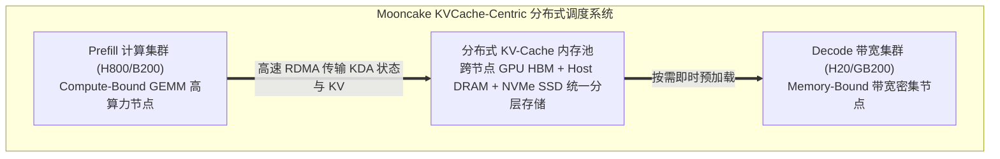

# 月之暗面 Kimi-K3 架构深度剖析：2.8T 全球最大开源 MoE、KDA 混合注意力与 Mooncake 协同

> **来源**：Hugging Face 官方开源权重库（[huggingface.co/moonshotai/Kimi-K3](https://huggingface.co/moonshotai/Kimi-K3)）  
> **核心定位**：月之暗面（Moonshot AI）于 2026 年 7 月开源的 **全球首个 3T 级（2.8 万亿总参数）开源原生多模态 MoE 旗舰模型**。采用 **896 专家 Stable LatentMoE 架构（每次激活 104B 参数）**，融合 **KDA（Kimi Delta Attention）混合线性注意力** 与 **AttnRes 跨层注意力残差检索**，原生支持 **100 万 Token（1M）极长上下文**，配合其自研的 **Mooncake 吞吐级分布式 PD 分离系统**，为全球工业级超长序列推理、仓储级代码工程（Repository-Scale Coding）与深度研究 Agent 提供终极算力底座。  
> **归档位置**：`Topic-1-TokenEconomy/9-月之暗面-Kimi-K3-2.8T超大规模MoE与KDA架构.md`  
> **调研时间**：2026 年 8 月

---

## 目录

1. [核心规格与指标速览](#1-核心规格与指标速览)
2. [三大微架构颠覆性创新](#2-三大微架构颠覆性创新)
   - [2.1 2.8T 总参 / 104B 激活：Stable LatentMoE 896 专家拓扑](#21-28t-总参--104b-激活stable-latentmoe-896-专家拓扑)
   - [2.2 KDA (Kimi Delta Attention)：长文本线性循环与全局检索平衡](#22-kda-kimi-delta-attention长文本线性循环与全局检索平衡)
   - [2.3 AttnRes (Attention Residuals) 跨层特征直接检索](#23-attnres-attention-residuals-跨层特征直接检索)
3. [软硬协同：Kimi-K3 与 Mooncake KV-Cache 分布式解耦系统](#3-软硬协同kimi-k3-与-mooncake-kv-cache-分布式解耦系统)
4. [2026 开源大模型全景梯队划分：轻量 Flash 矩阵 vs 3T 级重型旗舰](#4-2026-开源大模型全景梯队划分轻量-flash-矩阵-vs-3t-级重型旗舰)
5. [Token 经济学与企业级选型与部署建议](#5-token-经济学与企业级选型与部署建议)

---

## 1. 核心规格与指标速览

| 架构参数 | Kimi-K3 规格 | 架构设计意图与 Token 经济学价值 |
| :--- | :--- | :--- |
| **总参数量** | **2.8 Trillion (2.8 万亿参数)** | 全球首个开源 3T 级大模型，具备媲美闭源顶级旗舰（GPT-5 / Claude Opus 4.8）的泛化与推理深度 |
| **每 Token 激活参数** | **104B 参数**（激活率仅 ~3.7%） | 在 2.8T 巨型底座下维持极高稀疏比，降低超大模型的单步计算开销 |
| **MoE 专家拓扑** | **896 个专家**（16 动态激活 + 2 共享专家） | Stable LatentMoE 结构，解决超大规模 MoE 路由抖动与负载崩塌 |
| **模态支持** | **原生全模态 (Text / Image / Video)** | 覆盖文字、高分辨率图像与超长视频，统一 Token 端到端处理 |
| **注意力机制** | **KDA (Kimi Delta Attention) 混合注意力** | 线性循环层（固定内存状态）+ 周期性 MLA 全局检索层 |
| **上下文窗口** | **1,000,000 tokens (1M)** | 完美承载数万行大型项目工程、整部书籍与数小时超长视频 |
| **底层 Serving 系统** | **Mooncake KVCache-Centric PD Disaggregation** | 支撑日均 **1000 亿 Token** 的超大规模集群平稳生产 |
| **开源许可** | Open Weights（开放权重） | 托管于 Hugging Face，支持企业私有化部署与深度微调 |

---

## 2. 三大微架构颠覆性创新

```
Kimi-K3 2.8T 超大规模 MoE 推理拓扑:
┌────────────────────────────────────────────────────────────┐
│                       Kimi-K3 (2.8T)                       │
│                                                            │
│  输入多模态 Token 流 ──> [动态 Embedding 与 AttnRes 编码]  │
│                                   │                        │
│  ┌────────────────────────────────▼─────────────────────┐  │
│  │ KDA (Kimi Delta Attention) 混合注意力层              │  │
│  │   ├── 线性循环 Delta 通道: 固定状态压缩 1M 极长历史   │  │
│  │   └── 周期性 MLA 通道: 跨层 AttnRes 精准全局语义检索 │  │
│  └────────────────────────────────┬─────────────────────┘  │
│                                   │                        │
│  ┌────────────────────────────────▼─────────────────────┐  │
│  │ Stable LatentMoE (896 专家拓扑)                      │  │
│  │   ├── 2 个全局共享专家 (Shared Experts 基础常识)     │  │
│  │   └── 894 个专业领域专家 (每次动态路由 16 个专家)    │  │
│  │   ===> 每 Token 仅激活 104B 参数 (激活率 3.7%)      │  │
│  └────────────────────────────────┬─────────────────────┘  │
│                                   ▼                        │
│  输出 Token 流 ──> [长程多步推导 / 仓储级代码补全 / 深度报告]│
└────────────────────────────────────────────────────────────┘
```

### 2.1 2.8T 总参 / 104B 激活：Stable LatentMoE 896 专家拓扑
* **参数规模跃迁**：Kimi-K3 将开源模型的参数边界从数百 B 级直接推向 **2.8 万亿（2.8T）**；
* **极高稀疏比路由**：拥有 **896 个细分专家**，每次前向计算仅选出 **16 个动态专家 + 2 个常驻共享专家**，实际激活参数仅 **104B（3.7%）**；
* **Stable 机制**：针对 3T 级模型极易出现的专家路由过载或冷死现象，引入了 Latent 路由平衡惩罚项与专家容量缓冲（Expert Capacity Buffer），确保超深层特征分发的稳定收敛。

### 2.2 KDA (Kimi Delta Attention)：长文本线性循环与全局检索平衡
传统注意力在 100 万 Token 下的显存开销与二次方计算使得 2.8T 模型几乎无法低成本 Serving。Kimi-K3 采用了 **Kimi Delta Attention (KDA)** 混合拓扑：
* **线性循环通道（Linear-Recurrent State）**：利用 Delta Rule 状态更新算法，将绝大多数注意力层的历史序列压缩为一个**固定大小的循环隐状态（Fixed-size Recurrent State）**，使 1M 上下文解码时的显存增长被彻底锁死；
* **周期性 MLA 检索通道**：在关键骨干层保留基于多头潜在注意力（MLA）的全局注意力，并结合 **AttnRes** 进行全局高精定位，完全消除了纯线性注意力在长程代码复杂逻辑中的“记忆遗忘”缺陷。

### 2.3 AttnRes (Attention Residuals) 跨层特征直接检索
* 传统 Transformer 依赖逐层残差相加（$x_{l+1} = x_l + F(x_l)$），在极深网络（数百层）中容易发生特征信号稀释；
* **AttnRes** 允许深层注意力头直接对浅层或历史层的隐状态发起**跨层键值检索（Cross-layer Selective Retrieval）**，使 2.8T 巨型网络中的前沿知识与初始 Prompt 约束在深层推理中始终保持 100% 高保真度。

---

## 3. 软硬协同：Kimi-K3 与 Mooncake KV-Cache 分布式解耦系统

月之暗面在工程上最为人称道的是其自研的 **Mooncake 架构**（论文发表于 ASPLOS 2025/2026），Kimi-K3 的模型微架构设计与 Mooncake 基础设施达成了深度软硬协同：



1. **KV-Cache 统一分层解耦存储**：
   * 针对 1M 极长上下文，Mooncake 将集群中闲置的 **Host CPU DRAM 与 NVMe SSD** 统一虚拟化为全局分级 KV 缓存池；
   * 通过高速 RDMA 旁路传输，在 Prefill 节点计算完毕后，即时将压缩后的 KDA 状态下沉至缓存池，解码节点按需拉取，**消除了 GPU 显存对超长并发的硬性锁死**。
2. **PD 分离支撑日均千亿 Token 吞吐**：
   * Prefill 阶段由高算力芯片（H800/B200）以超大 Batch 并行吞吐；
   * Decode 阶段交由高带宽芯片（H20/GB200）依托 KDA 恒定状态快速生成；
   * 在维持严苛 P99 延迟的前提下，**集群有效吞吐（Goodput）提升 300%–500%**。

---

## 4. 2026 开源大模型全景梯队划分：轻量 Flash 矩阵 vs 3T 级重型旗舰

在 2026 年下半年的技术格局中，开源模型形成了清晰的**“轻量高频 Flash 阵营”**与**“超重型 Frontier 旗舰阵营”**的二元分工：

```
2026 开源大模型分工矩阵:
├── 1. 超重型前沿推理与全工程底座 (Frontier Heavyweight Tier · 3T 级):
│   └── 🌙 Moonshot Kimi-K3: 2.8T 总参 / 104B 激活 / KDA 混合注意力 / 1M 上下文
│       └── 场景：仓储级架构重构、全天候自主科研 Agent、万行代码复杂排错与深度决策
│
└── 2. 高频极速 Flash 降本矩阵 (High-Throughput Flash Tier · 6B~18B 激活):
    ├── 🇨🇳 DeepSeek-V4-Flash: 284B / 13B 激活 / MLA + DFlash 块扩散 (代码/数学吞吐之王)
    ├── 🇨🇳 Qwen3.8-Flash-Next: 125B / 6B 激活 / Gated DeltaNet + 51B 查表 (超低显存/端侧之王)
    └── 🇨🇳 GLM-5.3-Flash: 320B / 18B 激活 / 原生多模态 + 混合注意力 (视觉-UI 闭环之王)
```

| 评估维度 | 🌙 Moonshot Kimi-K3 | 🇨🇳 DeepSeek-V4-Flash | 🇨🇳 Qwen3.8-Flash-Next | 🇨🇳 GLM-5.3-Flash |
| :--- | :--- | :--- | :--- | :--- |
| **参数定位** | **2.8T 超重型 MoE** | 284B 极速 MoE | 125B+51B 查表 MoE | 320B 全模态 MoE |
| **激活参数量** | **104B** | 13B | **6B（极低）** | 18B |
| **上下文机制** | **KDA (Delta Linear) + AttnRes** | MLA + FlashMLA | Gated DeltaNet + QSA | Hybrid Sparse/Linear |
| **上下文长度** | **1,000,000 (1M)** | 1,000,000 (1M) | 1,000,000 (1M) | 1,000,000 (1M) |
| **部署门槛** | 8x H200 / B200 集群 | 2x-4x H20 / GB200 | **1x-2x GB10 / Mac Studio 512G** | 4x H20 / GB200 |
| **最适业务分工** | **复杂工程规划、核心复杂难题突破** | **高并发主力业务、代码生成 API** | **极长文档检索、海量轻量 Agent** | **UI/视觉反馈闭环 Coding Agent** |

---

## 5. Token 经济学与企业级选型与部署建议

1. **分级智能路由（Smart Hierarchical Routing）降本模型**：
   * **90% 高频常规请求** $\rightarrow$ 路由至 **DeepSeek-V4-Flash / Qwen3.8-Flash-Next**（单百万 Token 成本 \$0.01～\$0.05）；
   * **10% 极难高价值科研/全库重构任务** $\rightarrow$ 路由至 **Kimi-K3**（单百万 Token 成本 \$0.50～\$1.50，但一次性解决复杂难题，避免轻量模型多次失败重试带来的隐性 Token 浪费）；
   * **综合降本成效**：以 **90% 极低成本 + 10% 顶尖能力**，实现企业整体 Token 支出降低 **90% 以上**，同时保障任务成功率。
2. **私有化集群部署建议**：
   * 针对 Kimi-K3 2.8T 规模，推荐采用 **Mooncake 官方推荐的 Prefill-Decode 分离集群拓扑**，搭配 RDMA 高速网络与主机内存分级卸载，将单台 GPU 节点的显存利用率榨干至极限。
