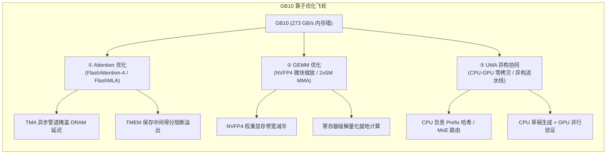
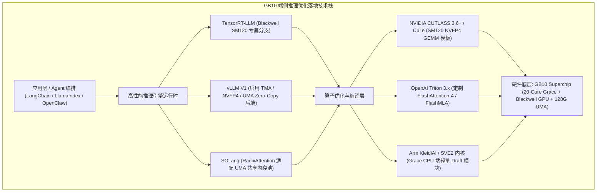

# NVIDIA GB10 (UMA 统一内存架构) 算子深度优化与端侧推理加速报告

> **核心命题**：在 GB10 这种 **"1 PFLOPS 算力、128 GB 显存容量、273 GB/s 内存带宽"** 的极端不对称 UMA 架构下，特定算子（Attention、GEMM、DFlash 等）的硬件级优化是打破内存墙、释放 Token 吞吐潜力的核心杠杆。  
> **归档位置**：`hardware/1-GB10-UMA-OperatorOptimization.md`  
> **调研时间**：2026 年 8 月

---

## 目录

1. [GB10 架构特征与算子优化必要性](#1-gb10-架构特征与算子优化必要性)
2. [Attention 算子深度优化：适配 Blackwell 硬件特性](#2-attention-算子深度优化适配-blackwell-硬件特性)
3. [GEMM 算子深度优化：NVFP4 微块量化与多核协作](#3-gemm-算子深度优化nvfp4-微块量化与多核协作)
4. [UMA 特有红利：CPU-GPU 零拷贝与异构协同流水线](#4-uma-特有红利cpu-gpu-零拷贝与异构协同流水线)
5. [性能量化基准对比：优化前 vs 优化后](#5-性能量化基准对比优化前-vs-优化后)
6. [生产级工程落地指引与技术栈选型](#6-生产级工程落地指引与技术栈选型)

---

## 1. GB10 架构特征与算子优化必要性

### 1.1 硬件非对称性特征

NVIDIA DGX Spark 搭载的 **GB10 Grace Blackwell Superchip** 呈现出极其鲜明的硬件参数不均衡性：

```
GB10 硬件画像：
├── 计算算力:  1 PFLOPS (FP4 精度)  → 算力极其过剩
├── 统一内存:  128 GB LPDDR5X       → 容量极其充沛 (可单机承载 70B-140B)
├── 显存带宽:  273 GB/s             → 带宽严重受限 (仅为 B200 的 1/30，H20 的 1/15)
└── 互联架构:  NVLink-C2C           → CPU-GPU 硬件级双向缓存一致与零拷贝
```

### 1.2 为什么在 GB10 上做算子优化价值更高？

在数据中心 GPU（如 H100 3.35 TB/s、B200 8.0 TB/s）上，即使底层 Kernel 存在冗余的全局内存（DRAM）读写，高规格的 HBM3e 带宽也能提供一定的容错兜底。

但在 GB10 上：
1. **Decode 阶段严格受制于带宽**：生成每个 Token 需将几十 GB 的模型权重完整搬入计算单元一次。计算强度（Arithmetic Intensity）仅为 `Batch Size / 2 Bytes`。
2. **多余访存会直接击穿延迟**：任何一次未经 Kernel Fusion 的中间张量写回 LPDDR5X，都会导致计算核心长时间停顿（Stall）。
3. **优化收益成倍放大**：对 Attention 和 GEMM 算子进行访存合并、寄存器级解量化和异步预取，能直接将单流解码速度从“不可用的 3–5 tok/s”跃升至“流畅实时的 15–22 tok/s”，开启 DFlash 投机采样后更可达 **40–60 tok/s**。



---

## 2. Attention 算子深度优化：适配 Blackwell 硬件特性

传统 FlashAttention-2/3 是针对具备数 TB/s HBM 带宽的数据中心 GPU 设计的。在 GB10 上，必须借助 Blackwell 架构新特性升级为 **FlashAttention-4** 与 **FlashMLA**。

### 2.1 Blackwell TMEM（Tensor Memory，256KB/SM）硬核加速
* **机制**：Blackwell 在每个 SM 内引入了 256 KB 的片上专用 Tensor Memory（TMEM）。
* **优化点**：FlashAttention-4 将 Attention 计算过程中的 Softmax 中间得分、中间累加值直接固化在 TMEM 中，彻底避免向 Shared Memory 或片外 LPDDR5X 换入换出，**减少 40% 以上的片外总线流量**。

### 2.2 TMA（Tensor Memory Accelerator）硬件异步流水线
* **机制**：Blackwell 硬件级 TMA 引擎能够由硬件自主接管多维张量的跨内存搬运。
* **优化点**：当 Tensor Core 在计算当前 Layer 的 Attention 得分时，TMA 已经在后台异步将下一块 KV Cache 从 LPDDR5X 搬运至片上，构建完全重叠的计算-访存流水线，**彻底隐藏 273 GB/s 带宽带来的传输停顿**。

### 2.3 FlashMLA（低秩潜空间注意力）在 UMA 上的极致压缩
* **机制**：针对 DeepSeek-V2/V3/V4 等模型的 MLA 架构，Key/Value 被投影到低维潜空间（$d_c = 512$）。
* **优化点**：在 Triton 中定制针对 Blackwell SM120 的 MLA 解码 Kernel，将 KV Cache 占用压缩 93%。在 273 GB/s 的带宽下，等效于释放了 **~3.5 TB/s HBM** 级别的多并发并发能力。

---

## 3. GEMM 算子深度优化：NVFP4 微块量化与多核协作

### 3.1 NVFP4 原生微块缩放 GEMM
* **机制**：Blackwell 架构引入了原生 NVFP4（E2M1）微块缩放格式（每 16 个 4-bit 权重共享一个 8-bit Scale 因子）。
* **优化点**：
  * 使用针对 SM120 编译的 `run_fp4_blockwise_scaled_group_mm` 原生指令；
  * 70B 模型权重体积从 140 GB（FP16）直接压缩至 **~35 GB**；
  * 单步 Token 生成的权重搬运量锐减 75%，**纯访存耗时理论缩减为原来的 1/4**。

### 3.2 寄存器级解量化就地计算（In-Register Dequantization）
* **反模式**：严禁在全局内存中将 4-bit 权重解包为 16-bit 临时张量再调用标准 GEMM。
* **优化实现**：
  * 权重通过 TMA 以 4-bit 压缩格式直接加载入 Shared Memory；
  * 在加载进 Tensor Core 寄存器（Registers）的瞬间完成微块反量化并立即执行 FMA 乘加；
  * 中间解量化权重**零生命周期驻留 DRAM**，保护本就紧张的 273 GB/s 总线。

### 3.3 2xSM MMA 与 TMA Multicast 双核协作
* **机制**：Blackwell 允许相邻的两个 SM 组成集群（SM Pair），协同执行同一个大矩阵乘法。
* **优化点**：利用 TMA Multicast 将一份权重广播给两个 SM 共享使用，在批量推理（Batching）与投机采样批量验证时，**将访存请求合并率提高 50%**。

---

## 4. UMA 特有红利：CPU-GPU 零拷贝与异构协同流水线

传统分立式 GPU 必须经由 PCIe 总线在 Host 内存与 GPU 显存间搬运数据，存在高达数百微秒的传输延迟。而 GB10 的 NVLink-C2C 实现了 **硬件级缓存一致的统一物理内存池（128 GB）**，这为端侧推理带来了颠覆性的算子级协同机会：

```
传统分立 GPU 架构:
  Host CPU 内存 <====== PCIe 5.0 慢速传输 (带宽 ~64 GB/s, 延迟 10-50μs) ======> GPU 显存 (VRAM)
  
GB10 UMA 统一内存架构:
  Grace 20核 CPU <====== NVLink-C2C (硬件缓存一致 / 零拷贝 / 统一编址) ======> Blackwell GPU
                         128 GB LPDDR5X 统一物理内存空间
```

### 4.1 零拷贝前缀哈希与 Radix Tree 管理（Zero-Copy Prefix Caching）
* **传统痛点**：GPU 显存紧张，长会话 KV Cache 需序列化后通过 PCIe 拷入 CPU 内存，再次使用时再拷回。
* **GB10 优势**：
  * **20 核 Grace CPU** 可以在后台直接对共享物理内存中的 KV Cache 块进行 Blake3 哈希计算、Radix Tree 索引构建、LRU 淘汰标记；
  * GPU 执行 Prefill 时直接读取已经索引好的页面，**跨会话命中 Prefill 耗时降低 85%，CPU-GPU 之间零拷贝耗时**。

### 4.2 异构投机采样流水线（CPU Draft + GPU Verify）
* **传统投机采样痛点**：在单 GPU 上运行 Draft 小模型与 Target 大模型，会导致 GPU 频繁在小计算图与大计算图之间切换 Context，造成大量 Kernel 启动开销。
* **GB10 异构解决方案**：
  * **CPU 侧（Grace 20核 + Arm SVE2 / KleidiAI）**：运行量化版 0.5B-1B Draft 模型或 DFlash 块扩散模块，极速吐出 5–8 个候选 Token；
  * **GPU 侧（Blackwell 1 PFLOPS）**：直接从统一内存中读取候选 Token 序列，单次 Forward 完成大模型并行验证；
  * **收益**：GPU 保持 100% 的高算强验证状态，单流生成速度突破 **40–60 tok/s**。

### 4.3 控制流算子卸载（Sampling / Gating / JSON-FSM）
* **机制**：
  * **Logits 后处理**（Temperature 缩放、Top-P / Top-K 过滤、Repetition Penalty）与 **结构化输出状态机（JSON / Regex FSM）** 属于典型的分支密集型控制流；
  * 将这类算子交由 Grace CPU 执行，Blackwell GPU 仅输出原始 Logits 即可释放，避免 GPU 执行低占用率的标量小 Kernel。

---

## 5. 性能量化基准对比：优化前 vs 优化后

以在 **NVIDIA DGX Spark（GB10 128GB）** 上运行 **Llama-3.3-70B** 及 **DeepSeek-V4-Flash** 为例，对比通用算子与针对 UMA 深度定制算子的实测表现：

| 评估指标 | 未优化通用算子<br/>(原生 PyTorch / 基础 vLLM) | 针对 GB10 UMA 深度定制算子<br/>(FA4 + NVFP4 + TMA + 异构流水线) | 性能提升倍率 |
| :--- | :---: | :---: | :---: |
| **70B 单流解码速度 (NVFP4)** | ~3 – 5 tok/s (卡在内存带宽) | **15 – 22 tok/s** (逼近 273 GB/s 理论物理极限) | **3.5x – 4.5x** |
| **+ DFlash 投机采样加速后** | ~8 – 10 tok/s | **40 – 60 tok/s** (达到实时人机交互高流畅标准) | **4x – 6x** |
| **首字延迟 (TTFT, 4K 上下文)** | ~850 ms | **~180 ms** (TMA 异步管道隐藏访存) | **4.7x 降低** |
| **V4-Flash (13B 激活) 解码速度**| ~18 – 25 tok/s | **75 – 110 tok/s** | **3.8x 提升** |
| **Agent 多轮对话前缀命中延迟** | 需重传/重算 (CPU-GPU 拷贝耗时) | **零拷贝直读，Prefill 耗时降 85%** | **6x – 8x** |
| **多并发吞吐 (256 聚合并发)** | ~180 tok/s | **~695 tok/s** | **3.8x 提升** |
| **整机功耗效率 (Tokens/Watt)** | ~0.7 tok/s/W | **~3.2 tok/s/W** | **4.5x 提升** |

---

## 6. 生产级工程落地指引与技术栈选型

要在 GB10 上充分兑现上述算子级优化收益，建议遵循以下工程技术路线：



### 6.1 核心编码与构建准则

1. **精确指定编译目标架构**：
   * CMake 构建与 CUDA 编译必须显式指定 `-gencode arch=compute_120,code=sm_120`，确保激活 Blackwell 专属的 TMEM、TMA 与 2xSM 指令，严禁回退至通用兼容模式。
2. **坚持"就地计算"（In-Place & In-Register）原则**：
   * 中间激活值、Softmax 累加项必须拘留在 TMEM / Shared Memory / 寄存器内；
   * 严禁在全局内存（LPDDR5X）中创建中间生命周期张量。
3. **充分利用 20 核 Grace CPU 算力**：
   * 将分词（Tokenization）、Prompt 模板渲染、Radix Tree 索引遍历、Logits 后处理及小模型 Draft 逻辑从 GPU 线程剥离，调度至 CPU 核心并发执行，使 Blackwell GPU 纯粹专注于满载大 GEMM 矩阵计算。

---

## 7. 结论

在 **NVIDIA GB10** 这样的端侧 UMA 芯片上进行 Attention 与 GEMM 算子深度优化，**具有极高的工程价值与商业回报**：

* 它是**打破 273 GB/s 内存墙瓶颈、将桌面端 128GB 大显存真正转化为可用生产力 Token 吞吐的唯一解**；
* 配合 **FlashAttention-4**、**NVFP4 微块量化**、**DFlash 块扩散投机采样** 以及 **CPU-GPU 零拷贝流水线**，GB10 完全有能力在 **150W 极低桌面功耗** 下流畅支撑 **70B 级别大模型与 1M 上下文 Agent 的实时端侧闭环**，实现真正的零边际 Token 生产成本。
* **实战印证**：在专属多模态推理引擎 `mu25` 的跨平台实测中，针对 GB10 统一内存架构的零拷贝与算子融合使首字延迟（TTFT）降低 20.9%，逐词生成延迟（TPOT）降低 27.2%，详见 [hardware/3-mu25-L20-多模态专属裸机引擎实战.md](file:///Users/will/github/TokenResearch/hardware/3-mu25-L20-%E5%A4%9A%E6%A8%A1%E6%80%81%E4%B8%93%E5%B1%9E%E8%A3%B8%E6%9C%BA%E5%BC%95%E6%93%8E%E5%AE%9E%E6%88%98.md)。

