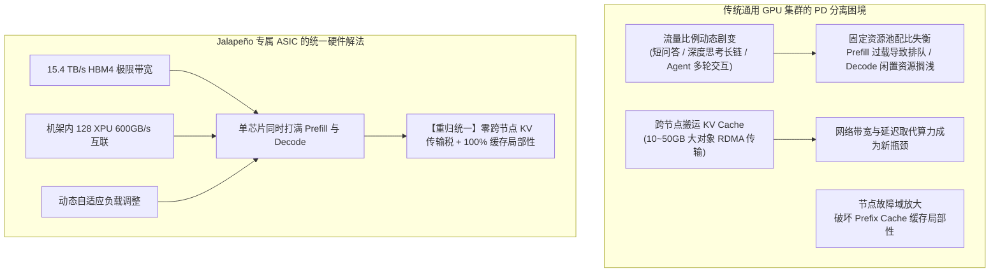

# OpenAI「掀桌」：自研推理芯片「墨西哥辣椒」跑赢英伟达

> **来源**：机器之心（微信公众号 / 知乎专栏）  
> **编辑**：山辉、Youli  
> **发布时间**：2026-08-26 10:41  
> **原文链接**：https://zhuanlan.zhihu.com/p/2075895371092452943  
> **归档位置**：`hardware/2-OpenAI墨西哥辣椒自研芯片.md`

---

## 核心要点速览

1. **芯片定位**：OpenAI 首款自研专用推理 ASIC 芯片 **Jalapeño（墨西哥辣椒）**，专为大语言模型与交互式 Agent 推理阶段设计，非训练芯片。
2. **硬件合作伙伴**：与 **Cerebras** 深度合作，借助其独特晶圆级与近存互联架构协同打造。
3. **超越 NVIDIA 旗舰**：
   * 在 **SemiAnalysis InferenceX** 公开基准测试中全面超越 NVIDIA GB200 / GB300 系统，处于 **Pareto Frontier（帕累托前沿）**。
   * **测试模型**：OpenAI GPT-OSS 120B、DeepSeek R1 670B、Moonshot AI Kimi K2.5 1T。
   * **峰值每瓦吞吐**：达到现有最佳系统（GB300）的 **1.5～1.9 倍**（GPT-OSS 1.9x、DeepSeek R1 1.7x、Kimi K2.5 1.5x）。
   * **交互与低延迟极限场景**：
     * 在 DeepSeek R1 670B 低延迟解码下，每千瓦吞吐达到 **12,258 mixed TPS/kW**（对比 GB300 的 118 mixed TPS/kW，**能效领先高达 104.3 倍**）；
     * 在 Kimi K2.5 1T 上，单用户解码速度提升时，每瓦吞吐优势从 1.5 倍扩大至最高 **56.1 倍**，端到端延迟降低至 1/3.4。
4. **功耗表现**：额定 TDP 为 700W，实测持续功耗始终保持在 **550W 或以下**。
5. **AI 参与造芯（AI for EDA / Chip Design）**：
   * 从最初设计到 **Tape-out（流片定稿）仅耗时 9 个月**；
   * 使用 **GPT-Astra 驱动的 Codex** 自动生成底层 Attention 和 MoE 算子，耗时仅 2 个月即适配三款外部开源模型，**生成的算子比人类专家手写版本还要快 1.5～1.8 倍**。
6. **三档运行模式**：Ultra-fast（极速交互）、Fast（日常低延时）、Batch（极致吞吐）。
7. **落地节奏**：2026 年底前部署进 OpenAI 计算基础设施；Gen 2 深度开发中，Gen 3 开始成形。

---

## 全文内容

一觉醒来，关于 OpenAI 的消息真是满天飞。

先是 X 用户 Leo@synthwavedd 独家声称：OpenAI 已完成一次新的预训练，代号「Bel」，参数规模据称超过 10 万亿，或是 Doug 的继任者，可能成为 Astra / GPT-6 的基础模型……

一圈搜索下来发现，并没有准确的消息。但确凿无疑的是，OpenAI 的首款自研推理芯片出成绩了。

就在刚刚，OpenAI 公布了首款自研推理芯片 Jalapeño 的最新测试结果：取得了重大突破，这款芯片专为大语言模型推理设计，通过全新的架构设计，它能够同时提升吞吐量，并降低延迟，在保持高能效的同时，实现两者兼得。并在多个模型测试中超过 NVIDIA GB200、GB300 系统的效率表现。

随即，OpenAI CEO Sam Altman 也在 X 上表示：「我们制造了一款芯片，它的速度很快。」

需要注意的是，作为 OpenAI 首款自研推理芯片，Jalapeño 并不是用于训练下一代 GPT 模型的芯片，而是针对模型上线后的运行阶段进行优化。

简单来说：训练阶段是让模型学会能力，而推理阶段是让模型快速回答用户请求。Jalapeño 则主要解决的是第二个问题。

OpenAI 表示，传统硬件系统往往需要在两个指标之间做取舍：
* **更高吞吐量（throughput）**：单位时间处理更多请求；
* **更低延迟（latency）**：让用户更快得到响应。

例如，大规模批处理可以提升整体效率，但可能增加单次请求等待时间；而追求极低延迟，又可能牺牲资源利用率。Jalapeño 的目标，是在一个架构中同时优化两者。

而在具体性能方面，OpenAI 表示，在多个大模型推理测试中，Jalapeño 要优于 NVIDIA GB200 和 GB300 系统。其中测试模型包括：
* OpenAI GPT-OSS 120B；
* DeepSeek R1 670B；
* Moonshot AI Kimi K2.5 1T。

尤其引人注意的是 DeepSeek R1 和 Kimi K2.5 的出现，这似乎是在说明：Jalapeño 并不是只针对 OpenAI 自家模型优化，而是能够适配不同的大模型工作负载。

有意思的，Jalapeño 可被翻译为「墨西哥辣椒」，而在此消息一经发布后，也是立即引起了各路网友的调侃与热议。

「你打算用辣椒的名字来命名你的芯片吗？迫不及待想体验了。」

而对于 OpenAI 来说，Jalapeño 的推出，表明 OpenAI 正在尝试打通「模型 — 软件 — 芯片 — 数据中心」的一整条链路。

另外值得一提的是，此次 OpenAI 的 Jalapeño 芯片，在硬件上是与 Cerebras 进行的合作。

Tibo 发文称：「这一能力得益于我们与 Cerebras 建立的深度合作，以及他们独特的硬件架构。未来，这种合作还将进一步推动“超快速”体验的边界。我非常期待双方继续合作，在 Cerebras 平台上不断突破极限，探索如何以最快速度运行我们能力最强的模型，并将这种体验带给对性能要求最高的客户。」

其实，OpenAI 并不是第一家走向自研芯片的 AI 公司。此前很多 AI 大厂也早已纷纷下场造芯。比如 Google 推出了 TPU；Amazon 开发 Trainium、Inferentia；Microsoft 推进 Maia；Meta 也布局自研 AI 加速器……

背后的逻辑非常类似：通用 GPU 足够灵活，但并非针对所有 AI 工作负载优化。对于每天运行海量 AI 请求的公司来说，如果能够针对自身模型、软件系统和服务方式设计芯片，就有机会进一步降低成本……

下面我们来具体看一看 Jalapeño 的能力。

---

## 更快，更省电

Jalapeño 的核心优势，是在相同功耗下完成更多 AI 工作，同时更快返回响应。现有系统通常需要在吞吐量和延迟之间取舍，而 Jalapeño 试图用同一套架构同时实现更高吞吐量和更低延迟。

OpenAI 强调，这种优势不仅出现在自家模型上，也覆盖外部开发的模型，证明 Jalapeño 是一套更通用的推理架构。

在 GPT-OSS 120B、DeepSeek R1 670B 和 Kimi K2.5 1T 三个公开模型上：
* Jalapeño 在峰值吞吐量下实现了 **1.5～1.9 倍的每瓦 AI 工作量**；
* 端到端延迟降低至对比系统的 **1/1.7～1/3.6**；
* 对于高度交互式的工作负载，性能优势达到 **2.1～4.1 倍**。

在 GPT-OSS 120B、DeepSeek R1 670B 和 Kimi K2.5 1T 上，Jalapeño 的峰值每瓦吞吐量分别达到现有最佳系统的 1.9 倍、1.7 倍和 1.5 倍。

其中，在规模最大的 Kimi K2.5 上，Jalapeño 的峰值每瓦性能约提升 1.5 倍，端到端延迟降低约 3.4 倍。

在 Kimi K2.5 1T 上，随着单用户解码速度提高，Jalapeño 相比 GB300 的每瓦吞吐量优势从峰值的 1.5 倍扩大至最高 **56.1 倍**。

OpenAI 没有只比较单颗芯片的峰值性能，而是更关注一个指标：**在满足用户和交互式 Agent 延迟要求的情况下，每单位电力能够完成多少有用的 AI 工作**。

原因也和 Agent 有关。Agent 往往需要连续完成多个步骤，一次请求中看似不大的延迟，会在整个任务执行过程中不断累积。

这也是 Jalapeño 在低延迟区间表现最明显的地方。以 DeepSeek R1 为例，在对比系统此前最佳 TBT 对应的条件下，Jalapeño 每千瓦吞吐量达到 **12,258 mixed TPS/kW**，对比 GB300 的 118，相差约 **104.3 倍**。

在 DeepSeek R1 670B 上，Jalapeño 峰值每瓦吞吐量约为 GB300 的 1.7 倍；在相同解码速度下，优势最高扩大至 104.3 倍。

OpenAI 使用 SemiAnalysis 的公开基准 InferenceX 进行测试，并与目前领先的商用系统比较。从高吞吐量服务到高度交互、低延迟场景，Jalapeño 在三个公开模型上都实现了更好的每瓦性能和延迟组合，位于 Pareto frontier（帕累托前沿）。

在 DeepSeek R1 670B 的不同运行点上，Jalapeño 在每瓦吞吐量与交互速度、端到端延迟之间形成更优组合，处于 Pareto frontier（帕累托前沿）。

Jalapeño 的额定功耗为 700W，不过在此次测试的工作负载中，实际持续功耗始终保持在 **550W 或以下**。

---

## 为 Agent 而生

Jalapeño 从一开始就是围绕现在及未来大语言模型，尤其是交互式 Agent 设计的。

LLM 推理的不同阶段有不同瓶颈：Prefill 更依赖计算能力，Decode 更受内存带宽限制，核心和芯片之间的数据移动也会增加延迟。

因此，OpenAI 将芯片、内存、网络、软件和机架级系统协同设计。包括 KV Cache 在内的模型状态可以被明确放置并尽可能留在本地，让 Jalapeño 同时适应 Prefill 和 Decode，并随两者工作量的变化进行调整。

OpenAI 认为，这正是 Agent 工作负载的关键特征。

有意思的是，AI 不只是 Jalapeño 要服务的对象，也直接参与了这颗芯片的开发。

借助不同阶段的模型，OpenAI 团队从最初设计到 Tape-out（流片设计定稿）**只用了 9 个月**。模型被用于探索不同实现、缩短设计、测量和验证周期，还参与优化芯片的算术电路。

Jalapeño 同样被设计成一个对人类和模型都清晰、可预测的编程目标。使用 GPT-Astra 驱动的 Codex，团队只用了 2 个月，就让三款原本不在 Jalapeño 初始生产计划中的开放权重模型实现了高性能运行。

**在部分 GPT-OSS Attention 和 MoE 模块中，Codex 生成的实现甚至比原有人类专家手写版本快 1.5～1.8 倍**。

---

## 年底部署，二代三代已经在路上

OpenAI 计划在 2026 年底前开始将 Jalapeño 部署到自己的计算基础设施中。目前团队仍在进行生产验证、完善软件、为大规模运行做准备，并继续在更多模型上验证性能。

后续的产品也已经启动，Gen 2 已经进入深度开发阶段，Gen 3 也已经开始成形。

OpenAI 将 Jalapeño 带来的效率变化总结成了三个档位：
* **Ultra-fast 模式**：可以达到过去只有 Fast 模式才有的效率；
* **Fast 模式**：可以达到过去只有 Batch 模式才有的效率；
* **Batch 模式**：本身则进一步提高极限效率。

不过，自研芯片并不意味着 OpenAI 准备摆脱 NVIDIA。

OpenAI 明确表示，满足不断增长的 AI 需求，需要来自所有可用来源的更多算力，公司仍将继续大规模部署 NVIDIA 和其他合作伙伴的加速器，同时覆盖训练和推理工作负载。

---

---

## 硬件微架构深度拆解与系统互联

| 模块 | 核心规格与设计指标 | 工程考量与创新意义 |
| :--- | :--- | :--- |
| **计算核心（Compute Die）** | **单裸片 13.4 PFLOPs MXFP4**（台积电 N3P 制程，光罩极限尺寸） | 单 Die 架构消除 2.5D 双裸片缝合延迟，B0 相比 A0 每瓦性能再提升约 25% |
| **近存系统（Memory System）** | **6 组 HBM4 · 216 GB · 15.4 TB/s 超高带宽** | 引脚速率达 **10 Gbps**（超越 NVIDIA Rubin 的 9.6 Gbps），彻底击碎解码内存墙 |
| **I/O Chiplet 与网络互联** | **台积电 N3E 制程 I/O 芯片 · 32 条 800G SerDes** | • **24 条（600 GB/s）**：机架内 **128 颗 XPU** 本地 Scale-up 全互联 • **8 条（200 GB/s）**：跨 16 机架 **2,048 颗 XPU** 全局 Scale-up 扩展 |
| **主机接口与功耗** | **PCIe Gen5 · 封装 TDP 700W（实测持续 ≤550W）** | 针对数据中心供电与散热极致优化，能效比实现代际断层领先 |

---

## 深度思辨：Prefill-Decode 物理分离在专属 ASIC 时代不再必要了？

在通用 GPU（如 Hopper / Blackwell）构建的推理集群中，**Prefill-Decode 分离（PD 分离）** 被公认为解决“行头阻塞”与“显存抖动”的标准答案。然而，OpenAI 在 Jalapeño 上却**坚持将 Prefill 与 Decode 统一跑在同一颗芯片上**，并在“素颜”（未开启投机采样、未做 PD 分离）状态下实现了对英伟达 GB200/GB300 的全面超越。

这一架构决策背后的深刻动因值得全行业深思：

### 1. 生产环境流量画像的动态性破坏了“固定划分”
* 在传统架构中，将硬件拆分为 Prefill 节点（算力密集）与 Decode 节点（带宽密集），只能在特定预设的“输入/输出比”下达到最优；
* 现实生产中，从“知识库短检索”到“O系列深度长思考链”，再到“Agent 7×24 交互”，序列长度与并发量随时大幅波动。固定的资源池划分必然导致：**Prefill 流量高峰时 Decode 节点被动闲置，Decode 流量高峰时 Prefill 节点被迫空转**。

### 2. 跨机搬运 KV Cache 创造了极其昂贵的“网络税”
* PD 分离虽然消除了单卡内的计算干扰，但把 **数十 GB 的 KV Cache 搬运** 抛给了机房网络；
* 当高并发长文本涌入时，PCIe、NVLink 与 RDMA 的传输延迟成为新的系统木桶短板；
* Jalapeño 依托 **15.4 TB/s 的超高 HBM4 带宽与 128 XPU 机架级近存互联**，使单颗芯片具备同时消化 Prefill 巨量吞吐与 Decode 极速吐字的能力，**免除了所有跨节点传输等待与调度碎片**。

### 3. 终局演进：从“软件调度打补丁”到“专属硬件物理统一”
* **通用 GPU 阶段**：算力与带宽配比受限于通用设计，必须靠上层复杂调度系统（Mooncake / DistServe / JANUS）做解耦与打补丁；
* **专属 ASIC 阶段**：从零定制芯片算力、内存与网络配比，让硬件原生适应大模型全生命周期，**以最极简的单步自回归（STP）实现最高的系统鲁棒性与超千倍 TCO 收益**。

---

## 参考文献与数据源
* [1] OpenAI Official. (2026.8). "Jalapeño: OpenAI's First Custom Inference Chip." openai.com/index/jalapeno-first-results
* [2] 马斯特李. (2026.8). "Jalapeño 拆解：OpenAI 的第一代推理 ASIC，Prefill-Decode 分离不再必要了？" 知乎专栏. zhuanlan.zhihu.com/p/2077148139862111564
* [3] SemiAnalysis. (2026.8). "InferenceX: Standardized LLM Inference Benchmark Suite & Jalapeño Pareto Frontier."
* [4] 机器之心. (2026.8). "OpenAI「掀桌」：自研推理芯片「墨西哥辣椒」跑赢英伟达."
* [5] Sam Altman Post on X. (2026.8.25). x.com/sama/status/2092339694210040187
