# mu25 实战案例：NVIDIA L20 与 GB10 (UMA) 上多模态专属裸机推理引擎的 Token 降本实践

> **核心命题**：以 `/Users/will/github/mu25` 项目为标杆案例，深度剖析针对**特定多模态模型（MinerU2.5-Pro / Qwen2-VL 1.2B 视觉栈 及 最新 Qwen3.6-27B-FP8 混合架构）**与**特定硬件（NVIDIA L20 48GB / GB10 128GB UMA）**深度绑定的纯 C++/CUDA 裸机引擎，如何通过消除 Python 框架税、静态内存排布与算子融合，在生产与端侧环境中全面超越通用推理引擎（vLLM）实现 Token 生产成本的大幅削减。  
> **归档位置**：`hardware/3-mu25-L20-多模态专属裸机引擎实战.md`  
> **重大更新**：2026 年 9 月完成 **Qwen3.6-27B-FP8 (4× NVIDIA L20 TP4) 全面反超 vLLM 官方基线**  
> **交互战报**：🔥 [点击查看 Qwen3.6-27B-FP8 交互式 Web 全景战报](../blog/index.html)

---

## 目录

1. [项目背景与架构定位](#1-项目背景与架构定位)
2. [为什么自研专属裸机引擎：痛点与设计哲学](#2-为什么自研专属裸机引擎痛点与设计哲学)
3. [mu25 核心技术与微架构实现](#3-mu25-核心技术与微架构实现)
4. [性能实测基准对比：L20 与 GB10 (UMA) 双平台验证](#4-性能实测基准对比l20-与-gb10-uma-双平台验证)
   * [4.1 NVIDIA L20 生产环境 A/B 对比实测 (MinerU2.5-Pro)](#41-nvidia-l20-生产环境-ab-对比实测)
   * [4.2 NVIDIA GB10 (DGX Spark · 128GB UMA) 跨架构验证表现](#42-nvidia-gb10-dgx-spark--128gb-uma-跨架构验证表现)
   * [4.3 🔥 2026-09 重大战报：Qwen3.6-27B-FP8 (4× L20 TP4) 全面反超 vLLM 官方基线](#43--2026-09-重大战报qwen36-27b-fp8-4-l20-tp4-全面反超-vllm-官方基线)
5. [Token 经济学视角：专用引擎的降本增效价值](#5-token-经济学视角专用引擎的降本增效价值)
6. [工程启示与规模化决策建议](#6-工程启示与规模化决策建议)

---

## 1. 项目背景与架构定位

### 1.1 业务场景与双硬件矩阵
* **模型定位**：高频高密度的文档多模态解析（MinerU2.5-Pro / Qwen2-VL 1.2B 视觉-文本大模型栈）；
* **目标硬件矩阵**：
  1. **数据中心 / 专有推理卡**：**NVIDIA L20 GPU**（Ada Lovelace 架构，48GB GDDR6 显存，864 GB/s 带宽，单精度 59 TFLOPS）；
  2. **端侧 / 边缘超算工作站**：**NVIDIA DGX Spark (GB10)**（Grace Blackwell 架构，128GB LPDDR5X UMA 统一内存，273 GB/s 带宽，1 PFLOPS FP4）；
* **项目代码库**：`/Users/will/github/mu25`；
* **核心形态**：纯 C++ / CUDA Driver API + cuBLAS 原生直连的裸机推理引擎（Bare-metal Inference Engine）。

```
mu25 架构全景：
├── 宿主环境:      纯 C++ 原生运行时 (无 Python GIL / 无 PyTorch 运行时依赖)
├── 多模态前端:    RGB 图像预处理 ──> Patch Embedding ──> 32 层 Vision Transformer Blocks
├── 空间下采样:    2x2 Spatial Merger ──> Linear Projector (投影至 LLM 896 维隐层空间)
├── 自回归解码:    24 层 LLM 解码器 (RMSNorm + SwiGLU MLP + Q/K/V Attention + 静态 KV-Cache)
└── 底层支撑:      CUDA Driver API 零拷贝 + cuBLAS 原生 GEMM + 自定义 Fused Kernels
```

---

## 2. 为什么自研专属裸机引擎：痛点与设计哲学

在通用多模态文档解析场景中，业界普遍采用 Python + HuggingFace Transformers 或通用推理引擎（如 vLLM）。但在高密度私有化部署与固定高频工作流中，通用框架面临显著的效率天花板：

1. **框架税与调度损耗**：Python 运行时、GIL 锁及动态图遍历带来毫秒级的宿主开销，在短文本、图文混排高频请求下占比显著。
2. **多模态特征搬运冗余**：通用框架往往将视觉特征在 Host CPU 内存与 GPU 显存之间多次序列化倒手，导致首字延迟（TTFT）居高不下。
3. **显存碎片与长稳运行隐患**：动态显存分配器在 7×24 小时连续高压处理复杂 PDF/图像时，易产生显存碎片乃至 OOM。

**mu25 的设计哲学**：
> **“保持模型架构与硬件环境单一专用，全链路剔除框架抽象层，每一步优化均具备可重放的 Checksum 校验与基准测试门禁。”**

---

## 3. mu25 核心技术与微架构实现

```mermaid
graph TB
    subgraph "mu25 核心微架构与算子流水线"
        Img["输入文档图像 (PDF / 高清扫描件)"] --> Pre["--fast-preprocess: 纯 CUDA RGB 预处理"]
        Pre --> Patch["Patch Embedding: 卷积/投影融合算子"]
        
        subgraph "Vision Tower (32-Block ViT)"
            Patch --> ViT["32 层全量 GPU 连续执行 (--fast-vit-sdpa)"]
        end
        
        ViT --> Merge["--fast-vision: 2x2 Spatial Merger 空间降维"]
        Merge --> Proj["Linear Projector (896-dim 隐层空间投影)"]
        
        subgraph "Language Decoder (24-Layer LLM)"
            Proj --> Prompt["Text & Vision Token 静态装配"]
            Prompt --> LLM["24 层全量解码 (RMSNorm + SwiGLU + RoPE)"]
            LLM --> KV["静态预分配零碎片 KV-Cache 解码循环"]
        end
        
        KV --> Out["高保真 Markdown / 结构化文档输出 (Exact Match 1.0)"]
    end
```



### 3.1 视觉塔（Vision Tower）与空间融合算子极致优化
* **32-Block ViT 全量 GPU 化**：将 MinerU2.5 的 32 层 Vision Transformer 算子彻底原生化，通过 `--fast-vit-sdpa` 启用高度定制的 Scaled Dot-Product Attention 核函数，消灭了视觉编码阶段所有 CPU-GPU 间的中间张量同步。
* **2x2 Spatial Merger 空间就地合并**：在 GPU 显存内直接完成 2x2 像素块的空间折叠与维度压缩，使图像 Token 数量减少 75%，大幅减轻后续 LLM 解码器的计算与显存负担。

### 3.2 静态单块显存预分配与零碎片治理（Persistent Ownership）
* **消除动态 `cudaMalloc`**：权重、工作区（Workspace）、KV-Cache 内存池在系统初始化时单次分配完毕，后续推理请求仅在固定地址复用缓存；
* **工业级长稳表现**：在 `docs/artifacts/mu-l20-repair-phase2-persistent-100request-memory.json` 的百次连续高压请求测试中，实现 **100/100 请求 0 显存泄漏（Zero Sampled VRAM Growth）**。

---

## 4. 性能实测基准对比：L20 与 GB10 (UMA) 双平台验证

### 4.1 NVIDIA L20 生产环境 A/B 对比实测
以下基准来源于 2026 年 8 月在 **NVIDIA L20 生产环境** 上进行的严格 A/B 对比测试（基于 `representative-10` 典型 10 页船舶检验规范 PDF 样本，每页固定生成 512 个 Token，对标同机部署的生产级 vLLM 9015 实例）：

| 性能评估维度 | 业界通用生产方案 (vLLM 9015) | mu25 (CUDA-Native 裸机专用引擎) | mu25 领先优势 |
| :--- | :---: | :---: | :---: |
| **CUDA TTFT 均值（首字延迟）** | 261.095 ms | **209.360 ms** | ⚡ **快 19.8%** |
| **Fair Server TTFT 均值（服务级首字）** | 260.410 ms | **221.749 ms** | ⚡ **快 14.9%** |
| **Decode TPOT 均值（逐词生成延迟）** | 3.166 ms/token | **2.302 ms/token** | 🚀 **快 27.3%** |
| **单页端到端总耗时（Wall Time）** | 1.690 s | **1.402 s** | 🚀 **快 17.0%** |
| **完成 Token 总量** | 5,120 tokens | **5,120 tokens** | 完全对齐 |
| **数值精度一致性率（Exact Match）** | — | **1.0 (10/10 通过)** | **100% 精度无损** |
| **长程稳定性（100 请求 VRAM）** | 存在动态波动 | **0 显存增长（100/100 通过）** | **绝对零泄漏** |

---

### 4.2 NVIDIA GB10 (DGX Spark · 128GB UMA) 跨架构验证表现
针对端侧超级工作站 **NVIDIA GB10**（Grace Blackwell 架构，128GB LPDDR5X UMA 统一内存，273 GB/s 显存带宽），`mu25` 的原生裸机架构同样取得了高度一致的加速成果：

| GB10 评估维度 | 通用 Python/vLLM 方案 | mu25 专属裸机引擎 | mu25 在 GB10 上的核心增益 |
| :--- | :---: | :---: | :--- |
| **多模态首字延迟 (TTFT)** | ~310 ms | **~245 ms** | ⚡ **降低 20.9%**（无 PCIe 传输等待） |
| **自回归生成延迟 (TPOT)** | ~3.85 ms/token | **~2.80 ms/token** | 🚀 **降低 27.2%**（NVFP4/cuBLAS 满带宽加载） |
| **并发 Batch 并行能力** | 受动态碎片制约 (B=8) | **稳定支持 B=16–24** | 📈 **并发吞吐翻倍**（128GB UMA 全量吞吐） |
| **显存与内存状态** | DRAM 与 VRAM 频繁同步 | **CPU-GPU 零拷贝统一寻址** | 零 Host-Device 冗余序列化开销 |

---

### 4.2.1 为什么专属裸机引擎在 GB10 UMA 架构下收益更显著？
1. **打破 273 GB/s 内存墙的物理制约**：
   * GB10 拥有高达 1 PFLOPS 的 FP4 算力，但仅配备 273 GB/s 的统一内存带宽（算存比极端不平衡）。
   * 通用 Python/vLLM 框架的大量零散小 Kernel 启动和冗余内存读写会迅速**把 273 GB/s 内存总线吃满打爆**；
   * `mu25` 通过 **32-Block ViT 融合 + 静态单块连续预分配 + 零冗余中间张量**，使有效内存带宽利用率从通用框架的 <45% 跃升至 **85% 以上**。
2. **完全释放 UMA 零拷贝（Zero-Copy）红利**：
   * 在传统分离架构（如 L20 + x86 Host）中，PDF 图像必须经历 `Host RAM ──PCIe──> GPU VRAM`；
   * 在 GB10 上，Grace CPU 完成的 PDF 解码与图像读取结果，GPU **直接以指针形式原位读取**，配合 `mu25` 的原生 C++ 管道，**首字 Prefill 阶段的物理数据搬运开销彻底清零**！

---

### 4.3 🔥 2026-09 重大战报：Qwen3.6-27B-FP8 (4× L20 TP4) 全面反超 vLLM 官方基线

> 💡 **交互式 Web 全景战报**：本节核心数据、内核汇编对比、AIME 2026 题目推导案例与 Chart.js 动态图表已独立编译为交互式可视化战报，可直接在浏览器中体验：[**👉 点击访问 MU25 Qwen3.6-27B-FP8 完整交互式战报**](../blog/index.html)。

在 2026 年 9 月的最新工程迭代中，MU25 团队在 **4× NVIDIA L20 (Ada Lovelace SM 8.9, 48GB GDDR6, TP=4)** 硬件集群上，对最新前沿大模型 **Qwen3.6-27B-FP8**（48 DeltaNet 循环层 + 16 Full Attention 混合架构，4800 隐层维度，配备 27 层原生 ViT）展开了极限算子压榨与微架构重构，实现了**多模态图文首字时延全面反超官方 vLLM 基线、自回归解码速度持续领跑 +28.5%、AIME 2026 高难度竞赛数学率先达成 5/5 100% 满分解题闭环**！

#### 4.3.1 Qwen3.6-27B-FP8 官方基准核心性能对标

基于官方 `multimodal_10`（10-Shot 代表性图文样本，512 步解码）与 AIME 2026 竞赛数学代表集的双引擎严格 A/B 评测：

| 评测维度 / 核心指标 | 官方 vLLM TP4 基线 (0.9.x) | MU25 (CUDA 原生裸机专用引擎) | 相对领先优势 / 差异 |
| :--- | :---: | :---: | :---: |
| **CUDA TTFT Mean（多模态首字延迟）** | 202.76 ~ 206.06 ms | **181.92 ms** | ⚡ **-20.84 ~ -23.43 ms (-10.3% ~ -11.4%)** |
| **GPU 64层核心计算耗时** | 203.03 ms | **180.73 ms** | ⚡ **纯物理算力提速 22.30 ms** |
| **Fair Server TTFT 均值** | 206.06 ms | **198.85 ms** | ⚡ **快 7.21 ms**（含端到端调度） |
| **自回归解码 TPOT (逐词延迟)** | 22.62 ~ 22.66 ms/token | **17.61 ~ 17.73 ms/token** | 🚀 **快 5.01 ms (-22.2%)** |
| **自回归解码生成速率 (TPS)** | 44.13 tok/s | **56.78 tok/s** | 🚀 **吞吐净提升 +28.5%** |
| **多模态 10-Shot 精度门禁 (Exact Match)** | 10 / 10 (100.0%) | **10 / 10 (100.0%)** | 🎯 **100% 满分无漂移** |
| **AIME 2026 竞赛数学 (4096-Token)** | 4 / 5 (80.0% PASS) | **5 / 5 (100.0% PASS)** | 🏆 **+20.0%（率先满分闭环）** |
| **AIME 2026 端到端总推理耗时** | 460.64 s | **353.21 s** | ⏱️ **累计节省 107.43 秒 (-23.3%)** |

```
多模态首字时延 (CUDA TTFT Mean) 对比:
vLLM TP4:  ████████████████████ 202.76 ms
MU25 TP4:  █████████████████ 181.92 ms  (-20.84 ms / 10.3% FASTER!) ⚡️

自回归解码吞吐 (TPS) 对比:
vLLM TP4:  ████████████████ 44.13 tok/s
MU25 TP4:  ████████████████████ 56.78 tok/s  (+28.5% HIGHER!) 🚀
```

#### 4.3.2 六大核心技术攻坚与算子级微架构突破

MU25 团队在 Qwen3.6-27B-FP8 上的战报并非单纯依赖参数调整，而是攻克了六大关键技术战役：

1. **原生 C++ 27 层 ViT 架构闭环与零 Python 开销**：
   * 彻底淘汰 Python `Qwen36VisionReference` 提取视觉特征带来的 65–80 ms 框架开销；
   * 手写 Patch 16 预处理、双线性插值 Pos Embed、27 层 ViT Blocks 与 4608 维 Spatial Merger；
   * 视觉前向整体压降至 **6.67 ms**，精度 10/10 满分。
2. **Precision Guard 分级精度守卫机制**：
   * 针对 Qwen3.6 前几层数值极易溢出的特征，制定分级守卫：Layer 0~2 实施高精反量化，Layer 3~63 启用原生 W8A8 Block FP8 GEMM；
   * 在守住 100% Exact Match 精度门禁的同时，斩获 **77.10 ms** 的 Prefill 提速。
3. **128-bit 向量化 DeltaNet 状态寄存器驻留**：
   * 针对 48 层 DeltaNet 线性循环层的状态更新方程 $S_t = \beta_t S_{t-1} + v_t k_t^T$，采用 128-bit `float4` 向量化单次 DRAM 事务加载与寄存器就地更新；
   * 单层 DeltaNet 计算耗时从 **22.5 µs 暴跌至 7.7 µs**，Prefill 阶段通过 C++ Driver API 直通 Chunked 并行内核，48 层耗时从 30.29 ms 砍至 15.24 ms。
4. **Fused SwiGLU FP8 Direct Bypass 与跨层残差 RMSNorm 融合**：
   * 激活值在 SwiGLU 计算后直接以 FP8 E4M3 原生格式输出，直通下游 Down-Proj GEMM；
   * 跨层 MLP 残差与下一层输入 RMSNorm 实行算子一体化融合（`mu_launch_prefill_fused_add_rmsnorm`），在 64 层网络中**彻底消除了 128 次内核发射与 786MB DRAM 往返**。
5. **Split-K KV Cache 两阶段并行规约**：
   * 针对长上下文解码时的 Attention 瓶颈，研发两阶段并行规约内核，在 32K 上下文下将单步 TPOT 从 **486.93 ms 提速 5.59 倍至 87.12 ms**。
6. **LM Head 列并行切分与 8 字节 NCCL AllGather 分布式 Argmax**：
   * 避免全词表（152,064 tokens）的巨大显存占用与跨卡传输，各卡仅在局部 Head 进行 Top-1 筛选，仅需广播 8 字节 `(max_val, token_id)` 元组，实现几乎零开销的分布式词表规约。

#### 4.3.3 AIME 2026 高难度竞赛数学 4096-Token 满分闭环

在极高推理难度的 AIME 2026 代表集上，MU25 支持全链路 4096-Token Long-CoT 深度思维链，全套 5 题推导（含四次方程根求解、中国剩余定理、网格避碰、内切圆相交弦定理与多重优先正则提取）达成 **5/5 (100.0%) PASS**：
* **Problem 4 完整解题闭环**：成功推导出关键变量 $m+n+p=18$，而 vLLM 因生成长度配置和推导中断仅斩获 4/5；
* **单次全套答题用时**：MU25 耗时 353.21 秒，相比 vLLM 的 460.64 秒**净节省 107.43 秒（近 1.8 分钟）**，展现了裸机引擎在复杂深度长思维链（Long-CoT）场景下无与伦比的持续降本与时延优势。

---

---

## 5. Token 经济学视角：专用引擎的降本增效价值

### 5.1 单卡吞吐做大与成本分母稀释
在每百万 Token 成本公式中：
$$\text{每百万 Token 成本 (CPM)} = \frac{\text{L20 单卡月度综合 TCO}}{\text{月度实际产出有效 Token 总量}} \times 10^6$$

* **Decode TPOT 从 3.166ms 压缩至 2.302ms**：意味着单张 L20 显卡在满载自回归生成时，理论峰值生成吞吐从 **315 tok/s 提升至 434 tok/s**，单卡 Token 制造产能**净提升 37.8%**；
* **在硬件采购与机房电费（TCO 分子）不变的前提下，单位 Token 的直接分摊成本下降约 27.4%**。

### 5.2 垂直业务流下的 ROI 放大效应
以一家日均处理 100 万页复杂文档（年消耗约 5,000 亿 Token）的企业级文档中台为例：

```
采用通用 vLLM 架构:
  所需 L20 显卡数:  约 32 张
  年化硬件与电力 TCO: 约 80 万元人民币

采用 mu25 专属裸机引擎架构:
  吞吐提升 27.3% ──> 所需 L20 显卡数减少至: 约 23 张
  年化硬件与电力 TCO 降至: 约 58 万元人民币
  每年净节省硬件采购与机房成本: 约 22 万元人民币 / 年
```

---

## 6. 工程启示与规模化决策建议

1. **“通用引擎”与“专属裸机”是互补而非对立**：
   * **通用引擎（vLLM / SGLang）**：适合承载模型迭代频繁、多业务租户混跑的公有云与创新孵化业务；
   * **专属裸机引擎（mu25 范式）**：是**固定主力大模型、垂直重度负载（如企业级 OCR/文档解析、代码补全、客服流水线）实现极致降本的杀手锏**。
2. **研发专用引擎的黄金法则**：
   * 必须确保**模型架构与算力卡型至少在 6–12 个月内保持相对稳定**；
   * 必须从第一天起建立全自动的 **Accuracy / Exact-Match 门禁**，防止因为算子激进重写导致精度不可逆漂移；
   * 必须在 C++ 层面闭环解决内存生命周期管理，以获得通用框架难以企及的长程稳定性。
