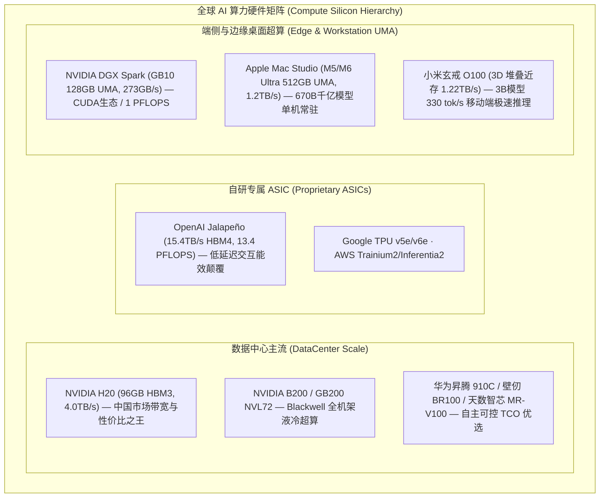

# AI 算力硬件与芯片微架构专题 (Hardware Silicon & Compute Matrix)

> **核心定位**：本目录系统归档大模型（LLM/VLM）在**数据中心级算力芯片**、**自研专用 ASIC** 以及 **端侧/边缘统一内存（UMA）与近存计算架构** 上的微架构剖析、算子深度优化、实测吞吐基准与 TCO 经济学模型。

---

## 📂 算力硬件文档全景目录

| 序号与文档 | 芯片 / 硬件平台 | 核心微架构与技术突破 | 典型模型承载与收益 |
| :--- | :--- | :--- | :--- |
| 📘 [1-GB10-UMA-OperatorOptimization.md](file:///Users/will/github/TokenResearch/hardware/1-GB10-UMA-OperatorOptimization.md) | **NVIDIA GB10** (Grace Blackwell DGX Spark) | **128GB LPDDR5X UMA 架构**：TMEM 驻留 + TMA 异步流 + FlashAttention-4 + NVFP4 微块量化 + CPU-GPU 零拷贝流水线 | 突破 273 GB/s 内存墙，桌面级 150W 功耗流畅运行 70B 大模型 |
| 🌶️ [2-OpenAI墨西哥辣椒自研芯片.md](file:///Users/will/github/TokenResearch/hardware/2-OpenAI%E5%A2%A8%E8%A5%BF%E5%93%A5%E8%BE%A3%E6%A4%92%E8%87%AA%E7%A0%94%E8%8A%AF%E7%89%87.md) | **OpenAI Jalapeño** (联合 Cerebras 打造) | **13.4 PFLOPS (MXFP4) + 216GB HBM4 (15.4 TB/s)**：晶圆级近存互联，700W TDP（实测≤550W），AI 参与 9 个月流片 | **InferenceX 帕累托前沿**：DeepSeek R1 能效超越 GB300 达 104.3x，Kimi K2.5 达 56.1x |
| 🔬 [3-mu25-L20-多模态专属裸机引擎实战.md](file:///Users/will/github/TokenResearch/hardware/3-mu25-L20-%E5%A4%9A%E6%A8%A1%E6%80%81%E4%B8%93%E5%B1%9E%E8%A3%B8%E6%9C%BA%E5%BC%95%E6%93%8E%E5%AE%9E%E6%88%98.md) | **NVIDIA L20 & GB10** (mu25 纯 C++/CUDA 引擎) | **MinerU2.5-Pro / Qwen2-VL 1.2B 专属裸机实现**：32 层 ViT GPU 算子融合 + 2x2 Spatial Merger + 静态单块显存预分配 | **实测超越 vLLM**：首字延迟 (TTFT) 降低 19.8%–20.9%，生成延迟 (TPOT) 降低 27.3%，零显存泄漏 |
| 🍎 [4-Apple-MacStudio-M5-M6-Ultra-UMA.md](file:///Users/will/github/TokenResearch/hardware/4-Apple-MacStudio-M5-M6-Ultra-UMA.md) | **Apple Mac Studio** (M5 Max / M5 Ultra / M6 Ultra) | **最高 512GB UMA 统一内存 + 1.2–1.6 TB/s 带宽**：UltraFusion 芯片互联 (>2.5 TB/s) + 64核 NPU + Thunderbolt 5 (120Gb/s) 集群 | **海量显存之王**：单机 200W 功耗下无缝常驻 **DeepSeek-R1 670B (4-bit)** 或 **Llama 3.1 405B**，完全免除分布式网络通信税 |

---

## 🧭 硬件算力矩阵选型速查

---

## 🔗 相关全栈报告联动
* 📘 全栈总览大报告：[Topic-1-TokenEconomy/1-Infra-TokenCostReduction-Report.md](file:///Users/will/github/TokenResearch/Topic-1-TokenEconomy/1-Infra-TokenCostReduction-Report.md)
* 📑 专属裸机推理引擎分析：[Topic-1-TokenEconomy/3-ModelSpecific-Baremetal-Engines.md](file:///Users/will/github/TokenResearch/Topic-1-TokenEconomy/3-ModelSpecific-Baremetal-Engines.md)
